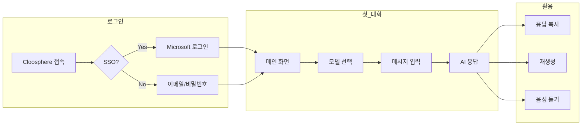

# 시작 가이드

> Cloosphere를 처음 사용하시나요? 이 가이드를 따라 5분 만에 AI와 대화를 시작하세요.



---

## 로그인

Cloosphere는 다양한 SSO(Single Sign-On) 인증 방식을 지원합니다.

### 지원 인증 방식

| 인증 방식 | 상태 | 설명 |
|----------|------|------|
| **Microsoft Entra ID** | ✅ 지원 | Azure AD 기반 기업 계정 |
| **Google Workspace** | 🚧 개발 예정 | Google 기업 계정 |
| **OIDC/OAuth 2.0** | 🚧 개발 예정 | 기타 IdP 연동 |

### Microsoft 계정으로 로그인 (SSO)

기업에서 Microsoft Entra ID(Azure AD)를 사용하는 경우, 회사 계정으로 간편하게 로그인할 수 있습니다.

1. Cloosphere 접속 URL을 브라우저에 입력합니다
2. **"Microsoft로 로그인"** 버튼을 클릭합니다
3. 회사 계정 정보를 입력합니다
4. 자동으로 메인 화면으로 이동합니다

**장점:**
- 별도 계정 생성 불필요
- 비밀번호 따로 관리할 필요 없음
- 회사 보안 정책 자동 적용
- 조직 정보 자동 연동

### 일반 로그인

SSO를 사용하지 않는 경우:

1. 이메일과 비밀번호를 입력합니다
2. **"로그인"** 버튼을 클릭합니다


---

## 메인 화면 살펴보기

로그인 후 메인 채팅 화면이 나타납니다.


### ① 사이드바 (왼쪽)

| 영역 | 설명 |
|------|------|
| **새 채팅** | 새로운 대화 시작 |
| **채팅 목록** | 이전 대화 기록 |
| **워크스페이스** | 에이전트, 지식베이스 등 관리 |
| **관리자** | 시스템 설정 (관리자만) |

### ② 채팅 영역 (중앙)

대화 내용이 표시되는 메인 영역입니다.
- 사용자 메시지: 오른쪽 정렬
- AI 응답: 왼쪽 정렬

### ③ 모델 선택 (상단)

사용할 AI 모델을 선택합니다. 모델마다 특성이 다릅니다:

| 모델 유형 | 특징 | 추천 용도 |
|----------|------|----------|
| **GPT-4o** | 최신 고성능 모델 | 복잡한 분석, 코드 작성 |
| **GPT-4o-mini** | 빠르고 경제적 | 일반 대화, 간단한 질문 |
| **Claude** | 긴 문서 처리 우수 | 문서 요약, 보고서 작성 |

### ④ 입력창 (하단)

질문이나 요청을 입력하는 곳입니다.

---

## 첫 번째 대화 시작하기

### 1. 모델 선택

상단의 모델 선택 드롭다운에서 원하는 모델을 선택합니다.


### 2. 메시지 입력

하단 입력창에 질문을 입력합니다.

**예시 질문들:**
- "이번 분기 매출 보고서 양식을 작성해줘"
- "Python으로 엑셀 파일 읽는 코드 알려줘"
- "영어 이메일을 자연스러운 한국어로 번역해줘"

### 3. 전송

**Enter** 키를 누르거나 **전송 버튼**을 클릭합니다.

### 4. 응답 확인

AI가 실시간으로 응답을 생성합니다. 응답이 생성되는 동안 텍스트가 스트리밍됩니다.


---

## 파일 첨부하기

Cloosphere는 다양한 형식의 파일을 AI에게 보여줄 수 있습니다.

### 지원 파일 형식

| 형식 | 확장자 | 활용 예시 |
|------|--------|----------|
| **문서** | PDF, DOCX, TXT, MD | 문서 요약, 내용 분석 |
| **스프레드시트** | XLSX, CSV | 데이터 분석, 차트 생성 |
| **이미지** | PNG, JPG, GIF | 이미지 분석, OCR |
| **코드** | PY, JS, 등 | 코드 리뷰, 버그 찾기 |

### 파일 첨부 방법


**방법 1: 드래그 앤 드롭**
파일을 채팅창으로 끌어다 놓습니다.

**방법 2: 첨부 버튼**
입력창 왼쪽의 **+** 버튼을 클릭합니다.

**방법 3: 클라우드 스토리지**
SharePoint, Google Drive (예정) 등과 연결되어 직접 파일을 가져올 수 있습니다.


### 파일과 함께 질문하기

```
첨부한 PDF 문서의 핵심 내용을 3줄로 요약해줘
```

```
이 엑셀 파일의 매출 데이터를 분석하고 차트로 보여줘
```

---

## 대화 관리하기

### 대화 이어가기

이전 대화 내용을 기억하며 연속적인 질문이 가능합니다.

```
[첫 번째 질문] Python으로 웹 크롤러 코드 작성해줘
[이어서] 이 코드에 에러 처리 추가해줘
[이어서] 결과를 CSV로 저장하는 기능도 넣어줘
```

### 새 대화 시작

사이드바의 **"새 채팅"** 버튼을 클릭하면 새로운 대화가 시작됩니다.
이전 대화는 사이드바 목록에 저장됩니다.

### 대화 검색

사이드바 상단의 검색창에서 이전 대화를 검색할 수 있습니다.


### 대화 정리

- **핀 고정**: 중요한 대화를 상단에 고정
- **태그 추가**: 대화를 카테고리별로 분류
- **삭제**: 불필요한 대화 삭제

---

## 응답 활용하기

### 복사하기

AI 응답 하단의 **복사** 버튼을 클릭하면 내용이 클립보드에 복사됩니다.

### 코드 복사

코드 블록 우측 상단의 **복사** 버튼으로 코드만 복사할 수 있습니다.

### 재생성

응답이 마음에 들지 않으면 **재생성** 버튼을 클릭하세요.
다른 관점의 답변을 받을 수 있습니다.

### 음성으로 듣기

**스피커** 버튼을 클릭하면 AI가 응답을 음성으로 읽어줍니다.


---

## 유용한 팁

### 더 나은 답변 받기

1. **구체적으로 질문하세요**
   - ❌ "보고서 써줘"
   - ✅ "2024년 1분기 마케팅 성과 보고서를 작성해줘. A4 2페이지 분량으로, 주요 KPI와 개선점을 포함해줘"

2. **맥락을 제공하세요**
   - ❌ "이거 고쳐줘"
   - ✅ "이 Python 코드에서 TypeError가 발생해. 원인을 찾고 수정해줘"

3. **원하는 형식을 지정하세요**
   - "표로 정리해줘"
   - "순서대로 번호 매겨서 알려줘"
   - "마크다운 형식으로 작성해줘"

### 키보드 단축키

| 단축키 | 기능 |
|--------|------|
| `Enter` | 메시지 전송 |
| `Shift + Enter` | 줄바꿈 |
| `Ctrl + /` | 사이드바 토글 |
| `Ctrl + N` | 새 채팅 |

---

## 도움이 필요할 때 — Guide Q&A

화면 상단 헤더의 **? 버튼**을 클릭하면 **Guide Q&A 패널**이 열립니다. 가이드 문서 내용을 기반으로 AI가 사용 방법을 안내합니다.

<!-- 스크린샷: Guide Q&A 패널
     파일명: images/guide-qa-panel.png
-->

**주요 기능:**
- 가이드 문서 기반 질문/답변 — "에이전트는 어떻게 만들어?" 같은 질문에 관련 가이드를 검색하여 답변
- 멀티턴 대화 — 이전 대화를 이어가며 추가 질문 가능
- AI 모델 선택 — 패널 상단에서 사용할 AI 모델 변경 가능

**예시 질문:**
- "지식베이스에 문서를 어떻게 추가하나요?"
- "가드레일은 뭔가요?"
- "예약 작업에서 대시보드를 연결하는 방법은?"

> **💡 팁:** ? 버튼은 채팅, 워크스페이스, 관리자 등 모든 페이지의 헤더에 위치합니다.

---

## 다음 단계

기본 사용법을 익혔다면, 더 강력한 기능을 활용해보세요:

- 📚 [지식 베이스로 사내 문서 연결하기](./workspace/knowledge.md)
- 🤖 [나만의 에이전트 만들기](./workspace/agents.md)
- 🔧 [외부 도구 연결하기](./workspace/tools.md)

---

## 문제가 있나요?

- 로그인이 안 되나요? → IT 관리자에게 계정 권한 확인 요청
- 응답이 느린가요? → 다른 모델로 변경해보세요
- 기타 문의 → support@cloocus.com
