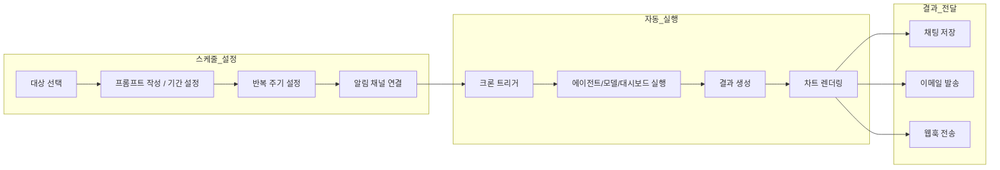
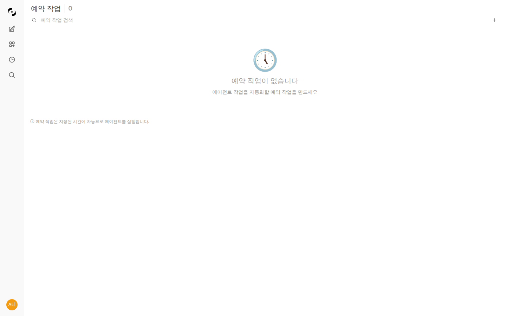

# 예약 작업 (Scheduled Tasks)

> 반복적인 AI 작업을 자동화하세요. 크론 스케줄러를 통해 에이전트, 모델, 플로우를 정해진 시간에 실행하고, 결과를 이메일이나 웹훅으로 자동 전달받을 수 있습니다.



---

## 예약 작업이란?

예약 작업은 AI 에이전트나 모델에게 정해진 시간에 자동으로 프롬프트를 보내고, 결과를 저장하거나 알림으로 전달하는 기능입니다.



**활용 예시:**
- 매일 오전 9시 매출 보고서 자동 생성
- 매주 월요일 주간 데이터 분석 실행
- 매시간 시스템 상태 점검 및 이상 감지 시 알림

---

## 예약 작업 목록

**워크스페이스 > 예약 작업**에서 모든 스케줄을 확인합니다.

<!-- 스크린샷: 예약 작업 목록 화면
     - 카드 형태로 나열된 스케줄들
     - 검색창, 생성 버튼, 활성/비활성 토글
     파일명: images/schedule-list.png
-->

### 목록 기능

| 기능 | 설명 |
|------|------|
| **검색** | 이름, 설명, 프롬프트로 검색 |
| **활성/비활성 토글** | 스케줄 즉시 켜기/끄기 |
| **즉시 실행** | 다음 주기를 기다리지 않고 바로 실행 |
| **삭제** | 스케줄 및 실행 이력 삭제 |

---

## 예약 작업 생성

**"+ 새 예약 작업"** 버튼을 클릭하여 스케줄을 생성합니다.

### 1단계: 기본 정보

<!-- 스크린샷: 스케줄 생성 폼 - 기본 정보
     - 이름, 설명 입력 필드
     파일명: images/schedule-create-basic.png
-->

| 필드 | 설명 | 예시 |
|------|------|------|
| **이름** | 스케줄 이름 | "일일 매출 보고서" |
| **설명** | 용도 설명 (선택) | "매일 오전 9시 매출 데이터 분석" |

### 2단계: 대상 선택

실행할 에이전트, 플로우, 또는 모델을 선택합니다.

<!-- 스크린샷: 대상 선택 드롭다운
     - 에이전트/플로우/모델 카테고리별 목록
     파일명: images/schedule-target-select.png
-->

| 대상 유형 | 설명 |
|-----------|------|
| **대시보드** | BI 대시보드를 HTML로 내보내기 (기간 프리셋 적용) |
| **에이전트** | 지식 베이스, 데이터베이스 등이 연결된 AI 에이전트 |
| **플로우** | 다단계 워크플로우 |
| **모델** | 기본 LLM 모델 (직접 프롬프트 전달) |

> **💡 팁:** 대시보드를 선택하면 프롬프트 대신 **기간 프리셋**을 설정합니다. 에이전트/플로우/모델을 선택하면 프롬프트를 입력합니다.

### 3단계-A: 기간 설정 (대시보드 대상)

대시보드를 선택하면 프롬프트 입력란 대신 **기간 프리셋** 드롭다운이 표시됩니다. 실행 시점 기준으로 날짜 범위가 자동 계산되어 대시보드의 모든 패널에 적용됩니다.

<!-- 스크린샷: 대시보드 기간 프리셋 선택
     파일명: images/schedule-dashboard-time-range.png
-->

| 기간 프리셋 | 설명 | 예시 (오늘이 4/6일 때) |
|-------------|------|----------------------|
| **어제 (Yesterday)** | 전일 하루 | 4/5 ~ 4/5 |
| **오늘 (Today)** | 당일 하루 | 4/6 ~ 4/6 |
| **최근 7일 (Last 7 Days)** | 오늘 포함 7일간 | 3/31 ~ 4/6 |
| **최근 30일 (Last 30 Days)** | 오늘 포함 30일간 | 3/7 ~ 4/6 |
| **지난주 (Last Week)** | 이전 주 월~일 | 3/30 ~ 4/5 |
| **이번 주 (This Week)** | 이번 주 월~오늘 | 4/6 ~ 4/6 |
| **지난달 (Last Month)** | 이전 월 1일~말일 | 3/1 ~ 3/31 |
| **이번 달 (This Month)** | 이번 월 1일~오늘 | 4/1 ~ 4/6 |

**동작 방식:**
- 대시보드의 각 패널 SQL에 포함된 날짜 필터(`$st`, `$ed`)가 선택한 기간으로 자동 치환됩니다
- 모든 패널이 순차적으로 실행되고, 결과가 자체 포함(self-contained) HTML로 생성됩니다
- 생성된 HTML에는 Plotly 차트가 포함되어 별도 서버 없이 열 수 있습니다

### 3단계-B: 프롬프트 작성 (에이전트/플로우/모델 대상)

실행 시 전달할 프롬프트를 입력합니다.

<!-- 스크린샷: 프롬프트 입력 영역
     파일명: images/schedule-prompt.png
-->

**작성 팁:**
- 구체적인 출력 형태를 명시하세요
- 에이전트에 구조화된 출력(JSON Schema)이 설정되어 있으면, 결과 필드를 알림 템플릿에서 활용할 수 있습니다

**예시:**
```
오늘의 매출 데이터를 분석하고, 전일 대비 증감율과 주요 변동 원인을 포함한 보고서를 작성해주세요.
차트로 시각화하고 핵심 인사이트 3가지를 요약해주세요.
```

### 4단계: 반복 설정 (크론 에디터)

실행 주기를 설정합니다. 직관적인 크론 에디터를 제공합니다.

<!-- 스크린샷: 크론 에디터 UI
     - 반복 모드 선택, 시간 설정
     파일명: images/schedule-cron-editor.png
-->

#### 반복 모드

| 모드 | 설명 | 예시 |
|------|------|------|
| **간격** | N분마다 실행 (1, 2, 3, 5, 10, 15, 20, 30분) | 매 10분마다 |
| **매시간** | 매시간 특정 분에 실행 | 매시간 30분에 |
| **매일** | 매일 지정 시간에 실행 | 매일 오전 9:00 |
| **매주** | 지정 요일 + 시간에 실행 | 월~금 오전 9:00 |
| **매월** | 지정 일 + 시간에 실행 | 매월 1일 오전 8:00 |
| **커스텀** | 크론 표현식 직접 입력 | `0 9 * * 1-5` |

#### 크론 표현식 가이드 (커스텀 모드)

커스텀 모드에서는 크론 표현식을 직접 입력합니다. 크론 표현식은 **5개 필드**로 구성됩니다.

```
┌─────────── 분 (0-59)
│ ┌─────────── 시 (0-23)
│ │ ┌─────────── 일 (1-31)
│ │ │ ┌─────────── 월 (1-12)
│ │ │ │ ┌─────────── 요일 (0-6, 0=일요일)
│ │ │ │ │
* * * * *
```

**특수 문자:**

| 문자 | 의미 | 예시 |
|------|------|------|
| `*` | 모든 값 | `* * * * *` = 매분 실행 |
| `,` | 여러 값 나열 | `0 9,18 * * *` = 9시, 18시 |
| `-` | 범위 지정 | `0 9 * * 1-5` = 월~금 |
| `/` | 간격 지정 | `*/10 * * * *` = 10분마다 |

**요일 번호:**

| 번호 | 요일 |
|------|------|
| 0 | 일요일 |
| 1 | 월요일 |
| 2 | 화요일 |
| 3 | 수요일 |
| 4 | 목요일 |
| 5 | 금요일 |
| 6 | 토요일 |

**자주 사용하는 예시:**

| 크론 표현식 | 설명 |
|------------|------|
| `0 9 * * *` | 매일 오전 9시 |
| `0 9 * * 1-5` | 평일(월~금) 오전 9시 |
| `0 9,18 * * *` | 매일 오전 9시, 오후 6시 |
| `30 8 * * 1` | 매주 월요일 오전 8시 30분 |
| `0 0 1 * *` | 매월 1일 자정 |
| `0 0 1,15 * *` | 매월 1일, 15일 자정 |
| `*/30 * * * *` | 30분마다 |
| `0 */2 * * *` | 2시간마다 정각 |
| `0 9 * * 1,3,5` | 월·수·금 오전 9시 |
| `0 22 * * 0` | 매주 일요일 오후 10시 |

> **💡 팁:** 간격/매시간/매일/매주/매월 모드에서 설정하면 크론 표현식이 자동 생성됩니다. 복잡한 스케줄만 커스텀 모드를 사용하세요.

#### 타임존 및 기간

| 설정 | 설명 |
|------|------|
| **타임존** | 실행 시간 기준 시간대 (기본: 브라우저 시간대) |
| **시작일** | 스케줄 시작 날짜 (선택) |
| **종료일** | 스케줄 종료 날짜 (선택, 미설정 시 무기한) |

### 5단계: 알림 설정

실행 결과를 알림으로 받을 채널을 설정합니다. 여러 개의 알림을 추가할 수 있습니다.

<!-- 스크린샷: 알림 설정 UI
     - 채널 선택, 트리거 조건, 템플릿 입력
     파일명: images/schedule-delivery.png
-->

| 설정 | 설명 |
|------|------|
| **채널 유형** | 이메일 / 웹훅(사전 설정) / 직접 URL |
| **채널 선택** | 관리자가 설정한 이메일 또는 웹훅 채널 선택 |
| **트리거** | 항상 / 성공 시만 / 실패 시만 |
| **제목 템플릿** | 알림 제목 (템플릿 변수 사용 가능) |
| **이메일 수신자** | 이메일 주소 목록 (이메일 채널만) |
| **제목/본문 템플릿** | 이메일 제목 및 본문 (이메일 채널만) |
| **메시지 템플릿** | 웹훅 메시지 (웹훅 채널만, 선택) |

> **💡 팁:** 하나의 스케줄에 여러 알림을 추가하여, 성공 시 이메일로, 실패 시 Slack으로 보내는 등 조건별 분기가 가능합니다.

### 6단계: 접근 제어

스케줄의 읽기/쓰기 권한을 그룹·사용자·조직 단위로 설정합니다.

<!-- 스크린샷: 접근 제어 설정 - Visibility 토글 + AccessControlModal
     파일명: images/schedule-access-control.png
-->

| 옵션 | 설명 |
|------|------|
| **공개 (Public)** | 모든 로그인 사용자가 조회 가능 (`access_control: null`) |
| **비공개 (Private)** | 소유자와 관리자만 조회/편집 가능 (`access_control: {}`) |
| **그룹/사용자 지정** | 특정 그룹·사용자·조직에 읽기 또는 쓰기 권한 부여 |

#### 권한 단계별 허용 동작

| 권한 | 가능한 동작 |
|------|------------|
| **읽기 (Read)** 공유자 | 스케줄 상세 조회 · 실행 이력 확인 · 결과 채팅 조회(읽기 전용) · 내 스케줄로 복사 |
| **쓰기 (Write)** 공유자 | 위 + 수정 · 삭제 · 활성/비활성 토글 · **즉시 실행** |
| **소유자 / 관리자** | 위 + 다른 사용자에게 복사 공유 · 결과 채팅에 후속 메시지 입력 |

> **💡 팁:** 복사 공유(다른 사용자에게 스케줄을 새로 만들어주기)는 권한 확산 방지를 위해 소유자/관리자에게만 허용됩니다. write 공유자도 복사 공유 버튼은 비활성화됩니다.

#### 실행 컨텍스트는 항상 소유자 기준

write 권한 공유자가 **즉시 실행** 버튼을 눌러도, 실제 실행은 **스케줄 소유자(`schedule.user_id`)의 컨텍스트로 수행**됩니다. 즉:

- 연결된 에이전트·대시보드·도구·지식베이스·DB 권한은 모두 **소유자 기준**으로 평가됩니다
- write 공유자는 트리거(시작 명령)만 위임받았을 뿐, 권한 상승은 일어나지 않습니다
- 누가 수동으로 실행했는지는 실행 이력의 `triggered_by_user_id` 필드에 감사 목적으로 기록됩니다 (정기 자동 실행은 비어 있음)
- 에이전트 실행 중 글로서리도 소유자의 read 권한으로 재필터되어, 소유자가 접근할 수 없는 비공개 글로서리는 자동 차단됩니다

> **⚠️ 주의:** 공유자가 보는 스케줄 출력에는 **소유자가 가진 데이터/리소스 결과**가 그대로 노출됩니다. 민감한 DB·KB 가 연결된 스케줄을 공유할 때는 결과 가시성을 충분히 검토하세요.

#### 결과 채팅의 후속 대화는 소유자 전용

스케줄 결과가 누적되는 채팅은 **소유자만 후속 메시지를 입력**할 수 있습니다.

- 읽기/쓰기 공유자, 그리고 소유자가 아닌 관리자는 채팅을 **읽기 전용**으로 열람합니다
- 입력창 대신 _"이 채팅은 읽기 전용으로 공유된 예약 작업 로그입니다. 메시지 입력이 비활성화됩니다."_ 안내가 표시됩니다
- 이유: 워커가 소유자 컨텍스트로 채팅 이력을 누적하기 때문에, 비소유자의 추가 발화가 끼어들면 소유자의 데이터·이력이 오염됩니다

<!-- 스크린샷: 공유받은 스케줄 결과 채팅 (읽기 전용 안내 배너)
     파일명: images/schedule-chat-readonly.png
-->

---

## 예약 작업 관리

### 활성화/비활성화

목록에서 토글 스위치로 스케줄을 즉시 켜거나 끌 수 있습니다. 비활성화 시 다음 실행이 예약되지 않습니다.

### 즉시 실행

**"실행"** 버튼을 클릭하면 다음 주기를 기다리지 않고 즉시 실행합니다. 수동으로 결과를 확인하거나 테스트할 때 유용합니다. 실행 권한(소유자·관리자·write 공유자)이 있는 사용자만 트리거할 수 있으며, 어떤 경우에도 실행 컨텍스트는 소유자 기준으로 유지됩니다.

### 편집

스케줄 카드를 클릭하여 상세 페이지에서 모든 설정을 수정할 수 있습니다. 수정 시 다음 실행 시간이 자동으로 재계산됩니다. **쓰기(write) 권한**이 있어야 편집할 수 있습니다.

### 삭제

스케줄을 삭제하면 관련 실행 이력도 함께 삭제됩니다. **쓰기(write) 권한**이 있어야 삭제할 수 있습니다.

---

## 실행 이력

스케줄 상세 페이지에서 최근 50건의 실행 이력을 확인할 수 있습니다.

<!-- 스크린샷: 실행 이력 테이블
     - 상태 뱃지, 실행 시간, 소요 시간, 에러 메시지
     파일명: images/schedule-task-history.png
-->

### 상태

| 상태 | 색상 | 설명 |
|------|------|------|
| **대기 중** | 노란색 | 실행 대기 |
| **실행 중** | 파란색 | 현재 실행 중 |
| **완료** | 초록색 | 정상 완료 |
| **실패** | 빨간색 | 오류 발생 |

### 이력 상세 정보

| 항목 | 설명 |
|------|------|
| **실행 시간** | 예약된 실행 시간 |
| **소요 시간** | 시작부터 완료까지 걸린 시간 |
| **재시도 횟수** | 오류 발생 시 자동 재시도 횟수 (최대 2회) |
| **에러 메시지** | 실패 원인 (실패 시) |
| **채팅 보기** | 결과가 저장된 채팅으로 이동 |

### 자동 재시도

타임아웃, 서버 오류(5xx), 속도 제한 오류는 자동으로 최대 2회 재시도됩니다. 10분 이상 실행 중인 작업은 자동으로 복구됩니다.

### 이력 보관

완료 및 실패한 실행 기록은 30일 후 자동으로 삭제됩니다.

---

## 채팅 저장

모든 실행 결과는 전용 채팅에 저장됩니다.

<!-- 스크린샷: 스케줄 결과 채팅 화면
     - 사용자 프롬프트와 AI 응답이 저장된 채팅
     파일명: images/schedule-chat-result.png
-->

**동작 방식:**
- 첫 실행 시 새 채팅이 생성됩니다
- 이후 실행 결과는 같은 채팅에 누적됩니다
- 채팅 제목은 알림의 제목 템플릿으로 설정됩니다 (기본: `[예약 작업] 스케줄명`)
- 실행 이력에서 **"채팅 보기"** 링크로 바로 이동할 수 있습니다

---

## 차트 이미지

데이터베이스(DbSphere) 에이전트가 생성한 차트는 서버사이드 렌더링으로 이미지로 변환되어 알림에 포함됩니다.

<!-- 스크린샷: 이메일에 포함된 차트 이미지 예시
     파일명: images/schedule-chart-email.png
-->

**지원 차트 유형:**
- 막대 차트, 선 차트, 원형 차트, 산점도
- 히트맵, 히스토그램, 그룹 막대 차트

**전달 방식:**

| 채널 | 방식 |
|------|------|
| **이메일** | 인라인 이미지로 본문에 포함 |
| **Slack** | 이미지 URL로 표시 |
| **Teams** | Adaptive Card에 이미지 포함 |
| **Discord** | Embed에 이미지 포함 (첫 번째 이미지) |

---

## 대시보드 내보내기

대시보드 대상 스케줄은 에이전트/모델과 다른 방식으로 결과를 생성하고 전달합니다.

### 실행 결과

- 대시보드의 **모든 패널 SQL이 기간 프리셋에 맞게 실행**됩니다
- 결과는 Plotly 차트가 포함된 **자체 포함 HTML 파일**로 생성됩니다
- 대시보드에 공유 링크가 설정되어 있으면 결과 메시지에 공유 URL이 포함됩니다

### 알림 전달

| 채널 | 방식 |
|------|------|
| **이메일** | 대시보드 HTML이 **첨부 파일**로 포함 (`대시보드명.html`) |
| **Slack** | "📊 대시보드 보기" 버튼 + "채팅에서 보기" 버튼이 포함된 카드 |
| **Teams** | Adaptive Card에 대시보드 링크 + 채팅 링크 버튼 포함 |
| **Discord** | Embed에 대시보드 URL 포함 |

> **💡 팁:** 대시보드 공유 링크를 미리 생성해두면 알림에 바로가기 버튼이 자동으로 포함됩니다. 모니터링 > 대시보드에서 공유 설정을 확인하세요.

### 활용 예시

```
매일 오전 9시 → "어제" 기간 → 전일 매출 대시보드 HTML 이메일 발송
매주 월요일 → "지난주" 기간 → 주간 리포트 대시보드 Slack 전달
매월 1일 → "지난달" 기간 → 월간 보고서 대시보드 Teams 전달
```

---

## 템플릿 변수

알림 제목, 본문, 메시지 템플릿에서 사용할 수 있는 변수입니다.

| 변수 | 설명 | 예시 |
|------|------|------|
| `{{schedule_name}}` | 스케줄 이름 | 일일 매출 보고서 |
| `{{prompt}}` | 실행된 프롬프트 | 오늘의 매출 데이터를... |
| `{{result}}` | 전체 실행 결과 | (AI 응답 전체) |
| `{{status}}` | 실행 상태 | completed / failed |
| `{{completed_at}}` | 완료 시간 | 2025-02-27 09:00:45 |
| `{{dashboard_url}}` | 대시보드 공유 URL (대시보드 대상만) | https://cloosphere.com/dashboard/abc123 |
| `{{time_range}}` | 기간 프리셋 (대시보드 대상만) | yesterday |
| `{{target_type}}` | 대상 유형 | dashboard / agent / flow / model |

### 구조화된 출력 접근

대상 에이전트에 JSON Schema 응답 형식이 설정되어 있으면, 점 표기법으로 개별 필드에 접근할 수 있습니다.

```
{{result.title}}           → 결과 JSON의 title 필드
{{result.data.count}}      → 중첩 필드 접근
{{result.metrics.revenue}} → 매출 데이터 접근
```

> **💡 팁:** 알림 설정 화면에서 구조화된 출력 필드가 자동으로 감지되어 버튼으로 표시됩니다. 클릭하면 템플릿에 자동 삽입됩니다.

**템플릿 예시:**

이메일 제목:
```
[{{schedule_name}}] {{status}} - {{completed_at}}
```

이메일 본문:
```
스케줄 "{{schedule_name}}" 실행이 완료되었습니다.

프롬프트: {{prompt}}

결과:
{{result}}
```

---

## FAQ

**Q: 스케줄이 실행되지 않아요.**
> 스케줄이 활성 상태인지, 시작일/종료일이 올바르게 설정되어 있는지 확인하세요. 대상 에이전트/모델에 대한 접근 권한도 확인하세요.

**Q: 여러 시간대의 사용자가 있으면 어떻게 하나요?**
> 각 스케줄에 개별 타임존을 설정할 수 있습니다. 예: 서울 사무소는 Asia/Seoul, 뉴욕 사무소는 America/New_York.

**Q: 실행 결과가 채팅에 보이지 않아요.**
> 실행이 실패했을 수 있습니다. 실행 이력에서 상태와 에러 메시지를 확인하세요.

**Q: 알림 채널은 어디서 설정하나요?**
> 이메일, 웹훅 채널은 관리자가 **관리자 > 설정 > 알림**에서 사전 설정합니다. 직접 URL 방식은 사전 설정 없이 스케줄에서 바로 입력할 수 있습니다.

**Q: 크론 표현식을 모르겠어요.**
> 간격/매시간/매일/매주/매월 모드를 선택하면 자동으로 크론 표현식이 생성됩니다. 커스텀 모드가 필요한 경우, 위의 [크론 표현식 가이드](#크론-표현식-가이드-커스텀-모드) 섹션을 참고하세요.

**Q: 대시보드를 예약 작업에 연결하려면 어떻게 하나요?**
> 예약 작업 생성 시 대상 선택 드롭다운에서 **[Dashboards]** 카테고리의 대시보드를 선택하세요. 대시보드를 선택하면 프롬프트 대신 기간 프리셋(어제, 최근 7일 등)을 설정할 수 있습니다. 실행 시 해당 기간의 데이터로 대시보드가 HTML로 내보내져 알림에 첨부됩니다.

**Q: 대시보드 알림에 바로가기 버튼이 안 보여요.**
> 대시보드 공유 링크가 설정되어 있어야 합니다. **모니터링 > 대시보드**에서 해당 대시보드의 공유 설정을 먼저 활성화하세요.

**Q: 공유받은 스케줄의 결과 채팅에서 메시지 입력창이 보이지 않아요.**
> 의도된 동작입니다. 결과 채팅의 후속 대화는 스케줄 소유자만 입력할 수 있고, 공유자(관리자 포함)는 읽기 전용으로 열람합니다. 워커가 소유자 컨텍스트로 채팅 이력을 누적하기 때문에, 비소유자가 끼어들면 소유자 데이터가 오염될 수 있어 이를 방지합니다.

**Q: write 권한 공유자가 즉시 실행을 누르면, 제 권한으로 실행되나요?**
> 아니요. 트리거만 위임받은 것이고, 실제 실행 컨텍스트는 항상 스케줄 소유자 기준으로 평가됩니다. 연결된 에이전트·대시보드·DB·KB·글로서리 권한은 모두 소유자 기준이며, 누가 수동으로 실행했는지는 실행 이력의 `triggered_by_user_id` 필드에 별도로 기록됩니다.

---

## 다음 단계

- 📧 [알림 설정 (관리자)](admin/notifications.md)
- 🤖 [에이전트 만들기](workspace/agents.md)
- 🔄 [플로우 만들기](workspace/flows.md)
- 🗄️ [데이터베이스 연결](workspace/database.md)
