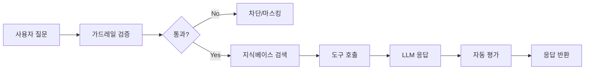
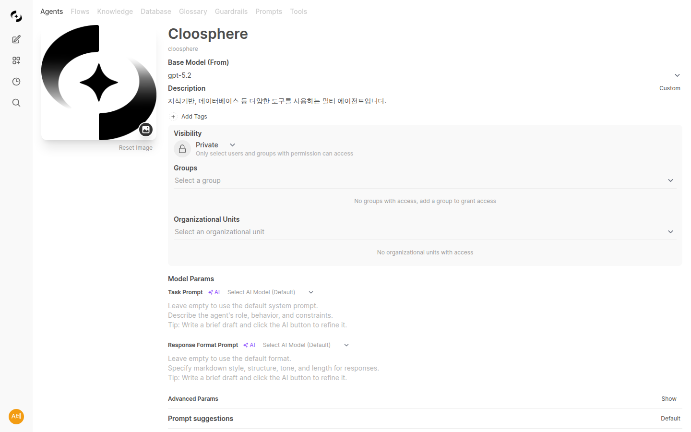
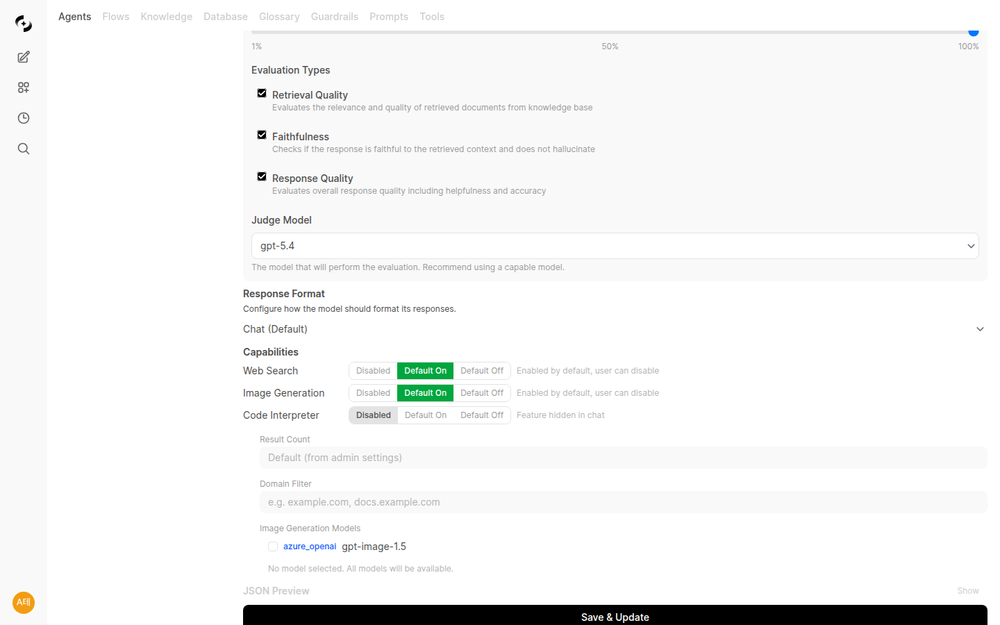
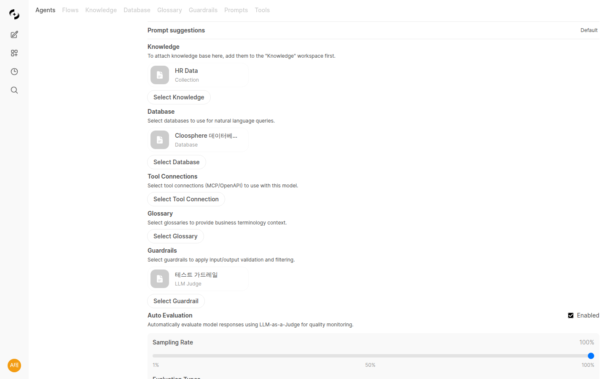
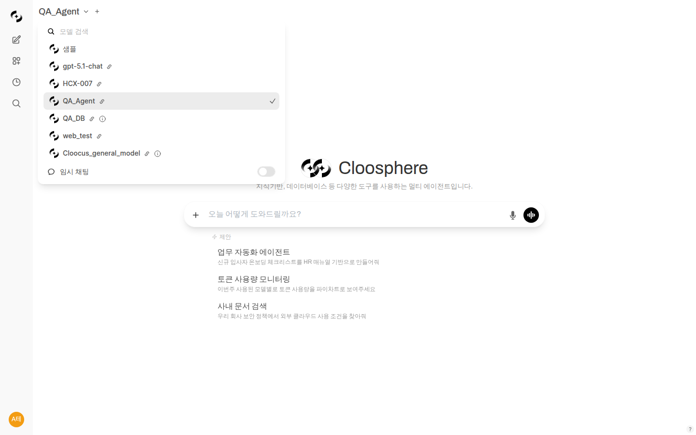

# 에이전트 (Agents)

> 에이전트는 특정 업무에 최적화된 맞춤형 AI 어시스턴트입니다. 마케팅, 개발, 고객 지원 등 부서별로 특화된 AI를 구성하여 업무 효율을 극대화하세요.



---

## 에이전트란?

에이전트는 기본 AI 모델에 **지식**, **도구**, **지침**을 결합하여 만든 맞춤형 AI입니다.

**예시:**
- **HR 어시스턴트**: 인사 규정 지식 + 연차 계산 도구 + HR 전문 지침
- **코드 리뷰어**: GPT-4 + 코딩 가이드라인 + 코드 분석 도구
- **고객 지원 봇**: Claude + FAQ 지식베이스 + 티켓 시스템 연동

### 에이전트 vs 기본 모델

| 구분 | 기본 모델 | 에이전트 |
|------|----------|----------|
| **지식** | 학습 데이터만 | 사내 문서 연동 |
| **도구** | 기본 기능만 | 외부 시스템 연동 |
| **응답 스타일** | 범용적 | 업무 맞춤형 |
| **일관성** | 다양함 | 가이드라인 준수 |

---

## 에이전트 목록

워크스페이스 > 에이전트에서 모든 에이전트를 확인할 수 있습니다.


### 에이전트 카드

| 요소 | 설명 |
|------|------|
| **프로필 이미지** | 에이전트 아이콘 |
| **이름** | 에이전트 이름 |
| **설명** | 용도 및 기능 설명 |
| **기반 모델** | 사용하는 LLM 모델 |
| **태그** | 분류 태그 |

### 에이전트 검색

상단 검색창에서 이름이나 설명으로 에이전트를 찾을 수 있습니다.

---

## 에이전트 생성

### 1단계: 기본 정보 입력

**워크스페이스 > 에이전트 > "+ 새 에이전트"** 클릭



| 필드 | 설명 | 예시 |
|------|------|------|
| **이름** | 에이전트 표시 이름 | "마케팅 어시스턴트" |
| **설명** | 에이전트 용도 설명 | "마케팅 콘텐츠 작성 및 분석 지원" |
| **프로필 이미지** | 아이콘 이미지 | 마케팅 관련 이미지 |
| **태그** | 분류 태그 | 마케팅, 콘텐츠 |

### 2단계: 기반 모델 선택

에이전트가 사용할 AI 모델을 선택합니다.

### 3단계: 프롬프트 작성

에이전트의 역할, 성격, 응답 규칙을 정의합니다. 에이전트 생성 화면에서 두 가지 프롬프트를 설정할 수 있습니다.

| 필드 | 설명 |
|------|------|
| **작업 프롬프트 (Task Prompt)** | 에이전트의 역할·성격·제한사항 및 구체적인 작업 지시를 정의합니다. 일반적인 "시스템 프롬프트" 역할을 합니다. |
| **답변 포맷 프롬프트 (Response Format Prompt)** | 응답 형식·구조를 지정합니다 (마크다운, 테이블 등). 작업 프롬프트와 분리하여 응답 형식만 별도로 관리할 수 있습니다. |

#### AI 프롬프트 자동 생성

프롬프트를 직접 작성하기 어렵다면 **AI 자동 생성** 기능을 활용하세요. 각 프롬프트 입력란 옆의 **자동 생성 버튼**을 클릭하면 AI가 에이전트의 이름, 설명, 연결된 지식 베이스·데이터베이스 정보를 분석하여 적절한 프롬프트를 자동으로 작성합니다.

| 항목 | 설명 |
|------|------|
| **자동 생성 대상** | 작업 프롬프트, 답변 포맷 프롬프트 |
| **분석 정보** | 에이전트 이름, 설명, 연결된 리소스 |
| **모델 선택** | 관리자 설정에서 AI 자동 작성용 모델 지정 가능 |

> **💡 팁:** AI가 생성한 프롬프트를 기반으로 세부 사항을 조정하면 더 빠르게 고품질 에이전트를 만들 수 있습니다.

**좋은 작업 프롬프트 예시:**

```markdown
당신은 Cloocus의 마케팅 어시스턴트입니다.

## 역할
- 마케팅 콘텐츠 작성 지원
- SNS 게시물 초안 작성
- 마케팅 데이터 분석

## 응답 규칙
- 항상 한국어로 응답
- 전문적이지만 친근한 톤 유지
- 데이터 기반 인사이트 제공
- 브랜드 가이드라인 준수

## 제한사항
- 경쟁사 비방 금지
- 검증되지 않은 통계 사용 금지
```

### 3-1단계: 프롬프트 제안 설정 (선택)

채팅 화면에서 에이전트를 선택했을 때 사용자에게 표시되는 **대화 시작 제안 문구**를 설정할 수 있습니다.

| 옵션 | 설명 |
|------|------|
| **Default** | 시스템 기본 제안 문구를 사용합니다 |
| **Custom** | 에이전트에 맞는 제안 문구를 직접 설정합니다 |

**활용 팁:**
- 에이전트 용도에 맞는 질문 예시를 제공하면 사용자가 빠르게 대화를 시작할 수 있습니다
- 예: "이번 달 매출 현황 요약해줘", "SNS 게시물 초안 작성해줘"

### 4단계: 지식베이스 연결

에이전트가 참조할 문서를 연결합니다.

**연결 방법:**
1. "지식베이스" 섹션에서 **"+ 추가"** 클릭
2. 연결할 지식베이스 선택
3. 여러 개 선택 가능

**효과:**
- 에이전트가 연결된 문서 내용을 참조하여 답변
- 정확한 사내 정보 제공
- 출처 인용 가능

### 4-1단계: 용어집 연결 (선택)

에이전트에 용어집(Glossary)을 연결하면 대화 중 도메인 특화 용어를 자동으로 조회하여 더 정확한 답변을 생성합니다.

**연결 방법:**
1. "용어집" 섹션에서 **"+ 추가"** 클릭
2. 연결할 용어집 선택
3. 여러 개 선택 가능

**효과:**
- 에이전트가 업계·사내 전문 용어를 정확히 이해
- 약어, 동의어를 자동으로 인식
- 일관된 용어 사용으로 답변 품질 향상

> 📖 용어집 생성 방법은 [용어집 문서](./glossary.md)를 참조하세요.

### 5단계: 도구 연결 (선택)

외부 시스템과 연동할 도구를 연결합니다.

**연결 가능한 도구:**
- API 서버 (OpenAPI)
- MCP 서버

### 6단계: 기능 설정

에이전트가 사용할 수 있는 고급 기능을 활성화합니다.

> **주의:** 모든 기능 토글의 기본값은 **비활성화**입니다. 사용자가 채팅 입력 메뉴(+ 버튼)에서 직접 켜야 기능을 사용할 수 있습니다.

| 기능 | 설명 |
|------|------|
| **웹 검색** | 에이전트가 실시간 웹 검색으로 최신 정보 조회 |
| **이미지 생성** | 에이전트가 대화 중 이미지를 AI로 생성 (연결 선택 가능) |
| **코드 인터프리터** | 에이전트가 Python 코드를 실행하여 계산·분석 수행 |

#### 이미지 생성 연결 선택

"이미지 생성"을 활성화하면 관리자가 설정한 이미지 생성 연결 목록이 체크박스 형태로 표시됩니다.



| 설정 | 설명 |
|------|------|
| **연결 선택** | 이 에이전트에서 사용할 이미지 생성 연결을 선택 |
| **미선택 시** | 관리자가 설정한 모든 연결을 사용 가능 |

사용자는 채팅 입력창 **"+" 메뉴**에서 "이미지 생성"을 클릭하면 에이전트에 허용된 연결 목록 중 하나를 선택하여 사용합니다. 각 연결의 엔진, 모델, 크기 등 상세 정보가 툴팁으로 표시됩니다.

#### 웹 검색 세부 설정

"웹 검색"을 활성화하면 추가 설정이 표시됩니다.

| 설정 | 설명 | 예시 |
|------|------|------|
| **결과 수** | 검색에서 가져올 문서 수 | 5 |
| **도메인 필터** | 검색을 허용할 도메인 목록 (쉼표 구분) | `company.com, docs.example.com` |

#### 코드 인터프리터 사용

에이전트에서 코드 인터프리터를 활성화한 경우, 사용자는 채팅 입력창 **"+" 메뉴**에서 "코드 인터프리터" 토글을 켜서 사용합니다. 에이전트와 사용자 양쪽 모두 활성화되어야 기능이 동작하는 이중 게이트 방식입니다.

### 7단계: 접근 권한 설정

누가 이 에이전트를 사용할 수 있는지 설정합니다.

| 옵션 | 설명 |
|------|------|
| **공개** | 모든 사용자가 사용 가능 |
| **비공개** | 본인만 사용 가능 |
| **그룹 지정** | 특정 그룹만 사용 가능 |
| **조직 지정** | 특정 부서만 사용 가능 |

### 8단계: 가드레일 설정 (선택)

에이전트에 보안 가드레일을 연결하여 민감한 정보를 보호합니다.



**가드레일 기능:**
- 개인정보(PII) 자동 탐지 및 마스킹
- 커스텀 패턴 필터링
- 금지 단어 차단
- LLM 기반 콘텐츠 검증

> 📖 자세한 내용은 [가드레일 문서](./guardrails.md)를 참조하세요.

### 9단계: 자동 평가 설정 (선택)

에이전트 응답 품질을 자동으로 모니터링합니다.


| 설정 | 설명 |
|------|------|
| **활성화** | 자동 평가 기능 켜기/끄기 |
| **샘플링 비율** | 평가할 응답 비율 (1%~100%) |
| **평가 유형** | 평가할 항목 선택 |
| **심판 모델** | 평가에 사용할 LLM 선택 |

**평가 유형:**

| 유형 | 설명 |
|------|------|
| **검색 품질 (Retrieval Quality)** | 지식베이스에서 검색된 문서의 관련성 평가 |
| **충실성 (Faithfulness)** | 응답이 검색된 내용에 충실한지, 환각이 없는지 평가 |
| **응답 품질 (Response Quality)** | 응답의 전반적인 품질, 유용성, 정확성 평가 |

**💡 권장 설정:**
- 신규 에이전트: 샘플링 비율 10~20%로 시작
- 안정화 후: 5~10%로 조정
- 중요 에이전트: 모든 평가 유형 활성화

### 10단계: 저장

**"저장"** 버튼을 클릭하여 에이전트를 생성합니다.

---

## 도구 설명 누락 경고 (1.0.2)

에이전트에 연결된 리소스(지식베이스 / 데이터베이스 / 용어집 / 지식 그래프 / 도구 / 가드레일) 중 **도구 설명(Tool Description) 이 비어 있는 항목**이 있으면, 해당 섹션 하단에 amber 색 경고 배너가 표시됩니다.

<!-- 스크린샷: 에이전트 편집기에서 도구 설명이 비어 있는 리소스 섹션 하단의 amber 배너
     - "도구 설명이 누락되었습니다" 메시지 + 누락 항목 이름 목록
     파일명: images/agents-missing-description-warning.png
-->

| 항목 | 동작 |
|------|------|
| **검사 시점** | 에이전트 편집기 진입 시 각 섹션이 전체 리스트를 fetch 해 비교 |
| **표시 위치** | 각 리소스 섹션(지식베이스, DbSphere, 용어집, KG, 도구, 가드레일) 하단 |
| **경고 메시지** | "도구 설명이 누락되었습니다 — 이 항목들은 LLM이 도구를 정확히 사용하지 못할 수 있습니다" |

> 💡 LLM 은 통합 에이전트 환경에서 여러 도구 중 어느 것을 호출할지 **도구 설명**으로 판단합니다. 설명이 비어 있으면 잘못된 도구가 선택되거나 호출이 누락될 수 있으므로, 배너가 뜨면 가능한 한 빨리 채워주세요.

---

## 후속 질문 추천 Task (1.0.2)

에이전트 응답 직후, 사용자가 다음으로 던질 만한 후속 질문 3~5개를 자동으로 제안하는 기능이 추가되었습니다. 응답 아래에 세로 버튼 목록으로 노출되어 클릭만으로 다음 대화를 이어갈 수 있습니다.

<!-- 스크린샷: 어시스턴트 응답 하단의 후속 질문 추천 버튼 3-5개
     파일명: images/agents-followup-suggestions.png
-->

### 활성화 방법

**관리자 → 설정 → 인터페이스 탭**에서 활성화합니다.

| 항목 | 설명 |
|------|------|
| **Follow-Up Generation 토글** | 기능 ON / OFF (기본 OFF — 매 턴 추가 LLM 호출 비용 고려) |
| **Follow-Up Generation Prompt** | 후속 질문 생성에 사용할 프롬프트 커스터마이즈 |
| **사용 모델** | 다른 Task 와 마찬가지로 Task 모델 설정을 따름 |

> 💡 같은 1.0.2 정리에서 미사용 upstream Task (Retrieval Query / Web Search Query / Image Prompt 등) 토글과 프롬프트가 제거되어, Task 설정 화면이 한층 간결해졌습니다.

---

## 응답 언어 감지 폴백 (운영 메모)

에이전트가 사용자 입력 언어를 감지하지 못해 영어로 답하거나 답변 언어가 흔들리던 케이스를 줄이기 위해, 1.0.2부터 **`langdetect` 기반 폴백 감지**가 추가되었습니다. 별도 UI 설정은 없으며, 짧거나 모호한 질문에서도 사용자의 언어로 일관되게 응답하도록 동작합니다.

---

## 에이전트 사용

### 채팅에서 선택

채팅 화면 상단 모델 선택에서 생성한 에이전트를 선택합니다.



### @ 명령어로 호출

채팅 중 `@에이전트이름`으로 특정 에이전트를 호출할 수 있습니다.

```
@마케팅어시스턴트 이번 달 프로모션 SNS 게시물 5개 작성해줘
```

---

## 워크스페이스 공통 기능

> 아래 기능들은 에이전트뿐만 아니라 도구, 프롬프트, 지식베이스, 데이터베이스, 용어집, 가드레일 등 모든 워크스페이스 항목에 공통으로 적용됩니다.

### 태그 시스템

워크스페이스 항목에 태그를 추가하여 분류하고 관리할 수 있습니다.

<!-- 스크린샷: 태그 추가/관리 UI
     파일명: images/workspace-common-tags.png
-->

- 항목 편집 화면에서 태그를 추가/삭제할 수 있습니다
- 목록 화면에서 태그로 필터링하여 빠르게 항목을 찾을 수 있습니다
- 하나의 항목에 여러 태그를 부여할 수 있습니다

### 태그 관리 페이지

**워크스페이스 > 태그 관리**에서 모든 태그를 일괄적으로 관리할 수 있습니다.

<!-- 스크린샷: 태그 관리 페이지
     파일명: images/workspace-common-tag-management.png
-->

- 태그 이름 변경, 삭제
- 사용되지 않는 태그 정리
- 태그별 사용 현황 확인

### 복제/내보내기/가져오기

워크스페이스 항목을 복제하거나 JSON 파일로 내보내기/가져오기할 수 있습니다.

<!-- 스크린샷: 복제/내보내기/가져오기 버튼
     파일명: images/workspace-common-clone-export-import.png
-->

| 기능 | 설명 |
|------|------|
| **복제** | 기존 항목을 복사하여 새 항목 생성 |
| **내보내기** | 항목 설정을 JSON 파일로 다운로드 |
| **가져오기** | JSON 파일에서 항목 설정을 불러오기 |

**활용:**
- 팀 간 설정 공유
- 백업 및 복원
- 환경 간 이동 (개발 → 운영)

### 내 항목 / 전체 필터 칩

목록 화면 상단의 필터 칩을 사용하여 내가 만든 항목만 보거나 전체 항목을 볼 수 있습니다.

<!-- 스크린샷: 내 항목/전체 필터 칩
     파일명: images/workspace-common-filter-chips.png
-->

| 필터 | 설명 |
|------|------|
| **내 항목** | 본인이 생성한 항목만 표시 |
| **전체** | 접근 가능한 모든 항목 표시 |

### 리소스 삭제 시 에이전트 사용 여부 확인

워크스페이스 항목(도구, 지식베이스, 용어집, 가드레일 등)을 삭제할 때, 해당 리소스가 에이전트에 연결되어 있는 경우 삭제 확인 대화상자에서 연결된 에이전트 목록이 표시됩니다.

<!-- 스크린샷: 리소스 삭제 시 에이전트 연결 확인 대화상자
     파일명: images/workspace-common-delete-agent-check.png
-->

> **주의:** 에이전트에 연결된 리소스를 삭제하면 해당 에이전트의 기능에 영향을 줄 수 있습니다. 삭제 전 반드시 연결 상태를 확인하세요.

### Write 권한 제어

워크스페이스 항목에 대한 쓰기(Write) 권한이 없는 경우:

<!-- 스크린샷: Write 권한이 없을 때의 UI 상태
     파일명: images/workspace-common-write-permission.png
-->

- **Save 버튼 비활성화**: 편집 화면에서 저장 버튼이 비활성화됩니다
- **New 버튼 숨김**: 목록 화면에서 새 항목 생성 버튼이 표시되지 않습니다
- 읽기 전용으로 항목 내용을 확인할 수 있습니다

### 편집 페이지 상단 버튼 통일

모든 워크스페이스 항목의 편집 페이지 상단에 동일한 형식의 액션 버튼이 배치됩니다.

<!-- 스크린샷: 편집 페이지 상단 통일된 버튼 레이아웃
     파일명: images/workspace-common-edit-header-buttons.png
-->

- **저장**: 변경 사항을 저장합니다
- **더보기 메뉴**: 복제, 내보내기, 삭제 등 추가 작업에 접근합니다

---

## 에이전트 관리

### 편집

에이전트 카드의 **편집** 버튼 또는 더보기 메뉴에서 수정합니다.


### 복제

기존 에이전트를 복사하여 새 에이전트를 만듭니다.

1. 에이전트 메뉴에서 **"복제"** 클릭
2. 필요한 부분만 수정
3. 새 이름으로 저장

**활용:**
- 비슷한 에이전트 빠르게 생성
- 버전 관리

### 내보내기/가져오기

에이전트 설정을 JSON 파일로 내보내고 가져올 수 있습니다.


**활용:**
- 팀 간 에이전트 공유
- 백업 및 복원
- 환경 간 이동 (개발 → 운영)

### 숨기기/표시

사용하지 않는 에이전트를 목록에서 숨길 수 있습니다.

### 삭제

더 이상 필요 없는 에이전트를 삭제합니다.
**주의:** 삭제된 에이전트는 복구할 수 없습니다.

---

## 에이전트 활용 사례

### 사례 1: HR 어시스턴트

**구성:**
- 기반 모델: GPT-4o-mini
- 지식베이스: 인사규정, 복리후생 안내
- 작업 프롬프트: HR 전문가 역할

**사용 예:**
```
Q: 연차 신청은 어떻게 하나요?
A: 연차 신청은 다음 절차로 진행됩니다:
1. HR 포털 접속
2. 휴가 신청 메뉴 선택
3. 연차 유형 및 기간 입력
4. 팀장 승인 요청

[출처: 인사규정 제15조]
```

### 사례 2: 기술 문서 작성 봇

**구성:**
- 기반 모델: Claude 3.5 Sonnet
- 지식베이스: 기술 스타일 가이드, API 문서
- 작업 프롬프트: 기술 문서 작성 전문가

**사용 예:**
```
Q: getUserById 함수 문서 작성해줘
A: ## getUserById(id: string): Promise<User>

사용자 ID로 사용자 정보를 조회합니다.

### Parameters
| Name | Type | Description |
|------|------|-------------|
| id | string | 조회할 사용자의 고유 ID |

### Returns
`Promise<User>` - 사용자 객체

### Example
\```typescript
const user = await getUserById('user-123');
console.log(user.name);
\```
```

### 사례 3: 데이터 분석 어시스턴트

**구성:**
- 기반 모델: GPT-4o
- 도구: 데이터베이스 연결 (DbSphere)
- 지식베이스: 데이터 딕셔너리

**사용 예:**
```
Q: 이번 달 가장 많이 팔린 상품 TOP 5 알려줘
A: 이번 달 판매량 TOP 5 상품입니다:

| 순위 | 상품명 | 판매량 | 매출액 |
|------|--------|--------|--------|
| 1 | 상품 A | 1,234 | ₩12,340,000 |
| 2 | 상품 B | 987 | ₩9,870,000 |
...

[데이터 출처: sales_orders 테이블, 2024-01-01 ~ 2024-01-31]
```

---

## 베스트 프랙티스

### 효과적인 작업 프롬프트 작성

1. **역할을 명확히 정의하세요**
   ```
   당신은 Cloocus 마케팅팀의 콘텐츠 전문가입니다.
   ```

2. **구체적인 지침을 제공하세요**
   ```
   - 모든 응답은 한국어로 작성
   - 2000자 이내로 간결하게
   - 데이터 인용 시 출처 명시
   ```

3. **제한사항을 설정하세요**
   ```
   - 경쟁사 비방 금지
   - 개인정보 노출 금지
   - 확인되지 않은 정보 제공 금지
   ```

### 지식베이스 연결 팁

- **관련 문서만 연결**: 너무 많은 문서는 오히려 정확도 저하
- **최신 문서 유지**: 오래된 정보는 삭제 또는 업데이트
- **문서 품질 관리**: 잘 정리된 문서가 좋은 답변 생성

### 접근 권한 관리

- **필요한 사람에게만**: 보안을 위해 최소 권한 원칙 적용
- **그룹/조직 활용**: 개별 사용자보다 그룹 단위 관리 권장
- **정기 검토**: 권한 설정 주기적 점검

---

## FAQ

**Q: 에이전트와 기본 모델의 차이점은?**
> 에이전트는 기본 모델에 지식, 도구, 지침을 추가하여 특정 업무에 최적화한 것입니다.

**Q: 한 에이전트에 여러 지식베이스를 연결할 수 있나요?**
> 네, 여러 지식베이스를 연결할 수 있습니다. 에이전트는 연결된 모든 문서를 참조합니다.

**Q: 에이전트 사용량도 추적되나요?**
> 네, 모니터링 대시보드에서 에이전트별 사용량을 확인할 수 있습니다.

**Q: 웹 검색/이미지 생성/코드 인터프리터를 활성화했는데 안 됩니다.**
> 에이전트 설정에서 기능을 허용해도, 채팅 입력창 **"+" 메뉴**에서 해당 기능 토글을 직접 켜야 합니다. 기본값은 비활성화입니다.

**Q: 이미지 생성은 어떻게 작동하나요?**
> 에이전트가 LLM 도구 호출(Tool Call) 방식으로 이미지 생성 요청을 판단하고, 설정된 이미지 생성 엔진(Azure OpenAI, Vertex AI, DALL-E 등)을 사용하여 이미지를 생성합니다.

---

## 다음 단계

- 📚 [지식베이스 구축하기](./knowledge.md)
- 🔧 [도구 연결하기](./tools.md)
- 🛡️ [가드레일 설정하기](./guardrails.md)
- 📖 [용어집 만들기](./glossary.md)
