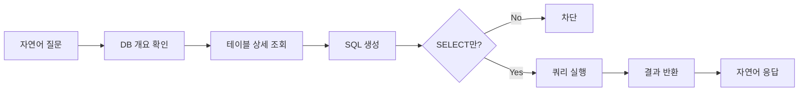
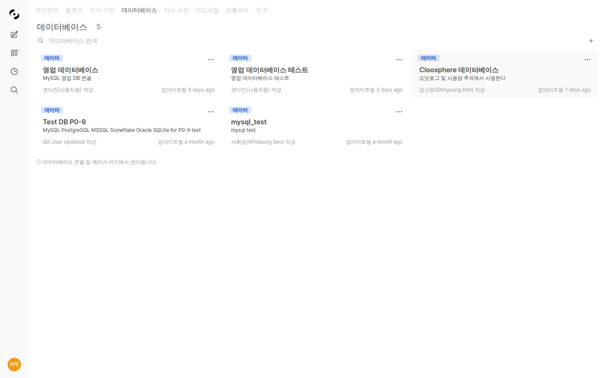
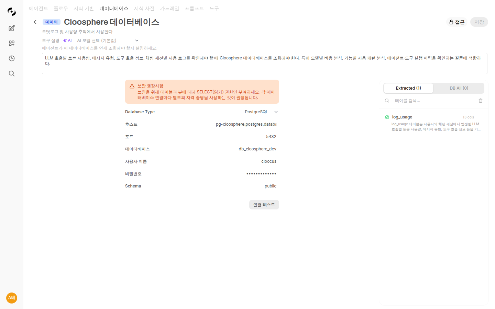

# 데이터베이스 연결 (DbSphere)

> 자연어로 데이터베이스를 조회하세요. SQL을 몰라도 "이번 달 매출 알려줘"라고 물으면 AI가 데이터를 찾아 답변합니다. DbSphere로 데이터 기반 의사결정을 더 빠르게 할 수 있습니다.



---

## DbSphere란?

DbSphere는 자연어를 SQL로 변환하여 데이터베이스를 조회하는 기능입니다.



### 주요 특징

| 특징 | 설명 |
|------|------|
| **자연어 쿼리** | SQL 없이 한국어로 데이터 조회 |
| **다중 DB 지원** | MySQL, PostgreSQL, MSSQL, Oracle 등 |
| **안전한 조회** | 읽기 전용 쿼리만 실행 |
| **스키마 인식** | 테이블 구조를 이해하고 적절한 쿼리 생성 |
| **단계적 컨텍스트 조회** | 필요한 정보만 선별적으로 가져와 토큰 절약 |

### AI 질의 흐름

DbSphere는 3단계로 정보를 수집하여 효율적으로 동작합니다:

1. **DB 개요 확인** — 연결된 데이터베이스에 어떤 테이블이 있는지 전체 목록을 파악합니다
2. **테이블 상세 조회** — 질문과 관련된 테이블의 컬럼 구조, 비즈니스 문서, SQL 예시를 가져옵니다
3. **SQL 실행** — 수집한 정보를 바탕으로 정확한 SQL을 생성하고 실행합니다

> 💡 필요한 테이블 정보만 단계적으로 가져오므로, 테이블이 많은 대규모 데이터베이스에서도 토큰 사용량이 최소화됩니다.

### 활용 예시

```
사용자: 이번 달 가장 많이 팔린 상품 TOP 5 알려줘

AI: 이번 달 판매량 TOP 5 상품입니다:

| 순위 | 상품명 | 판매량 | 매출액 |
|------|--------|--------|--------|
| 1 | 무선 이어폰 Pro | 1,523 | ₩228,450,000 |
| 2 | 스마트워치 X | 1,287 | ₩193,050,000 |
| 3 | 블루투스 스피커 | 1,156 | ₩92,480,000 |
| 4 | 노이즈캔슬링 헤드폰 | 892 | ₩178,400,000 |
| 5 | 보조배터리 20000mAh | 834 | ₩33,360,000 |

총 판매량: 5,692개 | 총 매출: ₩725,740,000
```

---

## 지원 데이터베이스

<!-- 스크린샷: 지원 DB 로고들
     파일명: images/dbsphere-supported-dbs.png
-->

| 데이터베이스 | 버전 | 특징 |
|-------------|------|------|
| **MySQL** | 5.7+ | 가장 널리 사용되는 RDBMS |
| **PostgreSQL** | 10+ | 고급 기능, JSON 지원 |
| **Microsoft SQL Server** | 2016+ | 엔터프라이즈 환경 |
| **Oracle** | 12c+ | 대규모 엔터프라이즈 |
| **SQLite** | 3.x | 경량 데이터베이스 |
| **Snowflake** | - | 클라우드 데이터 웨어하우스 |
| **Databricks** | - | 레이크하우스 플랫폼 |
| **Google BigQuery** | - | 서버리스 클라우드 데이터 웨어하우스 |

---

## 데이터베이스 연결

### 1단계: 새 연결 생성

**워크스페이스 > 데이터베이스 > "+ 새 연결"** 클릭

<!-- 스크린샷: 데이터베이스 연결 생성 폼
     파일명: images/dbsphere-create.png
-->

### 2단계: 연결 정보 입력

| 필드 | 설명 | 예시 |
|------|------|------|
| **이름** | 연결 표시 이름 | "매출 분석 DB" |
| **설명** | 데이터베이스 용도 | "영업팀 매출 데이터" |
| **DB 유형** | 데이터베이스 종류 | MySQL |

### 3단계: 접속 정보 입력



| 필드 | 설명 |
|------|------|
| **호스트** | DB 서버 주소 |
| **포트** | 접속 포트 |
| **데이터베이스명** | 접속할 DB 이름 |
| **사용자명** | DB 계정 |
| **비밀번호** | DB 비밀번호 |

### 3단계-Alt: BigQuery 접속 정보

BigQuery는 호스트/포트/비밀번호 대신 Google Cloud 서비스 계정 키로 인증합니다. DB 유형에서 **BigQuery** 를 선택하면 다음 필드가 표시됩니다.

| 필드 | 설명 |
|------|------|
| **프로젝트 ID** | BigQuery 데이터셋이 속한 Google Cloud 프로젝트 ID (예: `my-gcp-project`) |
| **데이터셋 ID** | 질의 대상 데이터셋 (예: `analytics`). 비워두면 서비스 계정 JSON의 기본값 사용 |
| **서비스 계정 JSON** | Google Cloud IAM에서 발급한 서비스 계정 키(JSON). 값을 직접 붙여넣거나 `.json` 키 파일을 업로드 |

**서비스 계정 준비:**

1. Google Cloud Console > IAM 및 관리자 > 서비스 계정에서 AI 전용 계정 생성
2. 필요한 데이터셋에 **BigQuery 데이터 뷰어(BigQuery Data Viewer)** + **BigQuery 작업 사용자(BigQuery Job User)** 역할 부여
3. **키 추가 > 새 키 만들기 > JSON** 으로 키 파일 다운로드
4. Cloosphere 폼에 JSON 내용을 붙여넣거나 **"JSON 키 파일 업로드"** 로 첨부

> **팁:** BigQuery는 파티션·클러스터링·데이터셋 위치를 스캔 비용·성능에 반영합니다. AI가 생성한 SQL도 Standard SQL 문법과 파티션 필터를 인식합니다.

### 4단계: 연결 테스트

**"연결 테스트"** 버튼을 클릭하여 연결을 확인합니다.

<!-- 스크린샷: 연결 테스트 성공 화면
     파일명: images/dbsphere-test-success.png
-->

> 💡 연결 테스트 시 DB 접속 가능 여부뿐만 아니라 **스키마 추출 가능 여부**도 함께 체크합니다. 스키마 추출이 불가능한 경우 경고 메시지가 표시되며, 권한 설정을 확인하라는 안내가 제공됩니다.

### 5단계: 테이블 선택

연결 성공 후 AI가 참조할 테이블을 선택합니다.

<!-- 스크린샷: 테이블 선택 화면
     - 테이블 목록 (체크박스)
     - 선택된 테이블 정보 표시
     파일명: images/dbsphere-table-select.png
-->

**선택 기준:**
- AI가 조회해야 할 테이블만 선택
- 민감한 정보가 있는 테이블은 제외
- 관련 테이블은 함께 선택 (JOIN 가능)

### 6단계: 스키마 설명 추가 (선택)

테이블과 컬럼에 대한 설명을 추가하면 AI가 더 정확한 쿼리를 생성합니다.

<!-- 스크린샷: 스키마 설명 입력
     파일명: images/dbsphere-schema-description.png
-->

**예시:**
```
테이블: orders
설명: 주문 내역 테이블
컬럼:
- order_id: 주문 고유 번호
- customer_id: 고객 ID (customers 테이블 참조)
- order_date: 주문 일시
- total_amount: 총 주문 금액 (원)
- status: 주문 상태 (pending/confirmed/shipped/delivered)
```

### 7단계: 도구 설명 설정 (선택)

에이전트가 이 데이터베이스를 언제, 어떻게 활용할지 안내하는 **도구 설명**을 작성합니다.

**AI 자동 생성:** 도구 설명 입력란 옆의 **자동 생성 버튼**을 클릭하면, AI가 연결된 테이블 구조와 컬럼 정보를 분석하여 적절한 도구 설명을 자동으로 작성합니다.

**예시:**
```
이 데이터베이스는 영업팀의 주문·고객·재고 정보를 담고 있습니다.
매출 분석, 고객 조회, 재고 현황 확인 등의 질문에 활용하세요.
주문 테이블(orders)과 고객 테이블(customers)을 JOIN하여 고객별 구매 내역을 조회할 수 있습니다.
```

> **💡 팁:** 도구 설명이 정확할수록 통합 에이전트가 여러 도구 중 적절한 데이터베이스를 선택하는 정확도가 높아집니다.

### 8단계: 접근 권한 설정

<!-- 스크린샷: 접근 권한 설정
     파일명: images/dbsphere-access-control.png
-->

---

## 데이터베이스 조회

### 에이전트에 연결

1. 에이전트 편집 화면으로 이동
2. "데이터베이스" 섹션에서 연결 추가
3. 저장

<!-- 스크린샷: 에이전트에 DB 연결
     파일명: images/dbsphere-agent-connect.png
-->

### 채팅에서 사용

데이터베이스가 연결된 에이전트와 대화합니다.

```
사용자: 지난 분기 대비 이번 분기 매출 성장률은?

AI: 분기별 매출을 분석했습니다:

📊 분기별 매출 비교
| 분기 | 매출액 | 전분기 대비 |
|------|--------|------------|
| 2023 Q4 | ₩12.5억 | - |
| 2024 Q1 | ₩14.2억 | +13.6% |

✅ 이번 분기 매출은 전분기 대비 13.6% 성장했습니다.

주요 성장 요인:
1. 신규 고객 유치 (+23%)
2. 기존 고객 재구매율 상승 (+8%)
3. 평균 주문 금액 증가 (+5%)
```

---

## 질문 예시

### 매출 분석

```
- 이번 달 매출 얼마야?
- 지난주 일별 매출 추이 보여줘
- 매출 TOP 10 고객 알려줘
- 제품 카테고리별 매출 비중은?
```

### 고객 분석

```
- 이번 달 신규 가입 고객 수는?
- VIP 고객 목록 보여줘
- 최근 3개월간 구매하지 않은 고객은?
- 고객 지역별 분포 알려줘
```

### 재고 관리

```
- 재고가 10개 미만인 상품 알려줘
- 이번 주 입고 예정 상품은?
- 재고 회전율이 낮은 상품 TOP 5는?
```

### 인사 관리

```
- 부서별 인원 현황 보여줘
- 이번 달 입사/퇴사자 수는?
- 평균 근속연수는?
```

---

## 데이터 시각화

AI가 데이터를 차트로 시각화할 수 있습니다.

<!-- 스크린샷: 차트가 포함된 응답
     - 막대 그래프, 파이 차트 등
     파일명: images/dbsphere-chart.png
-->

```
사용자: 월별 매출 추이를 차트로 보여줘

AI: [차트 생성]

📈 2024년 월별 매출 추이

[막대 차트 이미지]

주요 인사이트:
- 3월 매출이 전월 대비 25% 급증
- 여름 시즌(6-8월) 평균 15% 매출 상승
- 연간 성장 트렌드 유지 중
```

---

## 멀티 DB Runner

여러 데이터베이스의 스키마를 한 번에 추출하고 관리할 수 있는 기능입니다.

<!-- 스크린샷: 멀티 DB Runner 화면
     파일명: images/dbsphere-multi-db-runner.png
-->

### 전체 DB 스키마 추출

**"멀티 DB Runner"** 를 실행하면 연결된 모든 데이터베이스에서 스키마 정보를 일괄 추출합니다.

- 연결된 전체 DB를 대상으로 테이블 구조, 컬럼 정보, 데이터 타입 등을 자동 수집
- 추출 결과를 한눈에 확인하고, 필요한 테이블만 선택적으로 활성화 가능
- 스키마 변경 사항이 있을 때 재추출하여 최신 상태 유지

> 💡 대규모 환경에서 여러 DB를 운영 중일 때 개별적으로 스키마를 관리할 필요 없이 한 번에 처리할 수 있습니다.

---

## 메모리 관리

DbSphere는 사용자의 질문과 생성된 SQL 패턴을 학습하여 점점 더 정확한 쿼리를 생성합니다. 메모리 관리 UI를 통해 이 학습된 패턴을 직접 확인하고 관리할 수 있습니다.

<!-- 스크린샷: 메모리 관리 UI
     파일명: images/dbsphere-memory-management.png
-->

### 주요 기능

| 기능 | 설명 |
|------|------|
| **메모리 목록 조회** | DbSphere별로 학습된 SQL 패턴 목록을 확인 |
| **메모리 삭제** | 잘못 학습된 패턴이나 불필요한 메모리를 삭제 |
| **메모리 편집** | 학습된 SQL 패턴을 수정하여 정확도 향상 |

### 활용 시나리오

- AI가 반복적으로 잘못된 쿼리를 생성할 때 해당 메모리를 삭제하거나 수정
- 특정 비즈니스 로직에 맞는 SQL 패턴을 직접 추가하여 AI 정확도 향상
- DbSphere를 재설정하고 싶을 때 메모리를 일괄 정리

---

## 차트 타입 셀렉터

데이터 조회 결과를 시각화할 때 원하는 차트 유형을 직접 선택할 수 있습니다.

<!-- 스크린샷: 차트 타입 셀렉터 UI
     파일명: images/dbsphere-chart-type-selector.png
-->

### 지원 차트 유형

| 차트 유형 | 적합한 데이터 |
|-----------|--------------|
| **막대 차트** | 카테고리별 비교 |
| **선 차트** | 시계열 추이 |
| **파이 차트** | 비율/구성 비교 |
| **영역 차트** | 누적 추이 |
| **테이블** | 상세 데이터 조회 |

### 사용 방법

1. AI가 데이터를 조회하여 결과를 반환하면, 결과 영역에 **차트 타입 셀렉터**가 표시됩니다
2. 원하는 차트 유형을 클릭하면 동일한 데이터가 선택한 형태로 즉시 시각화됩니다
3. 차트 유형을 변경해도 데이터를 다시 조회하지 않으므로 빠르게 전환할 수 있습니다

---

## SQL 실행 결과 보기

AI가 생성한 SQL의 실행 결과를 **"결과 보기"** 버튼을 통해 직접 확인할 수 있습니다.

<!-- 스크린샷: SQL 실행 결과 보기 버튼 및 결과 패널
     파일명: images/dbsphere-sql-result-view.png
-->

- AI 응답 내의 SQL 블록에 **"결과 보기"** 버튼이 표시됩니다
- 클릭하면 해당 SQL의 실행 결과가 테이블 형태로 표시됩니다
- AI가 요약한 내용과 원본 데이터를 직접 비교하여 정확성을 검증할 수 있습니다

---

## SQL 쿼리 미리보기

AI가 생성한 SQL 쿼리를 보기 쉽게 포맷팅하여 미리보기로 제공합니다.

<!-- 스크린샷: SQL 쿼리 미리보기 UI
     파일명: images/dbsphere-sql-preview.png
-->

- SQL 구문 하이라이팅으로 쿼리 가독성 향상
- 들여쓰기 및 줄바꿈이 자동 적용된 포맷팅
- 복사 버튼으로 쿼리를 클립보드에 바로 복사 가능

---

## 에이전트 프롬프트 강화

DbSphere의 에이전트는 더 정확하고 안정적인 쿼리 실행을 위해 강화된 프롬프트를 사용합니다.

### SQL 실행 필수화

AI가 SQL을 생성한 후 반드시 실행까지 수행합니다. 이전에는 SQL만 생성하고 실행하지 않는 경우가 있었으나, 이제 생성된 SQL은 자동으로 실행되어 실제 데이터를 기반으로 응답합니다.

### 에러 자동 재시도

SQL 실행 중 오류가 발생하면 AI가 자동으로 원인을 분석하고 수정된 쿼리로 재시도합니다.

- 컬럼명 오류, 테이블 참조 오류 등 일반적인 SQL 에러를 자동 수정
- 최대 재시도 횟수 내에서 반복 시도하여 성공률 향상
- 재시도 과정이 사용자에게 투명하게 표시됩니다

---

## 삭제 시 사용 여부 확인

데이터베이스 연결을 삭제할 때, 해당 연결이 에이전트에서 사용 중인지 자동으로 확인합니다.

<!-- 스크린샷: 삭제 시 에이전트 사용 여부 확인 다이얼로그
     파일명: images/dbsphere-delete-check.png
-->

- **사용 중인 경우**: 해당 연결을 참조하는 에이전트 목록이 표시되며, 삭제가 차단됩니다
- **미사용인 경우**: 삭제 확인 후 정상적으로 삭제됩니다

> 💡 실수로 사용 중인 데이터베이스 연결을 삭제하여 에이전트가 동작하지 않는 상황을 방지합니다.

---

## 보안

### 읽기 전용

DbSphere는 **SELECT 쿼리만** 실행합니다.
- ❌ INSERT, UPDATE, DELETE 불가
- ❌ DROP, ALTER 등 DDL 불가
- ✅ 데이터 조회만 가능

### 자격 증명 보호

- 비밀번호는 암호화 저장
- 연결 정보는 안전하게 관리
- 접근 권한별로 DB 사용 제한

### 감사 로그

모든 DB 조회는 감사 로그에 기록됩니다.

<!-- 스크린샷: DB 조회 감사 로그
     파일명: images/dbsphere-audit-log.png
-->

---

## 베스트 프랙티스

### 데이터베이스 계정 설정

1. **전용 계정 생성**: AI 전용 읽기 계정 사용
2. **최소 권한**: 필요한 테이블만 SELECT 권한 부여
3. **쿼리 제한**: 타임아웃, 결과 행 수 제한

### 테이블 선택

1. **필요한 것만**: 모든 테이블 연결 지양
2. **민감 데이터 제외**: 개인정보, 비밀번호 테이블 제외
3. **관련 테이블 함께**: JOIN이 필요한 테이블은 함께 선택

### 스키마 설명

1. **명확한 설명**: 한국어로 테이블/컬럼 설명
2. **비즈니스 용어**: 기술 용어보다 업무 용어 사용
3. **관계 명시**: 테이블 간 관계 설명

---

## 트러블슈팅

### 연결 실패

| 원인 | 해결 |
|------|------|
| 네트워크 | 방화벽, VPN 확인 |
| 인증 | 계정/비밀번호 확인 |
| 권한 | DB 권한 확인 |

### 쿼리 오류

| 원인 | 해결 |
|------|------|
| 테이블 미선택 | 관련 테이블 추가 |
| 설명 부족 | 스키마 설명 보강 |
| 복잡한 질문 | 질문 단순화 |

### 느린 응답

| 원인 | 해결 |
|------|------|
| 대용량 데이터 | 조건 추가 (날짜 범위 등) |
| 복잡한 쿼리 | 질문 분리 |

---

## FAQ

**Q: 데이터가 변경될 수 있나요?**
> 아니요, DbSphere는 읽기 전용입니다. 데이터 조회만 가능합니다.

**Q: 어떤 DB든 연결할 수 있나요?**
> 지원 목록의 데이터베이스만 연결 가능합니다. 추가 DB 지원이 필요하면 관리자에게 문의하세요.

**Q: 실행된 SQL을 볼 수 있나요?**
> 네, 개발자 모드에서 생성된 SQL을 확인할 수 있습니다.

**Q: 여러 테이블을 JOIN할 수 있나요?**
> 네, 관련 테이블을 모두 선택하고 관계를 설명하면 AI가 적절한 JOIN 쿼리를 생성합니다.

---

## 다음 단계

- 🤖 [에이전트에 DB 연결하기](./agents.md)
- 📖 [용어집으로 비즈니스 용어 정의](./glossary.md)
- 🔧 [외부 API 연결하기](./tools.md)
