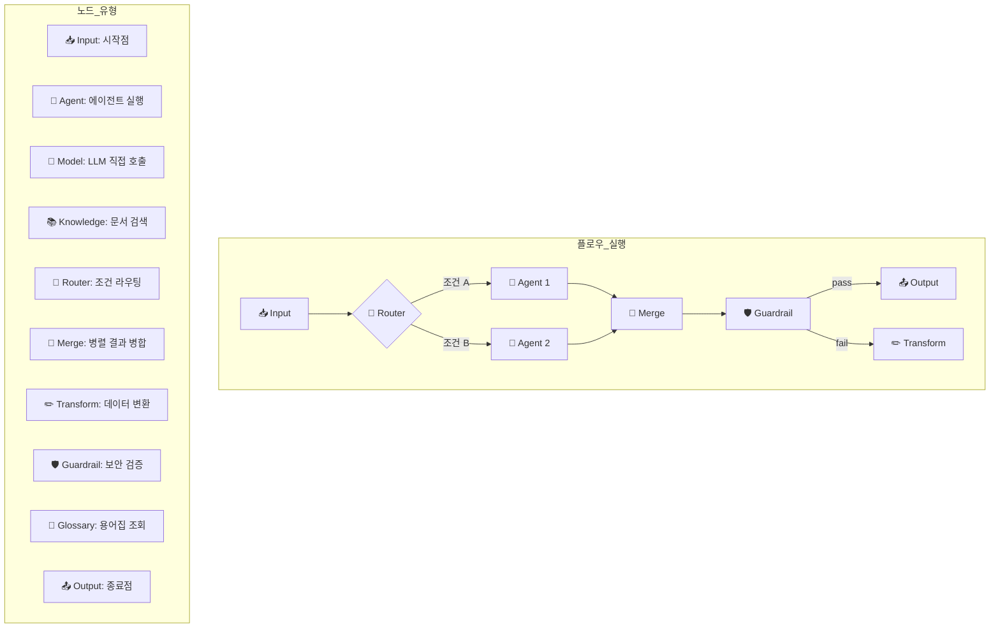
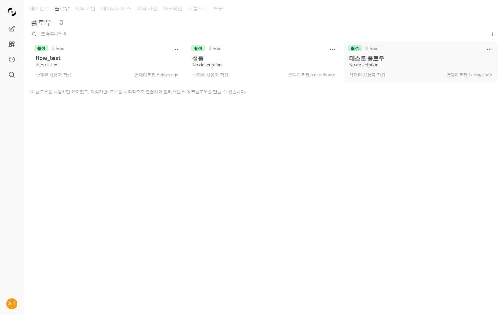
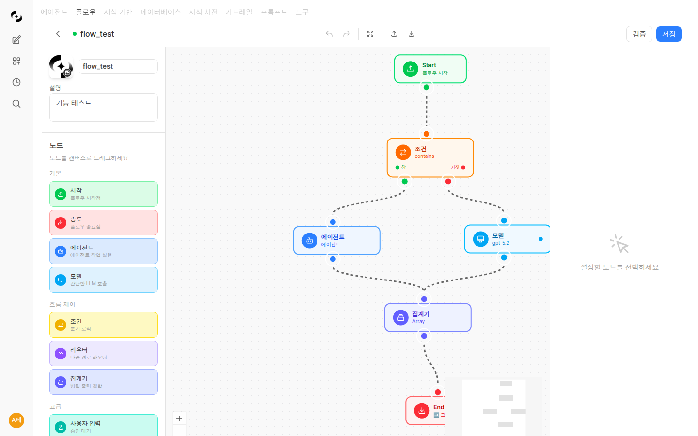

# 플로우 (Flows)

> 플로우는 여러 에이전트와 리소스를 시각적으로 연결하여 복잡한 워크플로우를 자동화하는 기능입니다. 드래그 앤 드롭으로 멀티 에이전트 오케스트레이션을 손쉽게 구성하거나, AI 대화형 빌더를 통해 자연어로 플로우를 자동 생성하세요.



---

## 플로우란?

플로우는 **비주얼 워크플로우 빌더**로, n8n이나 Dify와 유사하게 노드를 연결하여 AI 파이프라인을 구성합니다.

**예시:**
- **문서 분석 플로우**: 입력 → 문서 요약 에이전트 → 핵심 추출 에이전트 → 출력
- **고객 지원 플로우**: 입력 → 의도 분류 → FAQ 에이전트 / 기술 지원 에이전트 → 출력
- **데이터 리포트 플로우**: 입력 → DB 조회 에이전트 → 분석 에이전트 → 리포트 생성 → 출력

### 플로우 vs 단일 에이전트

| 구분 | 단일 에이전트 | 플로우 |
|------|-------------|-------|
| **복잡도** | 단순 질의응답 | 멀티스텝 처리 |
| **연결** | 독립 실행 | 에이전트 간 연결 |
| **분기** | 불가 | 조건부 분기 가능 |
| **재사용** | 개별 호출 | 파이프라인 재사용 |

---

## 플로우 목록

**워크스페이스 > 플로우**에서 모든 플로우를 확인할 수 있습니다.



### 플로우 카드

| 요소 | 설명 |
|------|------|
| **이름** | 플로우 이름 |
| **설명** | 플로우 용도 설명 |
| **노드 수** | 포함된 노드 개수 |
| **상태** | 활성/비활성 |

---

## 플로우 생성

플로우를 생성하는 방법은 두 가지입니다: 수동으로 직접 구성하거나, AI 대화형 빌더를 사용하여 자연어로 자동 생성할 수 있습니다.

### 방법 1: 수동 생성

#### 1단계: 새 플로우 만들기

**워크스페이스 > 플로우 > "+ 새 플로우"** 클릭

<!-- 스크린샷: 플로우 생성 버튼
     파일명: images/flow-create-button.png
-->

#### 2단계: 기본 정보 입력

| 필드 | 설명 | 예시 |
|------|------|------|
| **이름** | 플로우 이름 | "문서 분석 플로우" |
| **설명** | 플로우 용도 | "문서를 요약하고 핵심 내용을 추출합니다" |

#### 3단계: 노드 배치

왼쪽 **노드 팔레트**에서 원하는 노드를 캔버스로 드래그합니다.



#### 4단계: 노드 연결

노드의 **출력 핸들**(오른쪽 점)을 드래그하여 다른 노드의 **입력 핸들**(왼쪽 점)에 연결합니다.

엣지(연결선)를 클릭하면 **삭제 버튼**이 나타나 불필요한 연결을 손쉽게 제거할 수 있습니다.

<!-- 스크린샷: 엣지 선택 시 삭제 UI
     파일명: images/flow-edge-delete.png
-->

#### 5단계: 노드 설정

노드를 클릭하면 오른쪽에 **설정 패널**이 나타납니다.

<!-- 스크린샷: 노드 설정 패널
     파일명: images/flow-node-config.png
-->

#### 6단계: 저장

상단 **저장** 버튼을 클릭하여 플로우를 저장합니다.

### 방법 2: AI 대화형 플로우 빌더

AI 대화형 빌더(FlowBuilderAgent)를 사용하면 자연어 설명만으로 플로우를 자동 생성할 수 있습니다.

#### AI 빌더 사용법

1. 플로우 에디터 하단의 **AI 어시스턴트 패널**을 엽니다
2. **모델 선택 드롭다운**에서 사용할 LLM 모델을 선택합니다
3. 원하는 플로우를 자연어로 설명합니다

<!-- 스크린샷: AI 어시스턴트 패널과 모델 선택 드롭다운
     파일명: images/flow-ai-assistant-panel.png
-->

**입력 예시:**
```
"사용자 질문이 들어오면 먼저 FAQ 지식베이스에서 검색하고,
검색 결과가 충분하면 바로 응답하고,
부족하면 DB에서 추가 조회한 뒤 응답해줘"
```

#### 멀티턴 대화형 빌더

AI 빌더는 **멀티턴 대화**를 지원합니다. 한 번에 완벽한 플로우를 만들 필요 없이, 대화를 이어가며 점진적으로 수정하고 발전시킬 수 있습니다.

- 처음 생성된 플로우에서 노드를 추가하거나 제거 요청
- 조건 분기를 변경하거나 새로운 경로 추가
- 특정 노드의 설정을 대화로 조정

**대화 예시:**
```
사용자: "고객 지원 플로우를 만들어줘"
AI: (기본 플로우 생성)
사용자: "가드레일 노드를 추가해서 민감 정보를 필터링해줘"
AI: (가드레일 노드 추가)
사용자: "가드레일 실패 시 안내 메시지를 보내도록 분기 추가해줘"
AI: (pass/fail 분기 추가)
```

<!-- 스크린샷: 멀티턴 대화로 플로우를 점진적으로 생성하는 모습
     파일명: images/flow-ai-multiturn.png
-->

---

## 노드 타입

### 기본 노드

| 노드 | 아이콘 | 설명 |
|------|--------|------|
| **Input** | 📥 | 플로우 시작점. 사용자 입력을 받습니다 |
| **Output** | 📤 | 플로우 종료점. 최종 결과를 반환합니다 |

### 처리 노드

| 노드 | 아이콘 | 설명 |
|------|--------|------|
| **Agent** | 🤖 | 에이전트를 실행합니다 (KBSphere, DBSphere 포함) |
| **Model** | 🧠 | LLM 모델을 직접 호출합니다 |
| **Knowledge** | 📚 | 지식 베이스에서 문서를 검색합니다 |
| **Tool** | 🔧 | 외부 도구를 실행합니다 |

### 제어 노드

| 노드 | 아이콘 | 설명 |
|------|--------|------|
| **Condition** | 🔀 | 조건에 따라 분기합니다 |
| **Router** | 🔀 | LLM 기반 의미 라우팅으로 다중 경로를 분기합니다 |
| **Merge** | 🔄 | 병렬 실행된 여러 노드의 결과를 하나로 병합합니다 |
| **Transform** | ✏️ | 데이터를 변환합니다 (Jinja2 템플릿) |
| **Guardrail** | 🛡️ | 가드레일을 적용합니다 (pass/fail 분기 지원) |
| **Glossary** | 📖 | 용어집에서 용어를 조회하여 컨텍스트에 추가합니다 |

---

## 노드 상세 설명

### Input 노드

플로우의 시작점입니다. 모든 플로우는 하나의 Input 노드로 시작해야 합니다.

- **입력**: 없음
- **출력**: 사용자 입력 텍스트

### Output 노드

플로우의 종료점입니다. 이전 노드의 결과를 사용자에게 반환합니다.

- **입력**: 텍스트
- **출력**: 없음 (사용자에게 표시)

### Agent 노드

등록된 에이전트를 실행합니다. **향상된 RAG(KBSphere)** 또는 **데이터베이스(DBSphere)** 모드의 에이전트도 지원합니다.

**설정 항목:**

| 항목 | 설명 |
|------|------|
| **에이전트 선택** | 실행할 에이전트 |
| **온도** | 응답 다양성 (0.0 ~ 1.0) |

> **팁**: KBSphere 에이전트를 사용하면 지식 베이스 검색 결과(출처)가 함께 반환됩니다.

### Model 노드

에이전트 없이 LLM 모델을 직접 호출합니다.

**설정 항목:**

| 항목 | 설명 |
|------|------|
| **모델 선택** | 사용할 LLM 모델 |
| **시스템 프롬프트** | 모델에 전달할 지시사항 |
| **온도** | 응답 다양성 |
| **최대 토큰** | 응답 길이 제한 |

### Knowledge 노드

지식 베이스에서 관련 문서를 검색합니다.

**설정 항목:**

| 항목 | 설명 |
|------|------|
| **지식 베이스** | 검색할 지식 베이스 |
| **검색 임계값** | 최소 관련도 점수 |

### Condition 노드

조건에 따라 플로우를 분기합니다.

**설정 항목:**

| 항목 | 설명 |
|------|------|
| **조건 타입** | contains, equals, starts_with 등 |
| **비교 값** | 비교할 텍스트 |

**출력 핸들:**
- **True**: 조건 충족 시
- **False**: 조건 미충족 시

### Router 노드

LLM 기반 의미 라우팅을 수행합니다. Condition 노드가 단순 문자열 비교를 사용하는 반면, Router 노드는 LLM이 입력 내용의 의미를 분석하여 적절한 경로로 라우팅합니다.

**설정 항목:**

| 항목 | 설명 |
|------|------|
| **라우팅 경로** | 분기할 경로 목록과 각 경로의 설명 |
| **모델** | 라우팅 판단에 사용할 LLM 모델 |

**출력 핸들:**
- 설정한 경로 수만큼 출력 핸들이 생성됩니다

**예시:**
```
경로 1: "기술 문의" - 기술적 질문이나 오류 관련 문의
경로 2: "요금 문의" - 가격, 결제, 구독 관련 문의
경로 3: "일반 문의" - 기타 일반적인 문의
```

### Merge 노드

Fan-out 병렬 실행 후 여러 노드의 결과를 하나로 병합합니다. Router나 Condition으로 분기된 경로가 다시 합류할 때 사용합니다.

**설정 항목:**

| 항목 | 설명 |
|------|------|
| **병합 전략** | concat(순차 결합), summarize(요약), custom(커스텀 템플릿) |

> **참고**: Fan-out 패턴에서는 LangGraph의 Send 패턴을 활용하여 여러 노드를 병렬로 실행하고, Merge 노드에서 모든 결과가 도착할 때까지 대기한 뒤 병합합니다.

### Glossary 노드

등록된 용어집에서 관련 용어를 조회하여 후속 노드의 컨텍스트에 추가합니다. 도메인 특화 용어가 중요한 플로우에서 응답 품질을 향상시킵니다.

**설정 항목:**

| 항목 | 설명 |
|------|------|
| **용어집 선택** | 조회할 용어집 |
| **최대 용어 수** | 반환할 최대 용어 개수 |

### Transform 노드

Jinja2 템플릿을 사용하여 데이터를 변환합니다.

**예시 템플릿:**
```jinja2
요약 요청: {{ input }}

위 내용을 3줄로 요약해주세요.
```

**사용 가능 변수:**
- `{{ input }}`: 현재 입력 텍스트
- `{{ documents }}`: 검색된 문서 목록
- `{{ variables }}`: 플로우 변수

### Guardrail 노드 (pass/fail 분기)

가드레일을 적용하여 입력/출력을 검증합니다. V2에서는 **pass/fail 분기**를 지원하여, 검증 결과에 따라 다른 경로로 플로우를 진행할 수 있습니다.

**출력 핸들:**
- **pass**: 가드레일 검증 통과 시
- **fail**: 가드레일 검증 실패 시 (PII 감지, 콘텐츠 필터 위반 등)

**예시:**
```
[Agent 응답] → [Guardrail: PII 검사]
                  ├─ pass → [Output: 정상 응답]
                  └─ fail → [Transform: 민감정보 마스킹] → [Output]
```

---

## Variables 시스템

플로우 전체에서 공유되는 변수를 정의하고 사용할 수 있습니다. Variables를 통해 노드 간 데이터를 전달하거나, 플로우 실행 시 동적으로 값을 설정할 수 있습니다.

### 변수 정의

플로우 에디터 상단의 **Variables** 버튼을 클릭하여 변수를 관리합니다.

<!-- 스크린샷: Variables 관리 패널
     파일명: images/flow-variables-panel.png
-->

| 항목 | 설명 |
|------|------|
| **변수명** | 변수 이름 (영문, 숫자, 밑줄) |
| **기본값** | 변수의 기본값 |
| **설명** | 변수의 용도 설명 |

### 변수 참조

Transform 노드나 시스템 프롬프트에서 `{{ variables.변수명 }}` 형식으로 참조합니다.

```jinja2
고객명: {{ variables.customer_name }}
언어: {{ variables.language }}

{{ input }} 내용을 {{ variables.language }}로 번역해주세요.
```

---

## 플로우 실행

### 채팅에서 실행

1. 새 채팅 시작
2. 모델 선택기에서 **플로우** 선택
3. 메시지 입력 후 전송

<!-- 스크린샷: 모델 선택기에서 플로우 선택
     파일명: images/flow-select-chat.png
-->

### 실행 흐름

```
사용자 입력
    ↓
[Input 노드]
    ↓
[처리 노드들] → 순차/병렬 실행
    ↓
[Output 노드]
    ↓
사용자에게 응답
```

### Fan-out 병렬 실행

여러 노드를 동시에 실행하여 처리 속도를 높일 수 있습니다. LangGraph의 Send 패턴을 활용하여 구현됩니다.

```
                    ┌─→ [Agent: 요약] ────┐
[Input] → [Router] ─┼─→ [Agent: 감성분석] ─┼→ [Merge] → [Output]
                    └─→ [Agent: 키워드] ──┘
```

Fan-out 실행 시 각 병렬 경로는 독립적으로 실행되며, Merge 노드에서 모든 결과를 수집하여 병합합니다.

### 실행 중 상태

플로우 실행 중에는 각 단계의 상태가 표시됩니다:
- **실행 중**: 현재 처리 중인 노드
- **완료**: 처리 완료된 노드
- **대기 중**: 병렬 실행에서 다른 노드 완료를 대기 중
- **출처**: 검색된 문서 출처 (KBSphere 사용 시)

### Human-in-the-Loop 인터랙티브 위자드

특정 노드에서 사용자 확인이나 입력이 필요한 경우, **Human-in-the-Loop** 기능을 사용할 수 있습니다. 플로우 실행이 해당 노드에서 일시 중지되고, 사용자에게 인터랙티브 위자드가 표시됩니다.

**지원 상호작용:**
- **확인/거부**: 에이전트 결과를 사용자가 확인 후 진행
- **선택**: 여러 옵션 중 하나를 사용자가 선택
- **입력**: 추가 정보를 사용자가 직접 입력

<!-- 스크린샷: Human-in-the-Loop 위자드 화면
     파일명: images/flow-human-in-the-loop.png
-->

**예시:**
```
[Input] → [Agent: 주문 처리] → [Human: 주문 확인] → [Agent: 결제] → [Output]
                                    ↑
                              사용자가 주문 내역을
                              확인하고 승인/거부
```

---

## 플로우 실행 트레이스

플로우 실행 과정을 상세히 추적할 수 있는 트레이스 시스템을 제공합니다. 각 노드의 입출력, 실행 시간, 토큰 사용량 등을 확인할 수 있습니다.

### 트레이스 확인

플로우 실행 완료 후 채팅 화면에서 **트레이스 보기** 버튼을 클릭합니다.

<!-- 스크린샷: 플로우 실행 트레이스 화면
     파일명: images/flow-execution-trace.png
-->

### 트레이스 정보

| 항목 | 설명 |
|------|------|
| **노드별 입출력** | 각 노드에 전달된 입력과 생성된 출력 |
| **실행 시간** | 각 노드의 처리 소요 시간 |
| **토큰 사용량** | LLM 호출 시 사용된 토큰 수 |
| **에러 정보** | 실패한 노드의 에러 상세 정보 |

---

## 플로우 예시

### 예시 1: 간단한 요약 플로우

```
[Input] → [Model: GPT-4] → [Output]
              ↑
         시스템 프롬프트:
         "입력된 내용을 3줄로 요약하세요"
```

### 예시 2: 지식 기반 Q&A 플로우

```
[Input] → [Agent: FAQ 에이전트] → [Output]
               ↑
          KBSphere 모드
          FAQ 지식베이스 연결
```

### 예시 3: 조건 분기 플로우

```
                    ┌─ True ─→ [Agent: 기술지원] ─┐
[Input] → [Condition] ──────────────────────────→ [Output]
                    └─ False → [Agent: 일반문의] ─┘

          조건: "오류" 또는 "에러" 포함 여부
```

---

## 에디터 기능

### Undo/Redo

플로우 에디터에서 **Ctrl+Z** (Undo)와 **Ctrl+Shift+Z** (Redo)로 편집 작업을 되돌리거나 재실행할 수 있습니다. LangGraph 체크포인트 기반으로 안정적으로 동작합니다.

### 엣지(연결선) 관리

- 엣지를 **클릭**하면 선택 상태가 되고 **삭제 버튼**이 표시됩니다
- **Delete** 키 또는 삭제 버튼으로 연결을 제거할 수 있습니다
- 엣지를 드래그하여 다른 노드로 재연결할 수 있습니다

### 실행 재시도

노드 실행 실패 시 해당 노드에서 **재시도(Retry)** 버튼이 표시됩니다. 전체 플로우를 다시 실행하지 않고 실패한 노드부터 재실행할 수 있습니다.

---

## 자주 묻는 질문

### Q: 플로우에서 사용할 수 있는 에이전트는?

워크스페이스에 등록된 모든 에이전트를 사용할 수 있습니다. 일반 모드, KBSphere(향상된 RAG), DBSphere(데이터베이스) 모드 모두 지원됩니다.

### Q: 플로우 실행 중 오류가 발생하면?

오류가 발생한 노드에서 멈추고 에러 메시지가 표시됩니다. 노드 설정을 확인하고 다시 시도하세요.

### Q: 플로우의 실행 순서는?

노드 연결 순서대로 실행됩니다. Input 노드에서 시작하여 연결된 노드를 따라 Output 노드까지 진행합니다.

### Q: 하나의 플로우에 여러 에이전트를 연결할 수 있나요?

네, 여러 에이전트를 순차적으로 연결하거나 조건에 따라 분기할 수 있습니다. Fan-out 패턴을 사용하면 여러 에이전트를 병렬로 실행하고 결과를 Merge 노드로 합칠 수도 있습니다.

### Q: AI 빌더로 생성한 플로우를 수동으로 수정할 수 있나요?

네, AI 대화형 빌더로 생성한 플로우는 일반 플로우와 동일합니다. 캔버스에서 노드를 추가/삭제하거나 연결을 변경할 수 있습니다. 이후 AI 빌더에서 추가 대화를 통해 수정을 이어갈 수도 있습니다.

### Q: Router 노드와 Condition 노드의 차이는?

Condition 노드는 contains, equals 등 규칙 기반 문자열 비교로 분기합니다. Router 노드는 LLM이 입력의 의미를 분석하여 분기하므로, 의도 분류처럼 자연어 이해가 필요한 경우에 적합합니다.

### Q: 플로우 실행 트레이스는 어디서 확인하나요?

플로우 실행 완료 후 채팅 화면에서 트레이스 보기 버튼을 통해 확인할 수 있습니다. 관리자는 모니터링 > 트레이스 메뉴에서 전체 실행 기록을 조회할 수도 있습니다.

### Q: Human-in-the-Loop은 어떤 경우에 사용하나요?

결제 승인, 중요 데이터 변경, 민감한 결정 등 사용자 확인이 필요한 단계에서 사용합니다. 해당 노드에서 플로우가 일시 중지되고 사용자에게 확인 위자드가 표시됩니다.

---

## 다음 단계

- [에이전트 생성하기](./agents.md) - 플로우에서 사용할 에이전트 구성
- [지식 베이스 연결](./knowledge.md) - RAG를 위한 문서 업로드
- [가드레일 설정](./guardrails.md) - 안전한 응답을 위한 필터 구성
