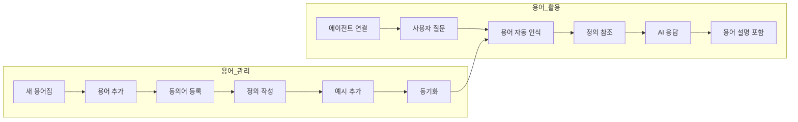
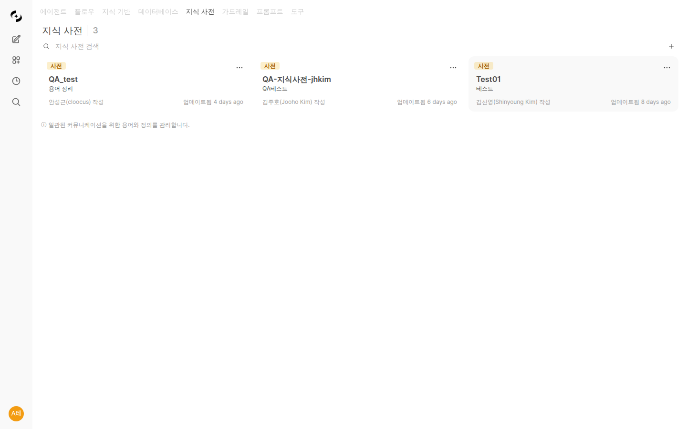
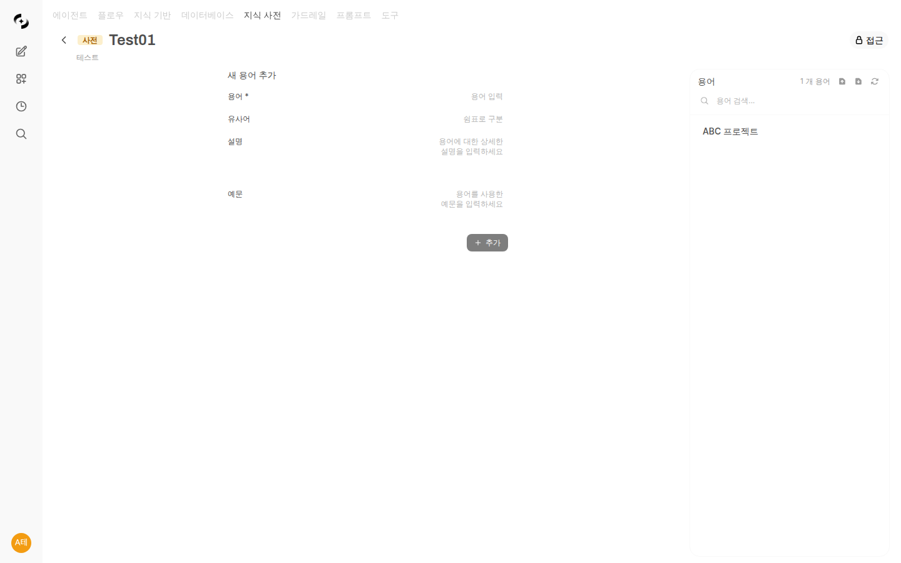
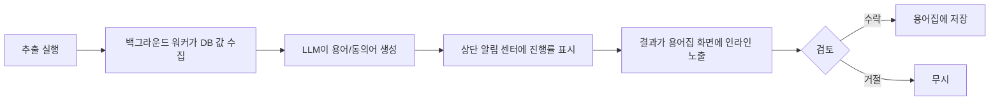

# 용어집 (Glossary)

> 사내 전문 용어, 약어, 업무 규칙을 체계적으로 관리하세요. AI가 회사의 용어를 정확히 이해하고 일관된 답변을 제공합니다.



---

## 용어집이란?

용어집은 조직 내에서 사용하는 전문 용어와 그 정의를 관리하는 시스템입니다.

<!-- 스크린샷: 용어집 개념도
     - 용어 정의 → 동의어 → 예시 → AI가 참조
     파일명: images/glossary-concept.png
-->

### 왜 용어집이 필요한가요?

| 문제 | 용어집 활용 후 |
|------|------------------|
| "MRR이 뭐야?" → AI가 모름 | "MRR은 월간 반복 매출입니다" |
| 부서마다 다른 용어 사용 | 표준화된 용어 제공 |
| 신입사원 온보딩 어려움 | 용어 즉시 검색 가능 |
| AI 답변의 일관성 부족 | 정의된 용어로 일관된 답변 |

### 주요 특징

- 📖 **용어 정의**: 명확한 설명과 예시
- 🔗 **동의어 지원**: 여러 표현을 하나의 용어로 연결
- 🔍 **자동 검색**: AI가 질문 시 관련 용어 자동 참조
- 🏷️ **카테고리**: 도메인별 용어 분류 · 필터 · 개별 관리 (1.0.1)
- ⚙️ **DB 값 자동 추출**: 데이터베이스 디멘션 값에서 용어를 백그라운드로 추출 (1.0.1 개선)
- 📄 **페이지네이션 & 단건 CRUD**: 대량 용어집도 빠르게 탐색하고 한 건씩 편집 (1.0.1)

---

## 용어집 목록

**워크스페이스 > 용어집**에서 모든 용어집을 확인합니다. 1.0.1부터는 **지식 베이스 · 지식 그래프와 동일한 워크스페이스 UI로 통일**되어, 태그 기반 필터 탭과 공유 정보가 다른 리소스와 같은 방식으로 동작합니다. 도구 설명이 비어 있는 항목은 상단에 **경고 배너**로 알려줍니다.



---

## 용어집 생성

### 1단계: 새 용어집 만들기

**"+ 새 용어집"** 버튼을 클릭합니다.

<!-- 스크린샷: 용어집 생성 폼
     파일명: images/glossary-create.png
-->

| 필드 | 설명 | 예시 |
|------|------|------|
| **이름** | 용어집 이름 | "마케팅 용어집" |
| **설명** | 용어집 설명 | "마케팅팀 전문 용어 및 KPI 정의" |

### 2단계: 접근 권한 설정

<!-- 스크린샷: 접근 권한 설정
     파일명: images/glossary-access.png
-->

---

## 용어집 상세 화면

용어집을 클릭하면 상세 페이지로 이동합니다. 상세 화면은 용어 관리에 최적화된 UI로 구성되어 있습니다.

<!-- 스크린샷: 용어집 상세 화면 (리디자인)
     - 용어 목록 패널 + 용어 상세 패널 레이아웃
     파일명: images/glossary-detail-redesign.png
-->

### 레이아웃 구성

| 영역 | 설명 |
|------|------|
| **좌측 용어 목록** | 등록된 용어를 검색하고 탐색할 수 있는 패널 |
| **우측 용어 상세** | 선택한 용어의 정의, 동의어, 예시를 편집하는 영역 |
| **상단 도구 모음** | 용어 추가, 가져오기, 내보내기, 동기화 등 주요 작업 버튼 |

### 주요 개선 사항

- **분할 화면**: 목록과 상세 정보를 동시에 확인하여 빠른 편집 가능
- **즉시 검색**: 용어 목록 상단의 검색창에서 실시간 필터링
- **인라인 편집**: 용어 상세 패널에서 바로 수정 후 저장
- **카테고리 사이드바 (1.0.1)**: 좌측에서 카테고리별로 용어를 필터링하고, 카테고리 자체를 추가 · 이름 변경 · 삭제할 수 있음
- **페이지네이션 (1.0.1)**: 용어 수가 수천 건을 넘어도 목록이 빠르게 로드되도록 서버 페이지네이션 적용
- **인덱스 재생성 메뉴 (1.0.1)**: 검색이 이상할 때 수동으로 인덱스를 다시 만들 수 있는 메뉴 제공

---

## 용어 추가

### 단일 용어 추가

용어집 상세 페이지에서 **"+ 용어 추가"** 클릭



| 필드 | 설명 | 예시 |
|------|------|------|
| **용어** | 정의할 용어 | MRR |
| **동의어** | 다른 표현들 | 월간반복매출, Monthly Recurring Revenue |
| **정의** | 용어 설명 | 매월 반복적으로 발생하는 구독 수익 |
| **예시** | 사용 예시 | "이번 달 MRR은 10억원입니다" |

### 용어 정보 작성 팁

**좋은 정의 예시:**

```markdown
## MRR (Monthly Recurring Revenue)

### 정의
매월 반복적으로 발생하는 구독 기반 수익을 의미합니다.
신규 계약, 업그레이드, 다운그레이드, 해지를 반영한 순수 반복 매출입니다.

### 계산 방법
MRR = (월 구독료 × 활성 구독자 수)

### 관련 지표
- ARR (연간 반복 매출) = MRR × 12
- Net MRR = 신규 MRR + 확장 MRR - 축소 MRR - 해지 MRR

### 예시
- "이번 달 MRR은 전월 대비 5% 성장했습니다"
- "신규 고객 유치로 MRR이 2억 증가했습니다"
```

### 대량 가져오기

JSON 파일로 여러 용어를 한 번에 가져올 수 있습니다.

<!-- 스크린샷: 가져오기 버튼 및 파일 형식 안내
     파일명: images/glossary-import.png
-->

**JSON 형식:**
```json
[
  {
    "term": "MRR",
    "synonyms": ["월간반복매출", "Monthly Recurring Revenue"],
    "definition": "매월 반복적으로 발생하는 구독 수익",
    "example": "이번 달 MRR은 10억원입니다"
  },
  {
    "term": "CAC",
    "synonyms": ["고객획득비용", "Customer Acquisition Cost"],
    "definition": "신규 고객 한 명을 획득하는 데 드는 비용",
    "example": "마케팅 최적화로 CAC를 20% 절감했습니다"
  }
]
```

---

## 용어 관리

### 용어 목록 보기

<!-- 스크린샷: 용어 목록 (검색, 필터 포함)
     파일명: images/glossary-terms-list.png
-->

- **검색**: 용어명, 정의 내용으로 검색
- **정렬**: 이름순, 최근 수정순
- **필터**: 카테고리별 필터링

### 용어 편집

용어를 클릭하여 내용을 수정합니다. 1.0.1부터는 단일 항목의 **즉시 추가 / 수정 / 삭제(단건 CRUD)**가 가능하여, 전체 동기화를 기다리지 않고 필요한 용어만 빠르게 정비할 수 있습니다.

### 용어 삭제

용어 목록에서 삭제 버튼 클릭

> **주의:** 용어집을 삭제할 때, 해당 용어집이 에이전트에 연결되어 있는 경우 삭제 확인 대화상자에서 연결된 에이전트 목록이 표시됩니다. 에이전트에 연결된 용어집을 삭제하면 해당 에이전트의 용어 참조 기능에 영향을 줄 수 있으므로, 삭제 전 연결 상태를 반드시 확인하세요.

<!-- 스크린샷: 용어집 삭제 시 에이전트 사용 여부 확인 대화상자
     - 연결된 에이전트 목록 표시
     파일명: images/glossary-delete-agent-check.png
-->

### 내보내기

전체 용어를 JSON 파일로 내보낼 수 있습니다.

<!-- 스크린샷: 내보내기 버튼
     파일명: images/glossary-export.png
-->

### 동기화

용어 변경 후 **"동기화"** 버튼을 클릭하여 검색 엔진에 반영합니다.

<!-- 스크린샷: 동기화 버튼
     파일명: images/glossary-sync.png
-->

### 인덱스 재생성 (1.0.1)

동기화 후에도 검색 결과가 이상할 때는 상단 메뉴의 **"인덱스 재생성"**으로 검색 인덱스를 수동으로 다시 구성할 수 있습니다. 임베딩 모델을 교체했거나 대량 용어를 정리한 뒤에 유용합니다.

---

## 카테고리 관리 (1.0.1)

용어집 내부에 **카테고리**를 만들어 용어를 의미 단위로 묶어 관리할 수 있습니다.

- **카테고리 생성 / 이름 변경 / 삭제** — 좌측 카테고리 사이드바에서 관리
- **카테고리 필터** — 특정 카테고리의 용어만 골라 조회 · 편집
- **카테고리별 메타데이터** — 카테고리마다 추출 출처(DbSphere · 테이블 · 컬럼)와 커스텀 추출 지시를 따로 저장
- **"카테고리 없음" 그룹** — 분류되지 않은 용어도 별도 그룹으로 구분되어 노출

---

## DB 값에서 용어 자동 추출 (1.0.1 개선)

데이터베이스의 디멘션 컬럼 값에서 용어 후보를 뽑아 용어집에 채워 넣을 수 있습니다. 1.0.1에서는 이 과정이 **백그라운드 작업**으로 전면 전환되었습니다.

### 흐름



### 주요 특징

- **백그라운드 파이프라인**: Redis 큐 기반으로 분리되어, 추출이 오래 걸려도 메인 서비스가 멈추지 않습니다.
- **인라인 검토**: 추출 결과는 용어 목록 화면에 바로 표시되어, 별도 모달 없이 수락 · 수정 · 거절할 수 있습니다.
- **실시간 진행률**: 추출 진행 상황이 상단 알림 센터에 표시되고, 완료 시 알림이 옵니다.
- **동의어 품질 향상**: LLM이 DB 값을 보고 생성하는 동의어의 정확도가 개선되어, 유사 표현이 더 잘 매핑됩니다.

### 항목별 커스텀 추출 지시사항

카테고리 단위로 **LLM에 전달할 추출 지시**를 따로 설정할 수 있습니다.

- "이 카테고리는 판례 중심 정의로 작성" 같은 맞춤 프롬프트를 카테고리별로 저장
- 카테고리마다 어조 · 출처 우선순위 · 금칙어 등을 다르게 지정 가능
- 카테고리를 바꿔가며 반복 추출할 때마다 카테고리의 지시가 자동 적용

### 추출 소스 선택

추출 시 어느 부분에서 값을 가져올지 선택할 수 있습니다.

| 옵션 | 설명 |
|------|------|
| **제목만** | 원본 텍스트의 제목 · 헤더만 사용 |
| **본문 전체** | 전체 내용을 대상으로 추출 |
| **앞 N자** | 앞부분 N자만 사용 (긴 본문의 요약성 도입부 활용) |
| **뒤 N자** | 뒷부분 N자만 사용 (결론 · 요약 구간 활용) |

문서 구조에 따라 적절한 위치에서 용어를 뽑도록 조절할 수 있습니다.

---

## 거버넌스 UX (1.0.2)

용어집 카드와 목록에 **소유 / 공유 범위 / 편집 권한** 정보가 시각적으로 표시되어, 어떤 용어집이 누구의 자산인지 한눈에 파악할 수 있습니다. 권한 모델은 이미 `access_control` (read / write 2단계)로 표현되며, 1.0.2에서는 **UX 갭만** 메꿉니다.

<!-- 스크린샷: 용어집 목록 카드의 scope 라벨 / Owner 뱃지 / Editable 뱃지 + 상단 필터 칩
     파일명: images/glossary-governance-cards.png
-->

### 카드의 거버넌스 메타

| 표시 | 의미 |
|------|------|
| **scope 라벨** | "전사 표준" / "내 그룹" / "Shared" 등 — 이 용어집의 공유 범위를 한 단어로 |
| **Owner 뱃지** | 본인이 만든 용어집에 표시 |
| **Editable 뱃지** | 본인이 admin이거나 owner이거나 write 공유자일 때 표시 |

> 보안: 사용자가 멤버가 아닌 그룹의 이름은 노출되지 않고 "Shared"로 마스킹됩니다.

### 상단 필터 칩

용어집 목록 상단에 다음 필터 칩이 추가되었습니다.

| 칩 | 보이는 항목 |
|----|------------|
| **전체** | 접근 가능한 모든 용어집 |
| **전사 표준 (Company-wide)** | 회사 전체에 공개된 용어집 |
| **내 그룹 (My Group)** | 내가 속한 그룹과 공유된 용어집 |
| **내 항목 (My)** | 내가 만든 용어집 |

### read 공유자 detail 진입 허용 + Copy 버튼

1.0.2부터 **read 권한만 있는 공유자도 용어집 상세 페이지에 진입**할 수 있습니다 (편집·삭제·추출 버튼은 비활성화). 그리고 상세 페이지 헤더에 **"범위에 복사 (Copy to scope)"** 버튼이 추가되어, 다른 그룹/스코프로 용어집을 복제할 수 있습니다.

<!-- 스크린샷: 용어집 상세 헤더의 "범위에 복사" 버튼 + CopyGlossaryModal
     파일명: images/glossary-copy-modal.png
-->

| 항목 | 정책 |
|------|------|
| **누가 Copy 할 수 있나** | admin / owner / write 공유자 (read 공유자는 차단) |
| **대상 그룹 검증** | 본인이 멤버인 그룹으로만 복사 가능 (admin 예외) |
| **복사 결과** | entry id 재발급 + `meta.copied_from` 기록 + 검색 인덱스 자동 재생성 |

> 🛡️ read 공유자는 detail 페이지에서 내용을 읽고 자기 그룹으로 Copy 한 뒤 자유롭게 편집할 수 있어, 권한 충돌 없이 개인화된 사본을 만들 수 있습니다.

---

## 용어집 활용

### 에이전트에 연결

1. 에이전트 편집 화면으로 이동
2. "용어집" 섹션에서 연결할 사전 선택
3. 저장

<!-- 스크린샷: 에이전트에 용어집 연결
     파일명: images/glossary-agent-connect.png
-->

### 지식 그래프로 단일 sync (1.0.1)

용어집 상세 화면에서 **지식 그래프로 바로 sync**할 수 있습니다.

- **단일 용어집 sync** — 전체 KG 동기화를 기다리지 않고 이 용어집만 KG에 반영
- **참조 DB 스키마 자동 동반 추출** — 카테고리에 연결된 DbSphere · 테이블 · 컬럼 정보도 함께 KG로 끌어오므로, 용어와 컬럼이 자동으로 매핑됨
- **토스트 진행률** — sync 진행 상황이 알림으로 표시되며, 노드 수가 많을 때는 페이지 단위로 처리되어 안정적

### 채팅에서 사용

용어집이 연결된 에이전트와 대화하면, AI가 자동으로 관련 용어를 참조합니다.

**예시 대화:**

```
사용자: MRR이 뭐야?

AI: MRR(Monthly Recurring Revenue)은 월간 반복 매출을 의미합니다.

📖 정의
매월 반복적으로 발생하는 구독 기반 수익입니다.
신규 계약, 업그레이드, 다운그레이드, 해지를 반영한 순수 반복 매출입니다.

📊 계산 방법
MRR = 월 구독료 × 활성 구독자 수

🔗 관련 지표
- ARR (연간 반복 매출) = MRR × 12
- Net MRR Growth: MRR 순성장률

💡 예시
"이번 달 MRR은 전월 대비 5% 성장했습니다"

[출처: 마케팅 용어집]
```

### 자동 용어 인식

AI가 대화 중 용어를 자동으로 인식하고 정의를 참조합니다.

```
사용자: CAC 대비 LTV 비율이 어느 정도여야 건강한 거야?

AI: 일반적으로 LTV/CAC 비율은 3:1 이상이 건강한 수준으로 간주됩니다.

📖 용어 설명
- **CAC (Customer Acquisition Cost)**: 고객 획득 비용
- **LTV (Customer Lifetime Value)**: 고객 생애 가치

📊 권장 비율
| 비율 | 상태 |
|------|------|
| < 1:1 | 위험 (비용 > 수익) |
| 1:1 ~ 3:1 | 개선 필요 |
| 3:1 이상 | 건강함 |
| 5:1 이상 | 매우 우수 |

💡 주의사항
비율이 너무 높으면 (예: 10:1) 성장 기회를 놓치고 있을 수 있습니다.
마케팅 투자를 늘려 더 빠른 성장을 고려해보세요.
```

---

## 용어집 예시

### 마케팅 용어집

| 용어 | 동의어 | 정의 |
|------|--------|------|
| MRR | 월간반복매출 | 월간 반복 수익 |
| CAC | 고객획득비용 | 신규 고객 획득 비용 |
| LTV | 고객생애가치, CLV | 고객이 평생 가져다주는 가치 |
| ARPU | 인당매출 | 유저당 평균 매출 |
| Churn Rate | 이탈률 | 고객 이탈 비율 |
| NPS | 순추천지수 | 고객 추천 의향 지표 |

### IT 용어집

| 용어 | 동의어 | 정의 |
|------|--------|------|
| API | 에이피아이 | 애플리케이션 프로그래밍 인터페이스 |
| CI/CD | 시아이시디 | 지속적 통합/배포 |
| SLA | 서비스수준협약 | 서비스 품질 보장 계약 |
| MSA | 마이크로서비스 | 마이크로서비스 아키텍처 |
| K8s | 쿠버네티스 | 컨테이너 오케스트레이션 플랫폼 |

### 인사 용어집

| 용어 | 동의어 | 정의 |
|------|--------|------|
| OKR | 오케이알 | 목표 및 핵심 결과 지표 |
| KPI | 케이피아이 | 핵심 성과 지표 |
| 1:1 | 원온원 | 상사와의 정기 면담 |
| PIP | 피아이피 | 성과 개선 프로그램 |
| 연봉 | 연간급여, 기본급 | 연간 총 급여 |

### 재무 용어집

| 용어 | 동의어 | 정의 |
|------|--------|------|
| EBITDA | 에비타 | 이자, 세금, 감가상각 전 이익 |
| ROI | 투자수익률 | 투자 대비 수익 비율 |
| P&L | 손익계산서 | 수익과 비용 명세서 |
| CAPEX | 자본지출 | 자본적 지출 |
| OPEX | 운영비용 | 운영 비용 |

---

## 베스트 프랙티스

### 용어 정의 작성

1. **간결하게**: 1-2문장으로 핵심 설명
2. **예시 포함**: 실제 사용 예시 추가
3. **관련 용어 연결**: 연관 개념 함께 설명
4. **최신 유지**: 정의가 바뀌면 업데이트

### 동의어 관리

- 자주 사용되는 다양한 표현 등록
- 영어/한글 표기 모두 포함
- 약어와 전체 명칭 모두 등록

### 용어집 구성

- **도메인별 분리**: 마케팅, IT, 재무 등
- **접근 권한 설정**: 부서별 필요한 사전만 공개
- **정기 검토**: 분기별 용어 업데이트

---

## FAQ

**Q: 용어집 없이 AI가 용어를 이해할 수 있나요?**
> 일반적인 용어는 이해하지만, 회사 고유의 용어나 최신 트렌드 용어는 정확히 모를 수 있습니다.

**Q: 여러 용어집을 하나의 에이전트에 연결할 수 있나요?**
> 네, 여러 용어집을 연결할 수 있습니다.

**Q: 동의어는 몇 개까지 등록할 수 있나요?**
> 제한이 없습니다. 다양한 표현을 등록할수록 AI가 더 잘 이해합니다.

**Q: 지식베이스와 용어집의 차이는?**
> - **지식베이스**: 문서 전체 내용 저장 및 검색
> - **용어집**: 개별 용어와 정의만 저장, 빠른 참조용

---

## 다음 단계

- 🤖 [에이전트에 용어집 연결하기](./agents.md)
- 📚 [지식베이스로 문서 연결하기](./knowledge.md)
- 🗄️ [데이터베이스 연결하기](./database.md)
