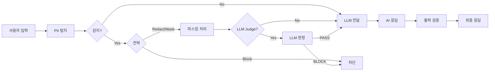
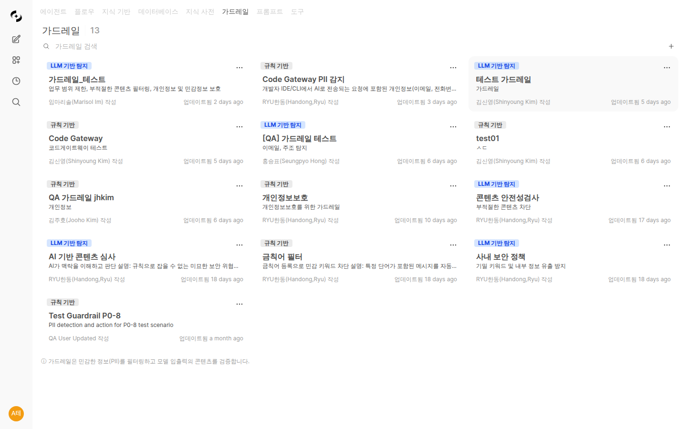
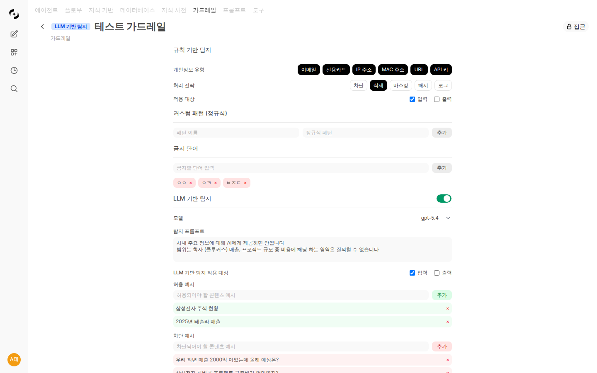
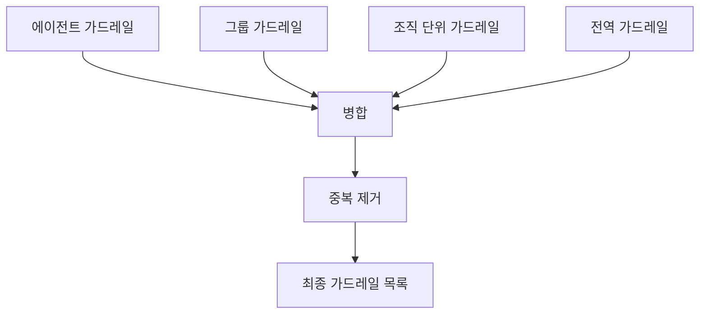

# 가드레일 (Guardrails)

> 가드레일은 AI 응답의 안전성과 보안을 보장하는 보호 장치입니다. 민감한 정보 유출을 방지하고, 부적절한 콘텐츠를 필터링하여 기업 환경에서 AI를 안전하게 사용할 수 있도록 합니다.



---

## 가드레일이란?

가드레일은 AI와 사용자 간의 대화에서 **입력과 출력을 검증**하는 보안 계층입니다.

<!-- 스크린샷: 가드레일 개념도
     - 사용자 입력 → 가드레일 검증 → LLM → 가드레일 검증 → 응답
     파일명: images/guardrail-concept.png
-->

### 주요 기능

| 기능 | 설명 |
|------|------|
| **PII 탐지** | 이메일, 신용카드, IP 주소 등 개인정보 감지 |
| **커스텀 패턴** | 정규식으로 사용자 정의 패턴 탐지 |
| **금지 단어** | 특정 단어/문구 필터링 |
| **LLM 기반 탐지** | AI를 활용한 의미 기반 콘텐츠 검증 |

### 사용 사례

- **개인정보 보호**: 고객 이메일, 전화번호 등이 AI에 노출되지 않도록 방지
- **보안 강화**: API 키, 비밀번호 등 민감한 정보 탐지
- **콘텐츠 필터링**: 부적절한 표현이나 금지된 주제 차단
- **규정 준수**: 산업별 규정(GDPR, PIPA 등)에 따른 데이터 처리

---

## 가드레일 목록

**워크스페이스 > 가드레일**에서 모든 가드레일을 확인할 수 있습니다.



### 가드레일 카드

| 요소 | 설명 |
|------|------|
| **이름** | 가드레일 식별 이름 |
| **설명** | 가드레일 용도 설명 |
| **LLM 배지** | LLM 기반 탐지 활성화 여부 |
| **생성일** | 가드레일 생성 날짜 |

---

## 가드레일 생성

### 1단계: 기본 정보

**워크스페이스 > 가드레일 > "+ 새 가드레일"** 클릭

<!-- 스크린샷: 가드레일 생성 화면
     파일명: images/guardrail-create.png
-->

| 필드 | 설명 | 예시 |
|------|------|------|
| **이름** | 가드레일 이름 | "고객정보 보호" |
| **설명** | 용도 설명 | "고객 개인정보 유출 방지" |
| **공개 범위** | 접근 권한 설정 | 비공개/팀 공유 |

---

## 규칙 기반 탐지

정규식 패턴을 사용하여 민감한 정보를 탐지합니다.

### PII 유형 선택

미리 정의된 개인정보 유형을 선택합니다.

| PII 유형 | 설명 | 예시 |
|----------|------|------|
| **이메일** | 이메일 주소 탐지 | user@example.com |
| **신용카드** | 신용카드 번호 탐지 (Luhn 검증) | 1234-5678-9012-3456 |
| **IP 주소** | IPv4 주소 탐지 | 192.168.1.1 |
| **MAC 주소** | MAC 주소 탐지 | 00:1A:2B:3C:4D:5E |
| **URL** | 웹 주소 탐지 | https://example.com |
| **API 키** | API 키 패턴 탐지 | sk-xxxxxxxx |

### 처리 전략

민감한 정보가 탐지되었을 때 어떻게 처리할지 선택합니다.

| 전략 | 설명 | 결과 예시 |
|------|------|----------|
| **차단 (Block)** | 메시지 전체를 차단하고 에러 표시 | "민감한 정보가 감지되어 처리할 수 없습니다" |
| **삭제 (Redact)** | 민감 정보를 라벨로 대체 | "연락처: [REDACTED_EMAIL]" |
| **마스킹 (Mask)** | 일부 문자만 표시 | "j***@***.com", "****-****-****-1234" |
| **해시 (Hash)** | 해시값으로 변환 | "연락처: a1b2c3d4e5..." |
| **로그만 기록 (Log Only)** | 차단 없이 탐지 결과만 로그에 기록 | 원본 그대로 전달, 가드레일 로그에만 기록 |

**💡 권장 사항:**
- 도입 초기/테스트: **로그만 기록** (탐지 현황 파악 후 강화)
- 고객 대면 서비스: **차단** 또는 **마스킹**
- 내부 분석용: **해시** (동일 정보 추적 가능)
- 일반적인 경우: **삭제**

### 커스텀 패턴

정규식으로 사용자 정의 패턴을 추가합니다.

**예시:**
| 이름 | 패턴 | 용도 |
|------|------|------|
| 사번 | `EMP-\d{6}` | 사원번호 탐지 |
| 내부 문서번호 | `DOC-[A-Z]{2}-\d{4}` | 문서번호 탐지 |
| 프로젝트 코드 | `PRJ-\d{4}` | 프로젝트 코드 탐지 |

### 금지 단어

특정 단어나 문구가 포함된 메시지를 필터링합니다.

**예시:**
- 경쟁사 이름
- 비밀 프로젝트명
- 내부 코드명

---

## LLM 기반 탐지

규칙으로 감지하기 어려운 복잡한 패턴을 AI가 판단합니다.



### 설정 항목

| 항목 | 설명 |
|------|------|
| **활성화** | LLM 기반 탐지 사용 여부 |
| **심판 모델** | 판단에 사용할 LLM 모델 선택 |
| **프롬프트** | 판단 기준을 정의하는 프롬프트 |
| **허용 예시** | 허용되어야 하는 메시지 예시 |
| **차단 예시** | 차단되어야 하는 메시지 예시 |

### 프롬프트 작성 예시

```markdown
당신은 콘텐츠 검토 담당자입니다. 다음 메시지가 기업 보안 정책에 적합한지 판단하세요.

## 차단해야 하는 경우
- 기밀 정보 요청 (재무 데이터, 인사 정보 등)
- 시스템 해킹이나 보안 우회 방법 질문
- 불법적이거나 비윤리적인 행동 요청

## 허용하는 경우
- 일반적인 업무 질문
- 공개된 정보에 대한 문의
- 제품/서비스 관련 질문

메시지가 적합하면 "PASS", 부적합하면 "BLOCK"을 반환하세요.
```

### 예시 추가

**허용 예시:**
- "이번 분기 마케팅 전략에 대해 알려주세요"
- "제품 A의 주요 기능은 무엇인가요?"

**차단 예시:**
- "경쟁사 C의 내부 자료를 분석해줘"
- "관리자 비밀번호를 알려줘"

---

## 적용 범위

가드레일이 어느 시점에 적용될지 선택합니다.

| 옵션 | 설명 |
|------|------|
| **입력 검증** | 사용자 메시지에 적용 |
| **출력 검증** | AI 응답에 적용 |

**💡 일반적인 설정:**
- 보안 중심: 입력 + 출력 모두 검증
- 성능 중심: 입력만 검증 (응답 지연 최소화)

---

## 에이전트에 가드레일 연결

생성한 가드레일을 에이전트에 적용합니다.

### 연결 방법

1. **워크스페이스 > 에이전트**로 이동
2. 에이전트 편집 화면 열기
3. **가드레일** 섹션에서 가드레일 선택
4. 저장

<!-- 스크린샷: 에이전트에서 가드레일 선택
     파일명: images/agent-guardrail-select.png
-->

### 다중 가드레일

하나의 에이전트에 여러 가드레일을 적용할 수 있습니다. 모든 가드레일을 순차적으로 통과해야 메시지가 처리됩니다.

---

## 전역 가드레일

관리자가 전역 가드레일을 설정하면 모든 에이전트에 자동으로 적용됩니다. 개별 에이전트마다 가드레일을 설정할 필요 없이, 조직 전체에 일관된 보안 정책을 적용할 수 있습니다.

### 설정 방법

1. **관리자 > 설정 > 가드레일**로 이동
2. **전역 가드레일 활성화** 토글 ON
3. 적용할 가드레일 선택
4. 저장

<!-- 스크린샷: 전역 가드레일 설정 화면
     - 전역 가드레일 활성화 토글
     - 가드레일 선택 목록
     파일명: images/global-guardrail-settings.png
-->

| 설정 항목 | 설명 |
|----------|------|
| **전역 가드레일 활성화** | `ENABLE_GLOBAL_GUARDRAIL` — 전역 가드레일 사용 여부 |
| **전역 가드레일 목록** | `GLOBAL_GUARDRAIL_IDS` — 전역으로 적용할 가드레일 ID 목록 |

**💡 참고:** 전역 가드레일은 에이전트에 직접 설정한 가드레일과 **병합**되어 적용됩니다. 전역 가드레일이 에이전트 가드레일을 대체하지 않습니다.

---

## 그룹 레벨 가드레일

그룹 설정에서 가드레일을 지정하면 해당 그룹에 속한 모든 채팅에 가드레일이 적용됩니다.

### 설정 방법

1. **관리자 > 그룹**에서 그룹 선택
2. 그룹 설정의 **가드레일** 섹션에서 가드레일 선택
3. 저장

<!-- 스크린샷: 그룹 가드레일 설정 화면
     - 그룹 설정 내 가드레일 선택 드롭다운
     파일명: images/group-guardrail-settings.png
-->

| 설정 항목 | 설명 |
|----------|------|
| **채팅 가드레일** | `group.meta.chat_guardrail_id` — 그룹에 적용할 가드레일 |

---

## 조직 단위별 가드레일

조직 단위(팀)마다 개별적으로 가드레일을 설정할 수 있습니다. 각 조직 단위는 전역 가드레일을 따를지 여부를 선택할 수 있습니다.

### 설정 방법

1. **관리자 > 조직**에서 조직 단위 선택
2. 조직 단위 설정의 **가드레일** 섹션에서 가드레일 선택
3. **전역 설정 따름** 토글 설정 (기본 ON)
4. 저장

<!-- 스크린샷: 조직 단위 가드레일 설정 화면
     - 가드레일 선택 목록
     - "전역 설정 따름" 토글
     파일명: images/org-unit-guardrail-settings.png
-->

| 설정 항목 | 설명 |
|----------|------|
| **가드레일 목록** | `unit.meta.guardrail_ids` — 조직 단위에 적용할 가드레일 |
| **전역 설정 따름** | `unit.meta.follow_global` — ON이면 전역 가드레일도 함께 적용 (기본 ON) |

**💡 참고:** **전역 설정 따름**이 OFF이면 해당 조직 단위에는 전역 가드레일이 적용되지 않고, 조직 단위에 직접 설정한 가드레일만 적용됩니다.

---

## 가드레일 적용 우선순위

여러 레벨에서 가드레일이 설정된 경우, 모든 레벨의 가드레일이 **병합**되어 적용됩니다. 상위 레벨이 하위 레벨을 대체하지 않습니다.



### 적용 순서

| 우선순위 | 레벨 | 설명 |
|---------|------|------|
| 1 | **에이전트** | 에이전트에 직접 설정한 가드레일 (또는 코드 게이트웨이 가드레일) |
| 2 | **그룹** | 그룹 설정의 가드레일 (`group.meta.chat_guardrail_id`) |
| 3 | **조직 단위** | 조직 단위 가드레일 (`unit.meta.guardrail_ids` + `follow_global`) |
| 4 | **전역** | 전역 가드레일 (`ENABLE_GLOBAL_GUARDRAIL` + `GLOBAL_GUARDRAIL_IDS`) |

**핵심 원칙:**
- 모든 레벨의 가드레일이 **병합**됩니다 (덮어쓰기가 아님)
- 중복 가드레일은 자동으로 **제거**됩니다
- 메시지는 병합된 모든 가드레일을 순차적으로 통과해야 합니다

**예시:**

에이전트에 가드레일 A, 그룹에 가드레일 B, 전역에 가드레일 A+C가 설정된 경우:
- 최종 적용: **A, B, C** (중복 A 제거)

---

## 코드 게이트웨이 가드레일

코드 게이트웨이를 통한 API 호출에도 가드레일을 적용할 수 있습니다.

### 출력 가드레일

코드 게이트웨이에서는 입력뿐 아니라 **출력에도 가드레일을 적용**할 수 있습니다. API 응답에 포함된 민감 정보를 탐지하고 처리합니다.

<!-- 스크린샷: 코드 게이트웨이 가드레일 설정 화면
     - 입력 가드레일 선택
     - 출력 가드레일 선택
     파일명: images/code-gateway-guardrail-settings.png
-->

### 전역 가드레일 통합

코드 게이트웨이에서도 전역 가드레일을 따르도록 설정할 수 있습니다.

| 설정 항목 | 설명 |
|----------|------|
| **전역 가드레일 따름** | `CODE_GATEWAY_FOLLOW_GLOBAL_GUARDRAIL` — ON이면 코드 게이트웨이에도 전역 가드레일 적용 |

---

## 차단 메시지 구체화

가드레일이 메시지를 차단할 때, 사용자에게 구체적인 차단 사유를 안내합니다.

### 차단 메시지 예시

| 상황 | 차단 메시지 |
|------|-----------|
| **PII 탐지 (이메일)** | "개인정보(이메일 주소)가 감지되어 메시지가 차단되었습니다." |
| **PII 탐지 (신용카드)** | "개인정보(신용카드 번호)가 감지되어 메시지가 차단되었습니다." |
| **금지 단어** | "금지된 단어가 포함되어 메시지가 차단되었습니다." |
| **LLM Judge** | "보안 정책에 의해 메시지가 차단되었습니다." |
| **커스텀 패턴** | "민감한 정보 패턴이 감지되어 메시지가 차단되었습니다." |

차단 메시지에는 어떤 유형의 정보가 탐지되었는지 포함되어, 사용자가 메시지를 수정할 수 있도록 안내합니다.

---

## 테스트

가드레일 설정 화면에서 바로 테스트할 수 있습니다.

### 테스트 방법

1. 테스트할 텍스트 입력
2. **테스트** 버튼 클릭
3. 결과 확인:
   - 탐지된 항목
   - 처리된 텍스트
   - 차단 여부

<!-- 스크린샷: 가드레일 테스트 결과
     파일명: images/guardrail-test.png
-->

**테스트 예시:**

| 입력 | 전략 | 결과 |
|------|------|------|
| "제 이메일은 test@example.com입니다" | 삭제 | "제 이메일은 [REDACTED_EMAIL]입니다" |
| "카드번호: 1234-5678-9012-3456" | 마스킹 | "카드번호: ****-****-****-3456" |

---

## 파일 업로드 가드레일

지식 베이스나 프로젝트에 업로드되는 파일에 대한 보안 규칙을 설정합니다.

### 설정 위치

**관리자 > 설정 > 문서 > 파일 가드레일** 탭에서 구성합니다.

### 설정 항목

| 항목 | 설명 | 예시 |
|------|------|------|
| **허용 파일 유형** | 업로드를 허용할 파일 확장자 목록 | pdf, docx, xlsx, txt |
| **최대 파일 크기** | 단일 파일 크기 제한 | 50MB |
| **적용 범위** | 가드레일 적용 범위 | 전역 / 특정 범위 |

### 동작 방식

파일 업로드 시 가드레일 규칙에 맞지 않는 파일은 자동으로 차단됩니다:
- 허용되지 않은 확장자의 파일 → 업로드 거부
- 크기 제한 초과 파일 → 업로드 거부
- 차단된 파일은 사유와 함께 에러 메시지가 표시됩니다

> 📖 LibreOffice PDF 변환이 활성화된 경우, 허용 확장자에 포함되어 있으면 PDF로 변환 후 처리됩니다.

---

## 트레이싱 및 모니터링 연동

가드레일 이벤트는 자동으로 트레이싱 시스템과 가드레일 로그에 기록됩니다.

### 트레이싱 자동 기록

가드레일이 민감 정보를 탐지하면 해당 이벤트가 **메시지 트레이스**에 자동으로 기록됩니다.

| 기록 항목 | 설명 |
|----------|------|
| **Run 타입** | Guardrail (GD) |
| **Run 이름** | `guardrail:가드레일이름` 또는 `guardrail:탐지유형` |
| **Inputs** | 탐지 유형, 원본 내용 (일부) |
| **Outputs** | 처리 전략 (차단/삭제/마스킹/해시), 탐지 상세, 가드레일 이름 |

트레이싱에서 가드레일 Run을 확인하면 어떤 시점에서 어떤 정보가 탐지되었는지 처리 흐름 내에서 파악할 수 있습니다.

> 📖 트레이싱 조회 방법은 [트레이싱 문서](../admin/tracing.md)를 참조하세요.

### 가드레일 로그

**관리자 > 모니터링 > 가드레일 로그**에서 모든 가드레일 탐지 이벤트를 전용 로그로 조회할 수 있습니다.

<!-- 스크린샷: 가드레일 로그 화면
     - 필터 영역 (기간, 처리 전략, 탐지 유형)
     - 로그 테이블
     파일명: images/guardrail-logs.png
-->

#### 필터 옵션

| 필터 | 설명 |
|------|------|
| **기간** | 1시간, 6시간, 1일, 7일, 30일, 전체, 사용자 지정 |
| **처리 전략** | 차단, 삭제, 마스킹, 해시 |
| **탐지 유형** | PII, 금지 단어, LLM Judge |
| **사용자 ID** | 특정 사용자 필터 |
| **Chat ID** | 특정 채팅 필터 |

#### 로그 상세

로그 항목을 클릭하면 상세 정보를 확인할 수 있습니다:

| 항목 | 설명 |
|------|------|
| **시간** | 탐지 시각 |
| **사용자** | 이름, 이메일 |
| **처리 전략** | 차단/삭제/마스킹/해시 |
| **탐지 유형** | PII/금지 단어/LLM Judge |
| **탐지 상세** | 구체적인 탐지 항목 (예: email, credit_card) |
| **원본 내용** | 탐지된 원본 텍스트 |
| **처리 후 내용** | 가드레일 적용 후 텍스트 |

로그 상세 모달 하단의 **"트레이스"** 버튼을 클릭하면 해당 메시지의 트레이싱 화면으로 이동하여 전체 처리 맥락을 확인할 수 있습니다.

---

## 모범 사례

### 1. 단계적 적용

처음에는 **로그만 기록(Log Only)** 전략으로 시작하여 어떤 정보가 탐지되는지 파악한 후, **삭제(Redact)** → **차단(Block)**으로 단계적으로 강화합니다.

### 2. 역할별 가드레일

| 역할 | 권장 설정 |
|------|----------|
| 고객 지원 봇 | PII 전체 + 마스킹 |
| 내부 분석 도구 | API 키만 + 해시 |
| HR 어시스턴트 | PII 전체 + LLM Judge + 차단 |

### 3. 정기적인 검토

- 새로운 민감 정보 패턴 추가
- 오탐(false positive) 패턴 제외
- LLM Judge 예시 업데이트

---

## 문제 해결

### 오탐(False Positive)이 많은 경우

1. 커스텀 패턴의 정규식 범위 축소
2. 금지 단어 목록 정제
3. LLM Judge 예시에 허용 케이스 추가

### 탐지 누락이 있는 경우

1. PII 유형 추가
2. 커스텀 패턴 추가
3. LLM Judge 활성화 및 차단 예시 추가

### 응답이 느린 경우

1. LLM Judge 비활성화 (규칙 기반만 사용)
2. 출력 검증 비활성화
3. 더 빠른 Judge 모델 선택
