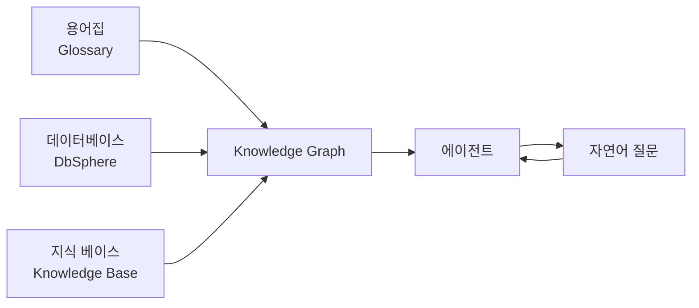
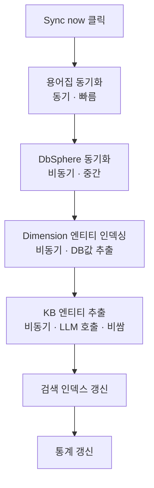
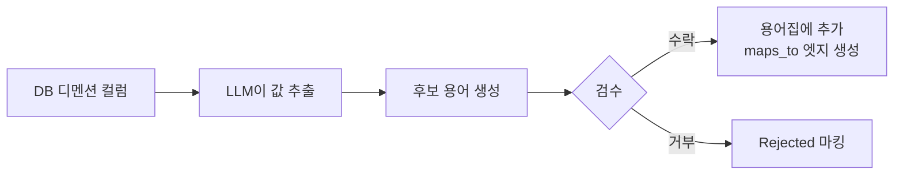

# 지식 그래프 (Knowledge Graph)

> 비즈니스 용어, 데이터베이스 스키마, 문서를 하나의 의미 있는 그래프로 연결하세요. AI 에이전트가 "강남지점 VIP 고객의 월간 매출"처럼 복잡한 질문도 정확히 이해하고 데이터로 답할 수 있습니다.



---

## 지식 그래프란?

지식 그래프(KG)는 **용어집·데이터베이스·지식 베이스**를 하나의 그래프로 연결한 통합 지식 구조입니다. AI 에이전트가 비즈니스 용어가 어떤 테이블 컬럼에 대응되는지, 어떤 문서 맥락과 관련 있는지를 자동으로 이해할 수 있게 해줍니다.

### 세 가지 정보원의 통합

| 정보원 | 담는 내용 | KG에서의 역할 |
|--------|----------|--------------|
| **용어집 (Glossary)** | 비즈니스 용어 정의 (VIP, MRR, 강남지점 등) | `term` / `concept` 노드 + 동의어/카테고리 엣지 |
| **데이터베이스 (DbSphere)** | 테이블/컬럼 스키마 + FK 관계 | `table` / `column` 노드 + `belongs_to` / `foreign_key` 엣지 |
| **지식 베이스 (Knowledge Base)** | 규정, 전략, 매뉴얼 등 문서 | `doc_entity` 노드 + LLM 추출 관계 엣지 |

### 문서 구조까지 담는 그래프 (1.0.2 개편)

1.0.2에서 KG의 문서 계층 구조가 단순화되었습니다. **청크는 더 이상 별도 노드로 만들지 않으며**, 추출된 엔티티는 **문서 노드에 직접 귀속(provenance)** 됩니다.

```
지식 베이스 (컨테이너) ── contains_document ──> 문서(Document) ── extracted_from / mentioned_in ──> doc_entity
                                                      │
                                                      └── has_doc_type ──> doc_type (KB 필터 라벨)
```

- **컨테이너 노드**: 지식 베이스 자체가 노드가 되어, 어떤 KB가 어떤 문서를 담는지 표현합니다.
- **문서 노드**: 각 원본 문서가 하나의 노드로 존재해 KG에서 직접 참조 가능합니다.
- **청크는 노드 없이 provenance만 사용**: 청크 단위 엔티티 추출은 그대로 동작하지만, 추출 결과의 출처(provenance) 는 문서 노드에 귀속됩니다. 그래프가 가벼워지고 시각화·탐색이 단순해집니다.
- **엣지 정리**: `contains_document` 는 KB→문서 소속, `extracted_from` / `mentioned_in` 은 엔티티→문서 출처. (구버전의 `contains_chunk` 는 마이그레이션으로 일괄 제거됨.)

> ⚠️ 1.0.2 마이그레이션: 기존 KG 의 `chunk` 노드와 `mentioned_in` / `contains_chunk` (chunk 대상) 엣지는 자동으로 일괄 삭제됩니다. 시각화 / 노드 리스트 / 엣지 카탈로그에서도 chunk 옵션이 사라집니다.

### 문서 타입 = KB 필터의 Doc Type (1.0.2)

문서가 계약서인지, 정책서인지, 매뉴얼인지, 보고서인지의 분류 정보는 1.0.2부터 **KG의 별도 노드 타입이 아니라 KB 필터의 Doc Type 슬롯**으로 관리됩니다.

- **KB Filter > Doc Type 으로 승격** — KB의 `filter_schema` 에 `type=doc_type` 슬롯을 추가하면 LLM/규칙이 사용할 라벨을 고정할 수 있습니다 (자세한 내용은 [Knowledge Base 가이드](./knowledge.md) 참조).
- **다중 문서 타입 지정 지원** — 한 문서가 "계약서 + 매뉴얼"처럼 둘 이상의 타입에 동시에 속할 수 있습니다 (`has_doc_type` 엣지가 다중 연결).
- **청크 본문 기반 자동 분류** — 파일명만 보던 기존 분류는 1 파일에 여러 섹션이 혼재되면 동작하지 않았습니다. 1.0.2부터는 청크 본문 앞부분을 보고 섹션을 추정하여 더 정확하게 분류합니다.
- **엣지 카탈로그 스코프** — 엣지 카탈로그에서 엣지 타입마다 어느 doc_type 에 적용할지 스코프를 지정할 수 있어, "주의사항 청크 → 주의사항 엣지" 같은 도메인 패턴이 깔끔하게 갈립니다.

> 참고: KG 동기화는 KB 필터에 저장된 `doc_type` 슬롯의 값(`file_metadata`)을 우선 사용하고, 미설정 KB는 파일명 기반 fallback 분류를 사용합니다.

### KG가 해결하는 문제

용어집·DbSphere·지식 베이스를 각각 따로 쓰면 에이전트가 **의미를 연결하지 못합니다.**

| 기능만 사용했을 때 | 한계 |
|------------------|------|
| 용어집만 | "VIP 고객"이 뭔지는 알지만 어느 테이블에 있는지 모름 |
| DbSphere만 | 테이블 구조는 알지만 "VIP"가 `tier='VIP'` 필터임을 모름 |
| 지식 베이스만 | 문서 내용은 찾지만 실제 데이터로 연결 못 함 |
| **KG 사용** | **용어 → 컬럼/필터 → 관련 문서까지 한 번에 연결** |

### 활용 예시

```
사용자: 강남지점 VIP 고객이 가장 많이 산 제품 TOP 3는?

에이전트 동작:
  1. kg_resolve_term("VIP 고객")
     → users.tier = 'VIP' 매핑 발견
  2. kg_resolve_term("강남지점")
     → stores.region = '강남' 매핑 발견
  3. kg_find_related_tables("users")
     → orders, products 테이블 연결 발견
  4. SQL 자동 생성 후 실행
  
응답: 강남지점 VIP 고객 매출 TOP 3입니다:
  1. 무선 이어폰 Pro — 1,523건
  2. 스마트워치 X — 1,287건
  3. 노이즈캔슬링 헤드폰 — 892건
```

---

## 지식 그래프 생성

### 1단계: 새 KG 만들기

**워크스페이스 > 지식 그래프 > "+ 새 Knowledge Graph"** 클릭하면 **전용 생성 페이지**로 이동합니다. (기존에는 인라인 모달이었으나 1.0.1부터 별도 페이지로 분리됨)

<!-- 스크린샷: KG 목록 페이지 + 새로 만들기 버튼
     파일명: images/kg-list.png
-->

### 2단계: 이름과 설명 입력

| 필드 | 설명 | 예시 |
|------|------|------|
| **이름** | KG 식별 이름 | "전사 지식 그래프" |
| **설명** | 용도 설명 | "매출/고객/상품 통합 분석용" |

### 3단계: 연결할 리소스 선택

신규 생성 페이지에서 바로 **연결할 용어집 / DbSphere / 지식 베이스를 체크박스로 선택**할 수 있습니다. 생성 직후 리소스를 하나씩 다시 연결할 필요 없이 시작할 수 있습니다.

---

## 리소스 연결

KG 상세 페이지에서 세 가지 정보원을 각각 연결합니다.

<!-- 스크린샷: KG 상세 페이지 전체 (통계 + 섹션들)
     파일명: images/kg-detail.png
-->

### 용어집 연결

**용어집 섹션 > "+ 용어집 추가"** 에서 사용할 용어집을 선택합니다.

| 연결 후 일어나는 일 |
|-------------------|
| 각 용어(entry)가 `term` 노드로 생성 |
| 동의어가 `synonym_of` 엣지로 연결 |
| 카테고리가 `concept` 노드로 분리되어 `broader_than` 엣지로 연결 |

### 데이터베이스 연결

**데이터베이스 섹션 > "+ 데이터베이스 추가"** 에서 DbSphere 연결을 선택합니다.

| 연결 후 일어나는 일 |
|-------------------|
| 각 테이블이 `table` 노드로 생성 |
| 각 컬럼이 `column` 노드로 생성 |
| 컬럼 → 테이블 `belongs_to` 엣지 생성 |
| 외래 키 관계가 `foreign_key` 엣지로 연결 |

> 💡 스키마 추출은 **DbSphere 동기화 결과**를 재사용하므로, 먼저 DbSphere에서 스키마를 동기화해두어야 합니다.

### 지식 베이스 연결

**지식 베이스 섹션 > "+ KB 추가"** 에서 지식 베이스를 선택합니다.

| 연결 후 일어나는 일 |
|-------------------|
| KB 문서 청크에서 엔티티/관계를 LLM이 추출 |
| 추출된 엔티티가 `doc_entity` 노드로 생성 |
| 엔티티 간 관계(`produces`, `owned_by`, `located_in`, `has_risk` 등)가 엣지로 생성 |

> ⚠️ 지식 베이스 엔티티 추출은 **LLM 비용이 발생**하므로, 필요한 KB만 연결하고 `자동 추출` 옵션을 신중히 활성화하세요.

---

## 동기화

리소스를 연결한 후에는 **동기화**를 실행해야 노드와 엣지가 만들어집니다.

### 동기화 실행

KG 상세 페이지 상단의 **"Sync now"** 버튼을 클릭하거나, 각 섹션별로 개별 동기화를 실행할 수 있습니다.

<!-- 스크린샷: 동기화 진행 배너 (Running Jobs)
     파일명: images/kg-sync-banner.png
-->

### 동기화 순서



### 진행 상황 추적

동기화가 시작되면 상단에 **진행 배너**가 나타납니다:
- 현재 처리 중인 단계
- 진행률 (처리 완료 / 전체)
- 오류 발생 시 오류 메시지
- **취소** 버튼으로 중단 가능

### 글로벌 진행률 표시 (1.0.1)

1.0.1부터 KG 동기화 진행 상황은 상단 **알림 센터**에 함께 표시됩니다.

- 다른 화면으로 이동해도 진행률이 유지되어, KG 페이지를 떠난 상태에서도 상태 확인이 가능합니다.
- 백그라운드 잡이 끝나면 알림으로 완료를 알려주고, 실패 시 재시도 또는 중단을 선택할 수 있습니다.
- 여러 리소스(용어집 · DbSphere · 지식 베이스)를 동시에 동기화해도 각 작업의 진행률이 구분되어 보입니다.

---

## KG 상세 페이지 구성

### 통계 카드

| 항목 | 의미 |
|------|------|
| **Nodes** | 그래프에 있는 총 노드 개수 |
| **Edges** | 그래프에 있는 총 엣지 개수 |
| **Last synced** | 마지막 동기화 시점 |

<!-- 스크린샷: 통계 카드 3개
     파일명: images/kg-stats-cards.png
-->

### 그래프 시각화

Cytoscape 기반의 인터랙티브 그래프로 노드와 엣지를 시각적으로 탐색할 수 있습니다.

- 드래그로 노드 이동
- 스크롤로 확대/축소
- 노드 클릭 시 상세 정보 표시

<!-- 스크린샷: 그래프 시각화 영역
     파일명: images/kg-graph-view.png
-->

### 전체화면 뷰 (1.0.1)

노드 수가 많은 대규모 그래프는 **전체화면 모드**로 전환해 훨씬 여유있게 탐색할 수 있습니다.

- 전체화면 버튼으로 뷰를 확장
- 좌측 리스트 패널과 함께 보기 — 시각적으로 안 보이는 노드도 목록에서 바로 선택
- 기존 인라인 뷰와 동일한 인터랙션을 그대로 사용 가능

### 노드 / 엣지 리스트

노드 타입별로 필터링하고 검색할 수 있습니다. 1.0.1부터는 시각 탐색 외에 **리스트(표) 형태**로도 노드와 엣지를 한눈에 확인할 수 있도록 노드 리스트·엣지 리스트 화면이 추가되었습니다.

| 노드 타입 | 의미 |
|----------|------|
| `term` | 용어집의 비즈니스 용어 |
| `concept` | 용어 상위 카테고리 |
| `table` | DB 테이블 |
| `column` | DB 컬럼 |
| `document` | 지식 베이스의 개별 문서 |
| `doc_entity` | KB 문서에서 추출한 엔티티 |
| `doc_type` | 문서 타입 (계약서 / 정책 / 매뉴얼 등) |

> 1.0.2부터 `chunk` 노드 타입은 제거되었습니다. 시각화 색상 팔레트 / 범례 / 집중 영역 드롭다운 / 노드 리스트 뱃지에서 모두 사라지며, 엣지 레이블 역시 chunk 대상이던 항목들이 정리되었습니다.

### 엣지 카탈로그 모달 (1.0.1, 1.0.2 보강)

엣지(관계) 타입을 한 곳에서 체계적으로 관리할 수 있는 **엣지 카탈로그** 모달이 추가되었습니다.

- **카테고리별 관리** — 엣지 타입을 카테고리(예: 구조 · 의미 · 참조 등)로 묶어 정리
- **카테고리별 적용 범위(scope)와 기본 seed** — 특정 도메인(의약품/법률 등)에 종속되지 않는 범용 기본값이 프리셋으로 제공
- **cross-category 배지** — 서로 다른 카테고리를 잇는 엣지에는 시각적 배지가 붙어 구분이 쉬움
- **엣지별 LLM 모델 지정** — 추출 모델을 엣지 타입 단위로 다르게 설정 가능
- **확인 대화상자(ConfirmDialog)** — 삭제처럼 되돌리기 어려운 작업은 명시적 확인을 거쳐야 진행
- **문서 타입 스코프 컬럼 (1.0.2)** — 엣지 타입마다 어느 문서 타입(`doc_type`)에서만 추출하도록 스코프를 지정할 수 있는 selector 추가. 연결된 KB 의 `allowed_values` 합집합을 안내 패널로 표시하고, 미설정 KB는 별도 안내가 노출됨
- **엣지 추천 — broad 축 + 카테고리 강제 매핑 (1.0.2)** — LLM 엣지 추천이 도메인 무관 broad 축(정의/목적/방법/제약/구성/관리/정량) 중심으로 먼저 제안하고, 카테고리 매핑은 코드가 강제. forbidden 0, cross-category 커버리지 안정화

### 엣지 추천 파이프라인 (1.0.2)

엣지 카탈로그의 **AI 제안** 버튼이 호출하는 추천 파이프라인이 1.0.2에서 재설계되었습니다.

| 단계 | 내용 |
|------|------|
| **INTRA** | 카테고리 내부에서 broad 축에 맞는 엣지를 우선 검토 후 제안 |
| **CROSS** | 카테고리 사이를 잇는 cross-category 엣지를 균형 있게 발견 |
| **MERGE** | broad 축 coverage 자기 점검 — 제안 결과가 좁은 축에만 몰리면 일반화하여 broad 축 커버 |

> 결과적으로 추천이 도메인 어휘에 휘둘리지 않고, 어떤 KB에 적용해도 일관된 7가지 broad 축이 잡힙니다.

---

## 에이전트와 연동

KG의 진짜 힘은 **에이전트에 연결했을 때** 나옵니다.

### KG를 에이전트에 연결

에이전트 편집 페이지에서 **지식 그래프** 섹션을 열고 사용할 KG를 선택합니다.

- 선택한 KG에 연결된 **용어집·DbSphere·지식 베이스**가 에이전트에 자동 상속됩니다.
- 에이전트는 별도 설정 없이 KG 도구 일체를 사용할 수 있게 됩니다.

<!-- 스크린샷: 에이전트 편집기의 KG 연결 섹션
     파일명: images/kg-agent-connection.png
-->

### KG 도구

에이전트가 사용할 수 있는 도구입니다. 1.0.2에서 **Graph-RAG 가 재설계**되어 도구가 보강되고 프롬프트도 슬림해졌습니다. KG 에이전트는 DbSphere 메모리(스키마 / SQL 예제)까지 함께 고려해 더 정확한 답을 만듭니다.

| 도구 | 용도 |
|------|------|
| **kg_resolve_term** | 비즈니스 용어 → 컬럼/필터로 변환 ("VIP 고객" → `tier='VIP'`) |
| **kg_explore_context** | 시작 노드에서 N홉 이웃 탐색 (복잡한 다단계 질문의 맥락 파악). 1.0.2부터 컨테이너/계층 엣지(contains_*) 는 트래버설에서 자동 제외되어 도메인 의미 엣지만 따라감 |
| **kg_search_concepts** | 의미 기반 노드 검색 (top-k + 이웃 확장) |
| **kg_find_related_tables** | 특정 테이블과 조인 가능한 테이블 목록 반환 |
| **kg_neighbors** | 특정 노드의 직접 이웃 조회 |
| **kg_fetch_data** (1.0.2) | KG 맥락을 근거로 바로 데이터베이스에서 데이터 행을 가져옴. user_question / SQL 결과의 entity 로 file_id 후보를 좁힌 뒤, 결과가 없으면 문서 검색으로 자동 보완 |
| **kg_fetch_document** (1.0.2) | seed 노드와 선택적 doc_type 필터로 후보 문서를 그래프에서 먼저 수집한 뒤, 벡터 스토어에서 본문을 직접 fetch. `edge_types` 파라미터로 카탈로그 엣지를 활용해 후보를 더 좁힐 수 있음 |
| **kg_cypher** (1.0.3) | read-only AGE Cypher escape hatch — 위 도구로 표현되지 않는 복잡한 그래프 질의를 직접 실행 (자세한 내용은 아래 절 참조) |

> 1.0.2 정리에서 chunk 전용 경로 (`_resolve_chunk_nodes_to_text`, `chunk_node_ids` 파라미터 등) 는 모두 제거되고 file_id 단일 path 로 통일되었습니다.

### kg_cypher 도구 — Read-only Cypher Escape Hatch (1.0.3)

기존 KG 도구 7종으로 표현되지 않는 복잡한 그래프 질의를 위해, **에이전트가 직접 작성한 Cypher 를 실행**할 수 있는 escape hatch 도구가 추가되었습니다.

- **read-only 강제** — 안전 실행 레이어가 `MATCH` 만 허용. `CREATE / MERGE / DELETE / SET / REMOVE / DROP / DETACH / CALL` 등 mutating 절과 `apoc.*` 호출, 다중 statement 는 모두 거부됩니다.
- **자동 LIMIT** — `RETURN` 에 LIMIT 가 없으면 `LIMIT 100` 이 자동 주입 (`max_rows` 파라미터로 ≤ 500 까지 override). 순수 집계(`count/sum/avg/min/max/collect`) 는 그대로 실행되고 statement timeout 은 5초.
- **LLM judge** — 실행 결과가 질문에 답이 되는지 LLM 이 한 번 더 점수(`confidence`)를 매김. `confidence ≥ 0.7` 인 (질문, Cypher) 페어는 `cypher_example` 메모리에 자동 저장되어 다음 호출의 few-shot 컨텍스트로 사용됩니다.
- **AGE 함정 가이드** — 도구 description 안에 AGE 함정 회피 가이드(엣지 alternation `[:A|B]` 금지, **`ORDER BY` 가 RETURN alias 를 참조하지 못함** 등) 가 포함되어 첫 시도 정확도가 개선됩니다.
- **결과 → final_answer 컨텍스트** — `kg_cypher` 결과는 `kg_resolve_term` / `kg_fetch_document` 등 다른 KG 도구와 동일하게 final_answer 의 KG 컨텍스트로 자동 승격됩니다.
- **negative learning** — 같은 턴 안에서 첫 Cypher 가 AGE 에러로 실패한 뒤 다음 시도가 성공하면, (실패한 Cypher, 에러, 수정한 Cypher) 페어가 `cypher_negative` 메모리로 저장되어 다음 호출에서 LLM 학습 신호로 쓰입니다.

언제 쓰나:
- 두 doc_entity 슬롯의 교집합, 다중 hop 트래버설, anti-join, 라벨 패턴 집계 등 표준 5종 도구로 표현되지 않는 그래프 질의
- 운영자가 KG 구조를 디버깅할 때 (도구 테스터에서 직접 실행)

### KG 시맨틱 메모리 5종 (1.0.3)

KG 에이전트가 호출할 때마다 참고하는 시맨틱 메모리가 추가되었습니다. 모두 단일 인덱스(`kg_memory`) + `collection=kg_id` + `entity_type` 디스크리미네이터로 저장되며, dedup / drift 처리가 포함되어 메모리가 무한히 늘어나지 않습니다.

| 메모리 타입 | entity_type | 내용 | dedup / drift |
|------------|-------------|------|----------------|
| **Cypher Example** | `cypher_example` | LLM judge 를 통과한 (질문, 성공 Cypher) 페어 | 질문 유사도 ≥ 0.92 + Cypher 토큰 Jaccard ≥ 0.8 시 신규 insert 대신 `hit_count++` & `last_used` 갱신. 검색 점수는 `0.6*sim + 0.25*confidence + 0.15*log(1+hit_count)` 로 자주 쓰이는 질의가 자연스럽게 가중됨 |
| **KG Schema Doc** | `kg_schema_doc` | 노드 / 엣지 타입에 대한 LLM 자연어 설명 | sample label / property keys / degree stats 의 SHA1 hash(`source_hash`) 기반 dedup — 입력이 변하지 않으면 LLM 호출 자체를 skip |
| **KG Domain Doc** | `kg_domain_doc` | KG-level 비즈니스 규칙 / 컨벤션 / AGE caveat (관리자 큐레이션 + 시스템 자동 시드). `doc_type` 으로 `rule` / `convention` / `caveat` 분류 | author / doc_type 으로 운영자 편집 분리 |
| **Cypher Pattern** | `cypher_pattern` | 정형 트래버설 템플릿 — `cypher_example` 클러스터에서 자주 등장한 형태가 슬롯 포함 패턴으로 승격 | 승격 trace(`promoted_from_examples`) 보존 |
| **Cypher Negative** | `cypher_negative` | LLM 이 첫 시도에 실패한 Cypher + 에러 발췌 + 수정한 Cypher | KG sync 로 참조 노드 / 엣지 타입이 사라지면 `stale=True` 마킹 (`mark_stale_by_referenced_types`) |

> 5종 메모리는 `search_all_context` 단일 진입점으로 병렬 검색되어 `kg_cypher` 응답의 `semantic_context` 필드로 묶여 나갑니다. 에이전트는 이걸 다음 시도의 few-shot 컨텍스트로 활용합니다.

### KG 노드/엣지 LLM 설명 추출 (kg_schema_doc, 1.0.3)

KG 의 각 노드 타입 / 엣지 타입에 대한 자연어 설명을 LLM 이 자동 생성해 `kg_schema_doc` 메모리로 저장합니다. 운영자가 그래프 schema 를 이해하기 쉬워지고, 에이전트도 schema 의미를 더 잘 추론합니다.

- **트리거 시점** — KG sync finalize 직후 자동 실행 (관리자가 명시적 재추출 요청도 가능).
- **샘플링** — 노드 타입당 최대 8개의 sample label 과 자주 쓰이는 property 키 + degree 통계를 LLM 에 전달.
- **dedup** — `source_hash` 가 동일하면 LLM 호출 자체를 skip 하므로 과금이 폭증하지 않습니다.
- **drift** — KG sync 결과 노드/엣지 타입이 사라지면 해당 schema doc 은 `stale=True` 로 자동 마킹.

### KB 청크 추출 보강 (1.0.3)

- **AGE 비어있던 버그 fix** — KB 청크에서 추출한 엔티티가 SQL `KGNode` 테이블만 채우고 AGE 그래프에는 쓰이지 않던 버그가 수정되었습니다. 이제 `doc_entity` 노드도 AGE 에 함께 작성되어 시각화 / 트래버설에서 일관되게 보입니다.
- **문서 검색 source 분리** — `kg_fetch_document` / `kg_fetch_data` 가 N 개 청크를 단일 source 로 묶어 emit 하던 것을 `metadata.source` (file_id) 기준 file 별로 분리. LLM 컨텍스트의 `[N]` 라벨도 file 단위로 매겨지고 청크는 `(chunk j, score=...)` sub-label 로 표기됩니다.

### KG-only 에이전트 격리 (1.0.1)

에이전트에 **KG만 연결한 경우**, KbSphere · DbSphere 독립 도구는 노출되지 않습니다.

- KG에 연결된 용어집 · DbSphere · 지식 베이스는 **KG 도구를 통해서만** 접근됩니다.
- 결과적으로 에이전트는 "그래프로 의미를 먼저 파악 → 필요한 데이터/문서를 정확히 fetch" 하는 일관된 흐름으로 움직입니다.
- KbSphere나 DbSphere 독립 기능을 같이 쓰고 싶다면, 에이전트에서 해당 리소스를 명시적으로 추가 연결하면 됩니다.

### 도구 테스터

KG 상세 페이지의 **도구 테스트** 섹션에서 에이전트 없이 도구를 직접 실행해볼 수 있습니다. 동기화 결과와 도구 출력을 확인하기에 유용합니다.

<!-- 스크린샷: 도구 테스터 섹션
     파일명: images/kg-tool-tester.png
-->

---

## 용어 후보 검수

데이터베이스 디멘션값에서 자동 추출한 **용어 후보**를 검수하여 용어집에 추가할 수 있습니다.

### 후보 추출 흐름



### 검수 화면

**후보 용어 섹션**에서 pending 상태의 후보 목록을 확인하고 처리합니다.

| 항목 | 설명 |
|------|------|
| **Suggested label** | LLM이 제안한 용어 |
| **Confidence** | 신뢰도 점수 (0~1) |
| **Reasoning** | 제안 근거 |
| **Source column** | 어느 DB 컬럼에서 추출했는지 |

**Accept** 시 용어집을 선택하면 자동으로 용어집에 entry가 추가되고, KG에 `maps_to` 엣지가 생성됩니다.

---

## 지식 연결 (Knowledge Link)

데이터베이스의 **디멘션값**(예: 제품ID, 협력사ID)과 **지식 베이스 문서**를 자동으로 매칭하여 연결을 생성하는 기능입니다.

### 활용 예시

- 제품 마스터 테이블의 제품명을 KB의 제품 소개 문서와 매칭
- 협력사 코드 테이블을 ESG 리스크 평가 문서와 매칭
- 환자 ID를 진료 기록 문서와 매칭

### 설정 방법

**지식 연결 섹션 > "+ 지식 연결 추가"**

1. **Source (데이터)**
   - DbSphere 선택
   - 테이블 선택
   - 항목명 컬럼 (예: `product_name`)
   - 고유 ID 컬럼 (예: `product_id`)

2. **Target (문서)**
   - 매칭할 지식 베이스 목록 선택 (복수 가능)

3. **매칭 모델**
   - 어떤 LLM으로 매칭할지 선택

저장 후 **"Sync now"** 로 매칭을 실행하면 `dimension_entity → doc_entity` 엣지(HAS_FEATURE)가 생성됩니다.

<!-- 스크린샷: 지식 연결 추가 모달 (KB / DbSphere 체크박스)
     파일명: images/kg-link-modal.png
-->

### KB / DbSphere 체크박스 선택 (1.0.2)

1.0.2 이전에는 용어집이 참조하는 모든 KB / DbSphere 가 자동으로 끌려와서, 사용자가 일부만 선택할 수 없었습니다. 1.0.2부터는 모달에서 **KB 와 DbSphere 를 체크박스로 직접 선택**할 수 있습니다.

| 항목 | 동작 |
|------|------|
| **KB 후보** | `meta.filter_schema` 에 해당 용어집을 쓰는 접근 가능 KB 목록 |
| **DbSphere 후보** | 용어집의 `extraction_sources` 에 등록된 DbSphere 목록 |
| **선택 결과** | `link.config.dbsphere_ids` 로 link 단위에 저장 — 빈 배열/미지정이면 sync 시 전체 fallback |
| **kg.data.sources 자동 재계산** | link 의 create / delete / sync 훅에서 `kg.data.sources = {glossaries, knowledge_bases, dbspheres}` 가 자동으로 갱신되어, 어떤 리소스가 KG에 연결되었는지 일관되게 표시 |

> 💡 같은 모달에서 후보 KB / DbSphere 가 비어 있는 경우, 어떤 용어집/필터를 먼저 설정해야 하는지 안내가 노출됩니다.

### Phase 2 fan-out + 배치 upsert (운영 메모, 1.0.2)

KG 동기화 중 KB 매칭(Phase 2)은 1.0.2에서 단일 워커 loop 가 아닌 **KB 단위 fan-out** 으로 분리되어 병렬 처리됩니다.

- 부모 잡(`process_kg_link_match_phase_task`) → 자식 잡(`process_kg_link_match_kb_task`) 으로 분리. 자식 완료마다 진행률이 정확히 카운트
- 노드 / 엣지 upsert 는 `bulk_upsert_nodes` / `bulk_upsert_edges` 단일 statement 배치로 동작 (대형 KB 에서 sync 시간 단축)
- KB 파일이 있는데 doc_entity_map 이 비면 `kg-link-sync-warning` 소켓 이벤트로 조용한 실패를 알려, 추출 실패가 묻히지 않도록 함

---

## 자주 묻는 질문

### KG와 용어집의 차이는?

용어집은 **용어 정의**만 관리합니다. KG는 용어집을 **데이터베이스 컬럼·문서 엔티티**와 연결해 에이전트가 실제 데이터로 답할 수 있게 해줍니다.

### KG와 DbSphere의 차이는?

DbSphere는 **스키마**를 기반으로 SQL을 생성합니다. KG는 여기에 **비즈니스 용어와 문서 맥락**을 더해 "VIP 고객"처럼 스키마에 없는 표현도 이해합니다.

### 동기화에 시간이 오래 걸려요

- **용어집 / DbSphere 동기화**: 빠름 (수 초 ~ 수 분)
- **지식 베이스 엔티티 추출**: 문서 수와 LLM 속도에 따라 수 분 ~ 수 시간 가능

진행 배너에서 취소할 수 있으며, 청크 단위로 상태가 저장되므로 다음 동기화는 남은 부분만 이어서 처리합니다.

### 동기화 실패 시?

- 진행 배너에 오류 메시지가 표시됩니다.
- **DbSphere 오류**: DbSphere에서 먼저 스키마 동기화가 성공했는지 확인하세요.
- **KB 추출 오류**: LLM 모델 설정(TASK_MODEL)과 API 키를 확인하세요.

### LLM 비용이 걱정돼요

지식 베이스 **자동 엔티티 추출**만 LLM을 호출합니다. 아래 방법으로 비용을 제어할 수 있습니다:

- KB 연결 시 `auto_extract_llm` 옵션을 비활성화
- 필요한 KB만 선택적으로 연결
- 청크가 많은 대형 KB는 배치 단위로 수동 추출
