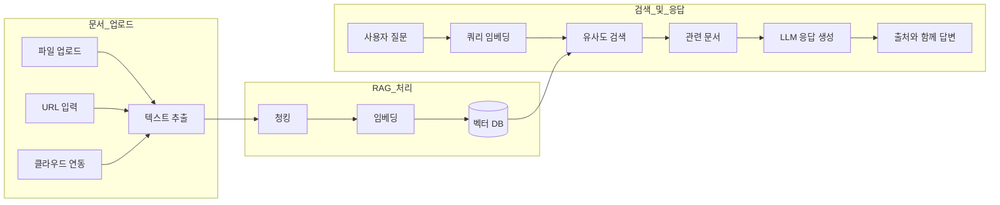
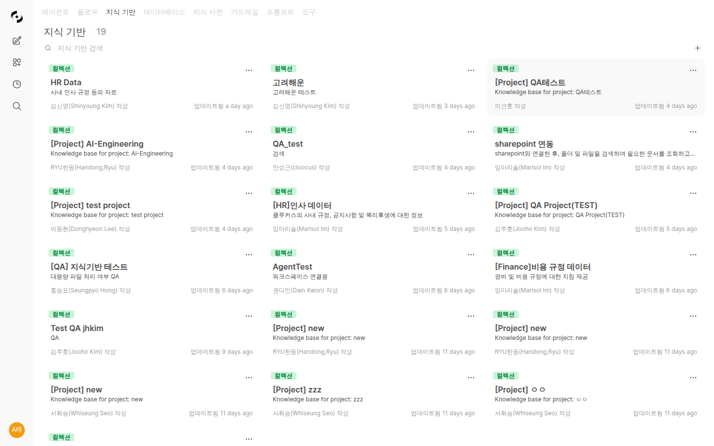
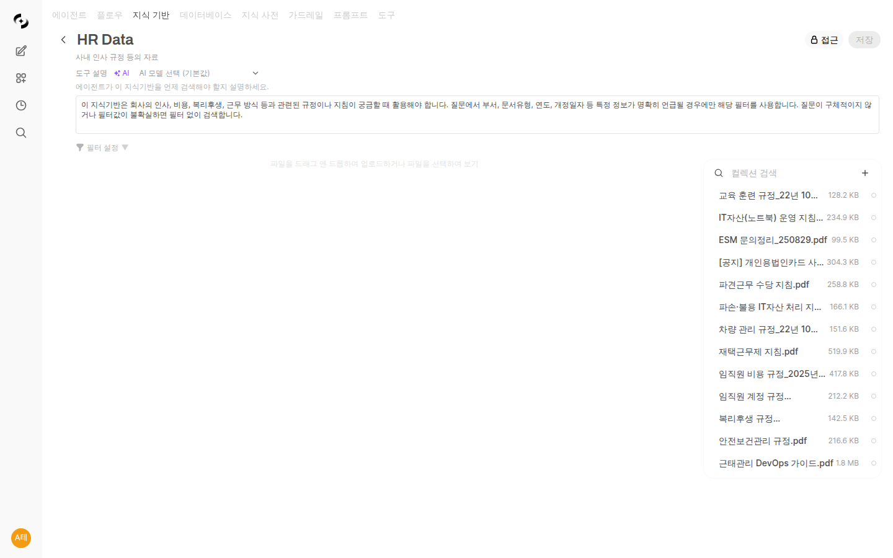

# 지식 베이스 (Knowledge Base)

> 사내 문서, 매뉴얼, 가이드라인을 AI에 연결하여 정확하고 신뢰할 수 있는 답변을 받으세요. 지식 베이스는 AI가 기업의 지식을 학습하고 활용하는 핵심 기능입니다.



---

## 지식 베이스란?

지식 베이스는 문서를 AI가 이해할 수 있는 형태로 변환하여 저장하는 시스템입니다.

<!-- 스크린샷: 지식 베이스 개념도
     - 문서 업로드 → 청킹 → 임베딩 → 벡터 DB → 검색 → AI 응답
     파일명: images/knowledge-concept.png
-->

### RAG (검색 증강 생성) 기술

**작동 원리:**
1. 사용자 질문 입력
2. 관련 문서 자동 검색
3. 검색된 내용을 AI에 전달
4. AI가 문서 기반으로 답변 생성

**장점:**
- ✅ 사내 정보 기반 정확한 답변
- ✅ 출처 명시로 신뢰성 확보
- ✅ 최신 문서 반영 가능
- ✅ AI 환각(hallucination) 감소

---

## 지식 베이스 목록

**워크스페이스 > 지식 베이스**에서 모든 지식 베이스를 확인합니다.



### 지식 베이스 유형

| 유형 | 아이콘 | 설명 |
|------|--------|------|
| **컬렉션** | 📚 | 여러 문서를 그룹으로 관리 |
| **단일 문서** | 📄 | 개별 파일 단위 관리 |

---

## 지식 베이스 생성

### 1단계: 새 지식 베이스 만들기

**"+ 새 지식 베이스"** 버튼을 클릭합니다.

<!-- 스크린샷: 지식 베이스 생성 폼
     - 이름, 설명 입력 필드
     파일명: images/knowledge-create-form.png
-->

| 필드 | 설명 | 예시 |
|------|------|------|
| **이름** | 지식 베이스 이름 | "인사 규정 2024" |
| **설명** | 용도 및 내용 설명 | "인사팀 규정 및 가이드라인" |

### 2단계: 문서 업로드

생성된 지식 베이스에 문서를 추가합니다.

<!-- 스크린샷: 문서 업로드 화면
     - 드래그 앤 드롭 영역
     - 업로드된 파일 목록
     파일명: images/knowledge-upload.png
-->

**업로드 방법:**
- 📁 **드래그 앤 드롭**: 파일을 업로드 영역으로 끌어다 놓기
- 📎 **파일 선택**: "파일 추가" 버튼 클릭
- 🌐 **URL**: 웹 페이지 URL 입력
- ✏️ **텍스트**: 직접 텍스트 입력

### 지원 파일 형식

| 카테고리 | 형식 | 최대 크기 |
|----------|------|----------|
| **문서** | PDF, DOCX, PPTX, TXT, MD | 50MB |
| **스프레드시트** | XLSX, CSV | 20MB |
| **웹** | HTML, URL | - |
| **코드** | PY, JS, TS, JSON, YAML | 10MB |

### 3단계: 처리 대기

업로드된 문서는 자동으로 처리됩니다.

<!-- 스크린샷: 문서 처리 중 상태 표시
     - 프로그레스 바 또는 처리 중 아이콘
     파일명: images/knowledge-processing.png
-->

**처리 과정:**
1. **텍스트 추출**: 문서에서 텍스트 추출 (OCR 포함)
2. **청킹**: 적절한 크기로 분할
3. **임베딩**: 벡터 변환
4. **인덱싱**: 검색 가능하게 저장

#### 안정적인 대용량 파일 처리

대량의 파일을 한 번에 업로드해도 메인 서비스가 멈추지 않도록, 파일 처리 작업이 큐 기반으로 안전하게 순차 처리됩니다.

- **자동 재시도**: 일시적인 오류가 발생해도 자동으로 재시도하여 안정적으로 동작합니다.
- **실패 파일 표시**: 처리에 실패한 파일은 화면에 명확하게 표시되며, 사용자가 직접 재시도할 수 있습니다.
- **동일 파일명 자동 교체**: 같은 이름의 파일을 다시 업로드하면 기존 파일을 자동으로 교체합니다 (중복 등록 방지).
- **파일 처리 현황 카드**: 진행 중 / 완료 / 실패 상태를 한눈에 보여줍니다.

<!-- 스크린샷: 파일 처리 현황 카드 (진행/완료/실패 상태 표시)
     파일명: images/knowledge-processing-status.png
-->

### 4단계: 접근 권한 설정

누가 이 지식 베이스를 사용할 수 있는지 설정합니다.

<!-- 스크린샷: 접근 권한 설정 모달
     파일명: images/knowledge-access-control.png
-->

| 옵션 | 설명 |
|------|------|
| **공개** | 모든 사용자가 사용 가능 |
| **비공개** | 본인만 사용 가능 |
| **그룹 지정** | 특정 그룹만 사용 가능 |
| **조직 지정** | 특정 부서만 사용 가능 |

---

## 지식 베이스 관리

### 문서 목록 보기

지식 베이스를 클릭하면 포함된 문서 목록을 볼 수 있습니다.



### 문서 추가/삭제

| 작업 | 방법 |
|------|------|
| **추가** | "+ 추가" 버튼 또는 드래그 앤 드롭 |
| **삭제** | 문서 선택 → 삭제 버튼 |
| **교체** | 같은 이름으로 다시 업로드 |

### 문서 검색

상단 검색창에서 파일명으로 문서를 찾을 수 있습니다.

<!-- 스크린샷: 문서 검색 기능
     파일명: images/knowledge-search.png
-->

### 문서 내용 보기

문서를 클릭하면 추출된 텍스트 내용을 확인할 수 있습니다.

<!-- 스크린샷: 문서 내용 미리보기
     파일명: images/knowledge-preview.png
-->

### 동기화

문서 변경 후 벡터 DB를 다시 동기화합니다.

<!-- 스크린샷: 동기화 버튼
     파일명: images/knowledge-sync.png
-->

### 동적 필터

동적 필터를 사용하면 지식 베이스 내 문서를 메타데이터 기준으로 세분화하여 검색 범위를 제한할 수 있습니다.

<!-- 스크린샷: 동적 필터 설정 화면
     - 필터 스키마 정의 영역
     - 필터 타입 선택 (텍스트/숫자/날짜)
     파일명: images/knowledge-dynamic-filter.png
-->

#### 필터 스키마 정의

지식 베이스 설정에서 필터 스키마를 정의합니다. **"+ 필터 추가"** 버튼을 클릭하여 필터 필드를 추가합니다.

| 설정 | 설명 | 예시 |
|------|------|------|
| **이름** | 필터 필드 이름 | "부서", "연도" |
| **타입** | 데이터 유형 선택 | 텍스트(선택), 숫자, 날짜 |
| **옵션** | 선택 가능한 값 목록 (텍스트 타입만) | "재무팀, 인사팀, 개발팀" |
| **설명** | AI가 필터를 이해하기 위한 설명 | "문서가 속한 부서를 필터링합니다" |

**필터 타입:**

| 타입 | 설명 | 슬롯 제한 |
|------|------|----------|
| **텍스트 (Enum)** | 미리 정의된 옵션 중 단일 선택 | 최대 4개 |
| **컬렉션 (Collection)** | 미리 정의된 옵션 중 복수 선택 | 최대 4개 |
| **숫자 (Number)** | 정수값 필터 | 최대 2개 |
| **날짜 (Date)** | 날짜 범위 필터 | 최대 2개 |

**필수 필드:**

각 필터에 "필수" 옵션을 설정할 수 있습니다. 필수 필터는 입력 폼에서 `*` 표시가 되며, 값이 누락된 파일은 주황색 인디케이터로 표시됩니다.

> **💡 팁:** 필터 설명은 AI 자동 생성 버튼을 사용하면 필터 이름과 옵션을 기반으로 자동 작성됩니다.

#### 파일별 메타데이터 설정

필터 스키마를 정의한 후, 각 파일에 메타데이터 값을 지정합니다.

<!-- 스크린샷: 파일 메타데이터 입력 폼
     - 파일 목록에서 메타데이터 상태 표시 (녹색 점: 설정됨, 빈 원: 미설정)
     - 4열 그리드 입력 폼
     파일명: images/knowledge-file-metadata.png
-->

1. 파일 목록에서 파일 선택
2. 메타데이터 입력 폼에서 각 필터 필드 값 입력
3. 저장 버튼 클릭

파일 목록에서 메타데이터 설정 상태가 4단계 색상으로 표시됩니다:

| 색상 | 의미 |
|------|------|
| **● 초록** | 모든 필터 필드에 값이 설정됨 |
| **● 노랑** | 일부 필드만 설정됨 |
| **● 주황** | 필수 필드가 비어 있음 |
| **○ 회색 테두리** | 메타데이터 미설정 |
| **🔄 보라 스피너** | AI 추출 진행 중 |

> **참고:** 메타데이터 변경 시 벡터 인덱스가 자동으로 업데이트되며, 재임베딩 없이 기존 벡터를 유지합니다.

#### AI 자동 추출

필터 스키마에 **추출 프롬프트**를 설정하면, 파일 업로드 시 LLM이 문서 내용과 파일 제목을 분석하여 메타데이터를 자동으로 추출합니다.

**설정 방법:**

1. 필터 스키마에서 **추출 모드**를 "AI"로 선택
2. 각 필터에 **추출 프롬프트** 작성 (예: "파일 제목에서 국가명을 추출하세요")
3. 추출에 사용할 **AI 모델** 선택
4. 파일 업로드 시 자동으로 추출 실행

**추출 방법:**

| 방법 | 설명 |
|------|------|
| **자동 추출** | 파일 업로드 시 자동 실행 (AI 모드 활성 시) |
| **단일 추출** | 파일 메타데이터 편집 화면에서 추출 버튼 클릭 |
| **전체 추출** | 모든 파일의 메타데이터를 일괄 재추출 |

> **💡 팁:** 추출 프롬프트에서 "파일 제목"을 조건으로 사용할 수 있습니다. 예: "파일 제목 앞에 [XX] 국가명이 있으면 해당 국가 코드를 추출하세요"

#### 검색 시 필터 활용

에이전트에 연결된 지식 베이스에 동적 필터가 설정되어 있으면, AI가 사용자 질문에서 필터 조건을 자동으로 추론하여 검색 범위를 제한합니다.

**예시:**
```
Q: 재무팀의 2024년 규정을 알려주세요
→ 필터 자동 적용: 부서=재무팀, 연도=2024
→ 해당 조건에 맞는 문서만 검색
```

### 도구 설명

도구 설명은 에이전트가 지식 베이스를 **언제, 어떤 상황에서** 사용해야 하는지 안내하는 AI 전용 설명입니다.

<!-- 스크린샷: 도구 설명 입력 영역 및 AI 자동 생성 버튼
     파일명: images/knowledge-tool-description.png
-->

| 항목 | 설명 |
|------|------|
| **도구 설명** | 에이전트가 이 KB를 사용할 조건을 안내하는 텍스트 |
| **AI 자동 생성** | KB 이름, 설명, 파일 목록 기반으로 AI가 도구 설명 자동 작성 |

**좋은 도구 설명 예시:**
```
회사 인사 규정 및 내부 가이드라인에 대한 질문이 있을 때 사용합니다.
연차, 복리후생, 출장 정책 등 HR 관련 문의에 참조하세요.
```

> **💡 팁:** 도구 설명이 설정되지 않으면 지식 베이스의 일반 설명이 대신 사용됩니다. AI가 적절한 KB를 선택하도록 구체적인 도구 설명을 작성하는 것을 권장합니다.

---

## 지식 베이스 활용

### 채팅에서 사용

**방법 1: @ 명령어**
```
@인사규정 연차 신청 절차가 어떻게 되나요?
```

**방법 2: 에이전트에 연결**
에이전트 설정에서 지식 베이스를 연결하면 자동으로 참조합니다.

<!-- 스크린샷: 채팅에서 지식베이스 응답 (인용 표시)
     파일명: images/knowledge-in-chat.png
-->

### 인용 확인

AI 응답에 표시된 인용 번호를 클릭하면 원문을 확인할 수 있습니다.

<!-- 스크린샷: 인용 클릭 시 원문 팝업
     파일명: images/knowledge-citation-popup.png
-->

---

## 클라우드 스토리지 연동

외부 클라우드 저장소의 문서를 직접 가져올 수 있습니다.

### Google Drive

<!-- 스크린샷: Google Drive 연동 화면
     파일명: images/knowledge-google-drive.png
-->

1. "Google Drive에서 가져오기" 클릭
2. Google 계정 연결
3. 파일 선택 및 가져오기

### OneDrive

<!-- 스크린샷: OneDrive 연동 화면
     파일명: images/knowledge-onedrive.png
-->

1. "OneDrive에서 가져오기" 클릭
2. Microsoft 계정 연결
3. 파일 선택 및 가져오기

### SharePoint

기업 SharePoint의 문서를 직접 연결할 수 있습니다.

<!-- 스크린샷: SharePoint 브라우저
     파일명: images/knowledge-sharepoint.png
-->

**장점:**
- 사내 문서 시스템과 직접 연동
- 실시간 최신 버전 유지
- 권한 관리 일원화

---

## 고급 설정

### 문서 처리 옵션

관리자 설정에서 문서 처리 방식을 조정할 수 있습니다.

<!-- 스크린샷: 관리자 > 설정 > 문서 처리
     파일명: images/knowledge-admin-settings.png
-->

| 설정 | 설명 | 기본값 |
|------|------|--------|
| **청크 크기** | 문서 분할 단위 | 1500자 |
| **청크 오버랩** | 청크 간 중복 | 100자 |
| **OCR 활성화** | 이미지 텍스트 추출 | 활성화 |

### 임베딩 엔진

| 엔진 | 특징 |
|------|------|
| **로컬** | 외부 전송 없음, 보안 우수 |
| **OpenAI** | 높은 품질, API 비용 발생 |
| **Azure OpenAI** | 기업 환경 최적화 |

### 검색 설정

| 설정 | 설명 |
|------|------|
| **Top K** | 검색 결과 개수 |
| **관련도 임계값** | 최소 유사도 점수 |
| **하이브리드 검색** | 키워드 + 의미 검색 병행 |
| **리랭킹** | 검색 결과 재정렬 |

---

## 활용 사례

### 사례 1: 신입 사원 온보딩

**지식 베이스 구성:**
- 회사 소개 자료
- 인사 규정
- IT 시스템 사용 가이드
- 부서별 업무 매뉴얼

**활용:**
```
Q: 출장비 정산은 어떻게 하나요?
A: 출장비 정산 절차입니다:

1. ERP 시스템 접속
2. 경비 정산 메뉴 선택
3. 출장 내역 및 영수증 첨부
4. 팀장 승인 요청

정산 마감일은 매월 25일이며, 법인카드 사용 건은 별도 정산이 필요합니다.

[출처: 경비정산가이드.pdf, 3페이지]
```

### 사례 2: 고객 지원

**지식 베이스 구성:**
- 제품 매뉴얼
- FAQ 문서
- 트러블슈팅 가이드
- 이전 티켓 기록

**활용:**
```
Q: 제품 A의 설정 초기화 방법을 알려주세요
A: 제품 A 설정 초기화 방법:

1. 전원 버튼 10초간 누르기
2. LED가 빨간색으로 깜빡일 때까지 대기
3. 버튼에서 손 떼기
4. 자동으로 재부팅됨

주의: 초기화 시 저장된 설정이 모두 삭제됩니다.

[출처: 제품A_사용자매뉴얼.pdf, 45페이지]
```

### 사례 3: 법률/규정 검토

**지식 베이스 구성:**
- 사내 규정집
- 계약서 템플릿
- 법률 가이드라인
- 컴플라이언스 체크리스트

**활용:**
```
Q: 개인정보 수집 시 필수 고지 사항은?
A: 개인정보 수집 시 필수 고지 사항:

1. 개인정보 수집·이용 목적
2. 수집하는 개인정보 항목
3. 개인정보 보유·이용 기간
4. 동의 거부권 및 거부 시 불이익
5. 개인정보 제3자 제공 여부

[출처: 개인정보보호지침.pdf, 제12조]
```

---

## 베스트 프랙티스

### 문서 준비 팁

1. **깔끔한 포맷**
   - 제목, 소제목 명확히 구분
   - 목차 포함
   - 일관된 스타일

2. **최신 버전 유지**
   - 정기적으로 문서 업데이트
   - 오래된 문서 삭제

3. **적절한 크기**
   - 너무 큰 문서는 분리
   - 관련 내용끼리 그룹화

### 지식 베이스 구성 팁

1. **주제별 분리**
   - "인사규정", "IT가이드", "제품매뉴얼" 등

2. **접근 권한 세분화**
   - 민감 정보는 별도 관리
   - 부서별 접근 제한

3. **정기 점검**
   - 월 1회 내용 검토
   - 불필요한 문서 정리

---

## 신규 기능 (2025년 3월 이후)

### 백그라운드 배치 병렬 처리

문서 추출 시 여러 파일을 동시에 병렬로 처리할 수 있습니다. Socket.IO를 통해 각 파일의 처리 진행률이 실시간으로 표시됩니다.

<!-- 스크린샷: 배치 처리 진행률 표시 화면
     - Socket.IO 기반 실시간 프로그레스 바
     - 여러 파일 동시 처리 상태
     파일명: images/knowledge-batch-processing.png
-->

**주요 특징:**
- 다수의 파일을 동시에 추출하여 처리 시간 단축
- 파일별 진행률을 프로그레스 바로 실시간 확인
- 백그라운드에서 처리되므로 다른 작업을 계속 진행 가능

### 체크박스 선택 기반 추출

파일 목록에서 체크박스로 개별 파일을 선택한 후 추출을 실행할 수 있습니다. 전체 파일이 아닌 필요한 파일만 골라서 추출할 수 있어 효율적입니다.

<!-- 스크린샷: 체크박스 선택 후 추출 UI
     - 파일 목록 좌측 체크박스
     - 선택된 파일에 대한 추출 버튼
     파일명: images/knowledge-checkbox-extract.png
-->

**사용 방법:**
1. 파일 목록에서 추출할 파일의 체크박스를 선택
2. 상단의 **"추출"** 버튼 클릭
3. 선택된 파일만 추출 처리 시작

### 지식기반별 검색 설정 오버라이드

각 지식 베이스마다 개별적으로 검색 설정을 지정할 수 있습니다. 전역 검색 설정 대신 지식 베이스 특성에 맞는 최적의 검색 파라미터를 사용할 수 있습니다.

<!-- 스크린샷: 지식 베이스별 검색 설정 오버라이드 화면
     - Top K, 관련도 임계값 등 개별 설정 필드
     파일명: images/knowledge-search-override.png
-->

| 설정 | 설명 |
|------|------|
| **Top K** | 해당 지식 베이스에서 반환할 검색 결과 수 |
| **관련도 임계값** | 해당 지식 베이스의 최소 유사도 점수 |
| **하이브리드 검색** | 키워드 + 의미 검색 병행 여부 |
| **리랭킹** | 검색 결과 재정렬 사용 여부 |

> **참고:** 개별 설정이 지정되지 않은 경우 전역(관리자) 검색 설정이 적용됩니다.

### 추출 에러 메시지 개선

문서 추출 중 오류가 발생하면 toast 알림에 해당 파일명이 함께 표시됩니다. 어떤 파일에서 문제가 발생했는지 즉시 확인할 수 있어 문제 해결이 용이합니다.

### 문서 처리 프로파일 시스템

문서 처리 방식을 세밀하게 제어할 수 있는 프로파일 시스템이 추가되었습니다. LLM Vision 기반 추출과 고급 청킹 전략을 지원합니다.

<!-- 스크린샷: 문서 처리 프로파일 설정 화면
     - LLM Vision 추출 옵션
     - Semantic / Contextual Chunking 선택
     파일명: images/knowledge-processing-profile.png
-->

| 옵션 | 설명 |
|------|------|
| **LLM Vision 추출** | LLM의 비전 기능을 활용하여 이미지, 차트, 표 등을 포함한 문서에서 텍스트를 추출 |
| **Semantic Chunking** | 의미 단위로 문서를 분할하여 검색 품질 향상 |
| **Contextual Chunking** | 문맥 정보를 포함하여 청킹하여 검색 시 더 정확한 결과 제공 |

> **팁:** 이미지가 많은 PDF나 스캔 문서에는 LLM Vision 추출을, 긴 보고서에는 Semantic 또는 Contextual Chunking을 적용하면 효과적입니다.

### 삭제 시 에이전트 사용 여부 확인

지식 베이스를 삭제할 때 해당 지식 베이스를 참조하고 있는 에이전트가 있는지 자동으로 확인합니다. 연결된 에이전트가 있으면 경고 메시지와 함께 에이전트 목록이 표시되어 실수로 인한 삭제를 방지합니다.

<!-- 스크린샷: 지식 베이스 삭제 확인 다이얼로그
     - 연결된 에이전트 목록 표시
     파일명: images/knowledge-delete-agent-check.png
-->

---

## 1.0.2 추가 사항

### KB 필터에 Glossary 타입 추가

기존 텍스트(Enum) / 컬렉션 / 숫자 / 날짜 / Doc Type 외에 **Glossary 타입** 필터가 추가되었습니다. 용어집을 그대로 KB 필터로 끌어와 검색 시 도메인 어휘로 좁히는 데 사용합니다.

<!-- 스크린샷: 필터 설정에서 Glossary 타입 선택 + GlossarySelector + 동의어/AI 토글
     파일명: images/knowledge-filter-glossary-type.png
-->

| 옵션 | 설명 |
|------|------|
| **용어집 선택** | 매칭할 용어집을 한 개 또는 여러 개 선택 |
| **동의어 포함** | term 뿐 아니라 등록된 동의어까지 매칭에 사용 |
| **AI 추출 모드** | 작은 용어집은 텍스트 매칭, 큰 용어집은 LLM + `search_glossary` 도구로 매칭 |
| **추출 모델** | AI 모드일 때 사용할 모델 선택 |

추출 결과는 다른 필터 슬롯과 동일하게 파일 메타데이터에 저장되어, 검색 시 자동으로 필터 조건으로 활용됩니다.

### Doc Type 필터 (문서 유형)

KG 동기화에서 별도 노드로 만들던 "문서 타입(계약서/정책/매뉴얼…)" 분류는 1.0.2부터 **KB 필터의 Doc Type 타입**으로 승격되었습니다.

<!-- 스크린샷: Doc Type 필터 설정 (rules 모드 + AI 모델 선택 + 다중 허용 토글)
     파일명: images/knowledge-filter-doc-type.png
-->

- **rules 모드** — 파일명 + 본문 앞부분에 정규식 리스트를 순차 매칭
- **AI 모드** — LLM 으로 문서 타입 라벨 추출
- **허용 라벨(allowed_values)** — LLM/규칙이 사용할 라벨 목록을 고정해 noise 방지
- **다중 허용** — 한 문서가 여러 타입에 속할 수 있도록 허용 (예: "계약서 + 매뉴얼")

> 💡 KG에 연결된 KB는 이 Doc Type 필터 라벨을 그대로 KG의 엣지 카탈로그 스코프로 사용합니다. 자세한 내용은 [Knowledge Graph 가이드](./knowledge-graph.md) 참조.

### Redis Queue 기반 추출 파이프라인

필터 추출(Glossary 타입 포함, Doc Type, AI 추출 등)은 1.0.2에서 **Redis Queue 기반 백그라운드 파이프라인**으로 전면 전환되었습니다.

- 파일 업로드 시 자동 체이닝되어 추출까지 한 번에 진행
- 메인 서비스가 멈추지 않고 12 worker prefork 환경에서도 안정 동작
- 진행률 / 완료 / 실패 알림이 모두 우측 상단 알림 센터로 통일됨 (아래 "백그라운드 작업 알림 센터 통합" 참조)

### 추출 진행률 / 재추출 / 배치 삭제 (UX 개선)

대량 파일 작업 중 흔하던 "0/76 에서 멈춘 것처럼 보이는" 문제를 비롯해 배치 작업 UX가 1.0.2에서 정비되었습니다.

<!-- 스크린샷: 파일 목록 상단의 추출/재추출/배치 삭제 버튼 + ToastHistory 진행률
     파일명: images/knowledge-batch-actions.png
-->

| 항목 | 변경 |
|------|------|
| **Extract All 진행률** | 백엔드가 batch 완료 이벤트(`extraction:complete`)를 1회만 emit. UI는 "0/N 멈춤" 없이 정확한 카운트로 마감 |
| **재추출 ConfirmDialog** | 이미 추출된 파일을 다시 추출할 때 "덮어쓰기 / 미추출만 / 취소" 3옵션 다이얼로그 제공 |
| **배치 삭제** | 체크박스로 다수 파일 선택 후 한 번에 삭제 (`knowledge_file_delete_worker`로 안전 처리) |
| **토스트 dedupe** | 같은 파일이 여러 번 알려와도 ToastHistory 카운터가 부풀려지지 않도록 file_id 기반 중복 제거 |
| **토스트 시작/종료 1회** | 배치 작업은 시작 1회 + 완료 1회만, 파일별 진행은 알림 센터에서 집계 |

### 디렉토리 업로드 안정화

폴더(디렉토리)를 통째로 끌어다 업로드할 때 발생하던 깜빡임 / 토스트 폭주 / 네이티브 confirm 다이얼로그 문제가 정리되었습니다.

- 배치 모드 가드로 개별 파일 refresh / toast 억제
- 네이티브 `window.confirm` → 커스텀 ConfirmDialog 모달 (네비게이션 가드 포함)
- 업로드 직전 "N개 파일을 업로드하시겠습니까?" 확인 모달 추가

### 백그라운드 작업 알림 센터 통합

KB 필터 추출, 파일 업로드, 디렉토리 업로드, 재추출, 배치 삭제 등 장시간 백그라운드 작업의 진행률·완료·실패 알림이 1.0.2부터 **우측 상단 알림 센터(ToastHistory)**로 통합되었습니다.

<!-- 스크린샷: 우측 상단 알림 센터에 표시되는 KB 추출/업로드 진행률
     - progress bar + "current/total · label" 캡션
     - 클릭 시 해당 KB 페이지로 이동
     파일명: images/knowledge-toast-history.png
-->

- 페이지를 떠나거나 새로고침해도 진행 상태가 유지됩니다.
- 알림 항목을 클릭하면 해당 KB / 작업 페이지로 바로 이동합니다.
- DbSphere 스키마 추출, 용어집 추출, KG 동기화도 같은 알림 센터에 노출됩니다.

---

## FAQ

**Q: 지식 베이스 용량 제한이 있나요?**
> 기본적으로 지식 베이스당 100개 파일, 총 500MB까지 지원합니다. 필요시 관리자에게 확장 요청하세요.

**Q: PDF 이미지의 텍스트도 인식되나요?**
> 네, OCR 기능이 활성화되어 있으면 이미지 내 텍스트도 추출됩니다.

**Q: 문서 업데이트 시 자동으로 반영되나요?**
> 아니요, 문서 변경 후 "동기화" 버튼을 클릭해야 합니다.

**Q: 영어 문서도 지원되나요?**
> 네, 다국어 문서를 모두 지원합니다.

---

## 다음 단계

- 🤖 [에이전트에 지식베이스 연결하기](./agents.md)
- 📖 [용어집으로 전문 용어 관리](./glossary.md)
- 🗄️ [데이터베이스 연결하기](./database.md)
