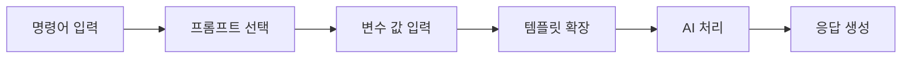
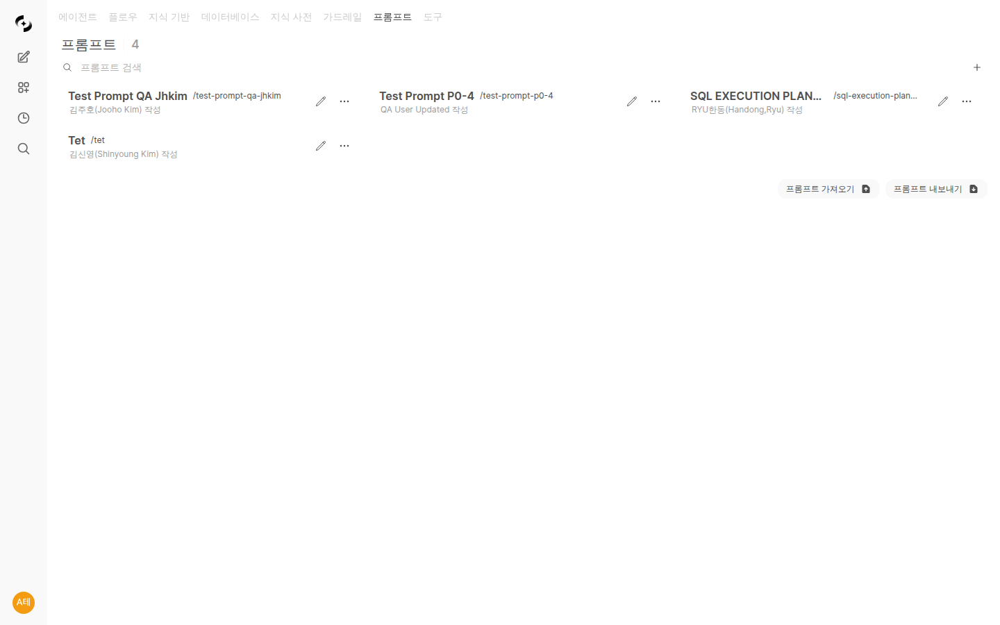

# 프롬프트 관리 (Prompts)

> 자주 사용하는 질문 형식이나 지시사항을 템플릿으로 저장하고 팀과 공유하세요. 프롬프트 관리로 일관된 품질의 AI 응답을 빠르게 얻을 수 있습니다.



---

## 프롬프트란?

프롬프트는 AI에게 보내는 질문이나 지시사항의 템플릿입니다.

<!-- 스크린샷: 프롬프트 사용 전후 비교
     - 왼쪽: 일반 질문
     - 오른쪽: 프롬프트 사용 (더 구조화된 응답)
     파일명: images/prompts-comparison.png
-->

### 프롬프트 활용의 장점

| 장점 | 설명 |
|------|------|
| **시간 절약** | 긴 지시사항을 매번 입력할 필요 없음 |
| **일관성** | 동일한 형식의 결과물 생성 |
| **팀 협업** | 효과적인 프롬프트를 팀원과 공유 |
| **품질 향상** | 검증된 프롬프트로 더 나은 응답 |

---

## 프롬프트 목록

**워크스페이스 > 프롬프트**에서 모든 프롬프트를 확인합니다.



### 프롬프트 정보

| 항목 | 설명 | 예시 |
|------|------|------|
| **명령어** | 호출할 때 사용하는 단축키 | `/이메일작성` |
| **제목** | 프롬프트 이름 | "비즈니스 이메일 작성" |
| **내용** | 실제 프롬프트 템플릿 | "다음 내용으로..." |

---

## 프롬프트 생성

### 1단계: 새 프롬프트 만들기

**"+ 새 프롬프트"** 버튼을 클릭합니다.

<!-- 스크린샷: 프롬프트 생성 폼
     파일명: images/prompts-create.png
-->

### 2단계: 기본 정보 입력

| 필드 | 설명 | 예시 |
|------|------|------|
| **명령어** | `/`로 시작하는 단축 명령 | `이메일작성` |
| **제목** | 프롬프트 표시 이름 | "비즈니스 이메일 작성" |

### 3단계: 프롬프트 내용 작성

프롬프트 템플릿을 작성합니다.

<!-- 스크린샷: 프롬프트 내용 편집기
     파일명: images/prompts-editor.png
-->

**기본 템플릿 예시:**

```markdown
다음 내용으로 전문적인 비즈니스 이메일을 작성해주세요.

## 작성 규칙
- 공손하고 전문적인 톤
- 명확하고 간결한 문장
- 적절한 인사말과 맺음말 포함

## 이메일 정보
- 받는 사람: [상대방 직함/이름]
- 목적: [이메일 목적]
- 주요 내용: [전달할 내용]
```

### 변수 사용

`{{변수명}}`을 사용하여 동적 값을 입력받을 수 있습니다.

```markdown
{{recipient}}님께 보내는 {{purpose}}에 관한 이메일을 작성해주세요.

내용: {{content}}
```

**사용 시:**
```
/이메일작성 recipient=김부장님 purpose=프로젝트 진행상황 공유 content=이번 주 개발 완료 예정
```

### 4단계: 저장

**"저장"** 버튼을 클릭합니다.

---

## 프롬프트 사용

### 방법 1: `/` 명령어

채팅창에 `/`를 입력하면 프롬프트 목록이 나타납니다.

<!-- 스크린샷: / 입력 후 프롬프트 자동완성
     파일명: images/prompts-autocomplete.png
-->

```
/이메일작성 클라이언트에게 미팅 일정 조율 요청
```

### 방법 2: @ 명령어

`@`로도 프롬프트를 호출할 수 있습니다.

```
@이메일작성 프로젝트 지연 안내 메일
```

### 방법 3: 직접 선택

입력창 옆 **프롬프트** 버튼을 클릭하여 선택합니다.

<!-- 스크린샷: 프롬프트 선택 버튼 및 팝업
     파일명: images/prompts-select-button.png
-->

---

## 프롬프트 예시

### 이메일 작성

**명령어:** `/이메일`

```markdown
다음 정보를 바탕으로 전문적인 비즈니스 이메일을 작성해주세요.

## 요구사항
- 공손하고 전문적인 톤 유지
- 핵심 내용을 명확히 전달
- 적절한 인사말과 맺음말 포함
- 필요시 다음 단계(Action Item) 명시

## 이메일 내용
{{content}}
```

**사용:**
```
/이메일 클라이언트에게 다음 주 미팅 일정을 화요일 2시로 변경 요청
```

### 보고서 작성

**명령어:** `/보고서`

```markdown
다음 주제로 체계적인 보고서를 작성해주세요.

## 보고서 구조
1. 요약 (Executive Summary)
2. 현황 분석
3. 문제점 및 원인
4. 개선 방안
5. 실행 계획
6. 기대 효과

## 작성 규칙
- 데이터와 근거 기반 작성
- 간결하고 명확한 문장
- 도표 활용 권장

## 주제
{{topic}}
```

### 회의록 작성

**명령어:** `/회의록`

```markdown
다음 회의 내용을 정리해주세요.

## 회의록 형식
### 회의 정보
- 일시:
- 참석자:
- 안건:

### 논의 내용
(주요 논의 사항 정리)

### 결정 사항
(합의된 결정 사항)

### Action Items
| 담당자 | 업무 | 기한 |
|--------|------|------|

### 다음 회의
- 일시:
- 안건:

## 회의 내용
{{content}}
```

### 코드 리뷰

**명령어:** `/코드리뷰`

```markdown
다음 코드를 리뷰하고 개선점을 제안해주세요.

## 리뷰 관점
1. **가독성**: 코드가 이해하기 쉬운가?
2. **효율성**: 성능 개선 여지가 있는가?
3. **보안**: 보안 취약점은 없는가?
4. **베스트 프랙티스**: 관례를 따르고 있는가?
5. **에러 처리**: 예외 상황을 적절히 처리하는가?

## 출력 형식
- 개선 필요 부분 코드와 함께 설명
- 수정된 코드 예시 제공
- 우선순위 (높음/중간/낮음) 표시

## 코드
{{code}}
```

### 번역

**명령어:** `/번역`

```markdown
다음 텍스트를 {{target_lang}}로 번역해주세요.

## 번역 규칙
- 원문의 의미와 뉘앙스 유지
- 자연스러운 표현 사용
- 전문 용어는 적절히 처리
- 문화적 맥락 고려

## 원문
{{text}}
```

### 요약

**명령어:** `/요약`

```markdown
다음 내용을 요약해주세요.

## 요약 형식
1. **한 줄 요약**: 핵심 내용 1문장
2. **주요 포인트**: 3-5개 bullet point
3. **세부 요약**: 200자 내외

## 내용
{{content}}
```

### 데이터 분석

**명령어:** `/분석`

```markdown
다음 데이터를 분석하고 인사이트를 도출해주세요.

## 분석 관점
1. 현황 파악
2. 트렌드/패턴 발견
3. 이상치 식별
4. 원인 분석
5. 액션 아이템 제안

## 출력 형식
- 주요 발견 사항 (bullet point)
- 시각화 제안 (필요시)
- 추가 분석 권장 사항

## 데이터
{{data}}
```

---

## 프롬프트 관리

### 편집

프롬프트 목록에서 **편집** 버튼을 클릭합니다.

<!-- 스크린샷: 프롬프트 편집 화면
     파일명: images/prompts-edit.png
-->

### 복제

기존 프롬프트를 복사하여 새 버전을 만듭니다.

1. 프롬프트 메뉴에서 **"복제"** 클릭
2. 명령어와 내용 수정
3. 저장

### 내보내기/가져오기

프롬프트를 JSON 파일로 내보내고 가져올 수 있습니다.

<!-- 스크린샷: 내보내기/가져오기 버튼
     파일명: images/prompts-export.png
-->

**활용:**
- 팀원과 프롬프트 공유
- 백업 및 복원
- 다른 환경으로 이동

### 삭제

더 이상 필요 없는 프롬프트를 삭제합니다.

---

## 효과적인 프롬프트 작성 팁

### 1. 역할 정의

AI에게 명확한 역할을 부여하세요.

```markdown
당신은 10년 경력의 마케팅 전문가입니다.
```

### 2. 구체적인 지시

원하는 결과물을 상세히 설명하세요.

```markdown
## 요구사항
- 500자 내외로 작성
- 전문적이지만 친근한 톤
- 3개의 핵심 메시지 포함
```

### 3. 출력 형식 지정

원하는 형식을 명시하세요.

```markdown
## 출력 형식
| 항목 | 내용 |
|------|------|
| 제목 | ... |
| 본문 | ... |
```

### 4. 예시 제공

원하는 결과의 예시를 보여주세요.

```markdown
## 예시
입력: "프로젝트 미팅"
출력: "프로젝트 A 2차 진행 현황 공유 미팅"
```

### 5. 제약 조건 명시

피해야 할 것을 알려주세요.

```markdown
## 제한사항
- 전문 용어 최소화
- 비속어 사용 금지
- 개인정보 포함 금지
```

---

## 팀 프롬프트 공유

### 공개 프롬프트

관리자가 만든 프롬프트는 모든 사용자가 사용할 수 있습니다.

<!-- 스크린샷: 공개 프롬프트 표시 (아이콘으로 구분)
     파일명: images/prompts-public.png
-->

### 접근 권한 설정

특정 그룹이나 조직에만 프롬프트를 공개할 수 있습니다.

| 옵션 | 설명 |
|------|------|
| **공개** | 모든 사용자 |
| **그룹 지정** | 특정 그룹만 |
| **비공개** | 본인만 |

---

## FAQ

**Q: 프롬프트에 파일을 포함할 수 있나요?**
> 프롬프트 자체에는 파일을 포함할 수 없지만, 프롬프트 사용 시 파일을 함께 첨부할 수 있습니다.

**Q: 다른 사람의 프롬프트를 수정할 수 있나요?**
> 아니요, 다른 사람의 프롬프트는 복제하여 자신만의 버전을 만들어야 합니다.

**Q: 프롬프트 명령어에 한글을 사용할 수 있나요?**
> 네, `/이메일`, `/보고서` 등 한글 명령어도 사용 가능합니다.

---

## 다음 단계

- 🤖 [에이전트에 프롬프트 활용하기](./agents.md)
- 📚 [지식베이스로 답변 품질 높이기](./knowledge.md)
- 💬 [채팅 고급 기능 활용하기](../chat.md)
