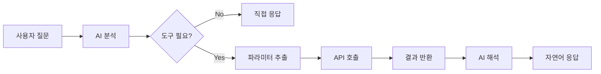
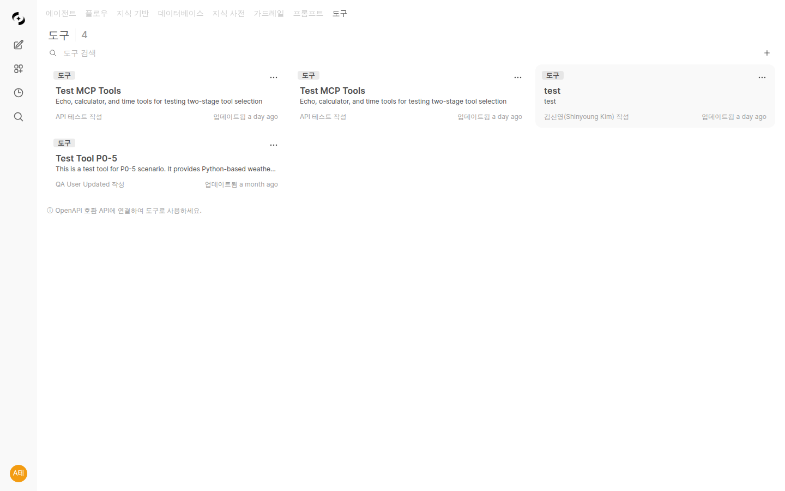

# 도구 연결 (Tools)

> 외부 시스템과 API를 AI에 연결하여 실시간 데이터 조회, 작업 자동화, 시스템 통합을 구현하세요. 도구 연결로 AI의 능력을 무한히 확장할 수 있습니다.



---

## 도구 연결이란?

도구 연결은 AI가 외부 시스템의 기능을 호출할 수 있게 해주는 기능입니다.

<!-- 스크린샷: 도구 연결 개념도
     - AI ↔ 도구 연결 ↔ 외부 시스템 (CRM, ERP, API 등)
     파일명: images/tools-concept.png
-->

### 활용 예시

| 연결 대상 | 할 수 있는 일 |
|----------|--------------|
| **CRM 시스템** | 고객 정보 조회, 영업 기회 등록 |
| **티켓 시스템** | 이슈 생성, 상태 업데이트 |
| **HR 시스템** | 휴가 신청, 직원 정보 조회 |
| **날씨 API** | 실시간 날씨 정보 제공 |
| **주식 API** | 실시간 주가 조회 |

### 지원 프로토콜

| 프로토콜 | 설명 | 사용 사례 |
|----------|------|----------|
| **OpenAPI** | REST API 표준 스펙 | 대부분의 웹 서비스 |
| **MCP** | Model Context Protocol | AI 전용 도구 서버 |

---

## 도구 목록

**워크스페이스 > 도구**에서 모든 도구 연결을 확인합니다.



### 연결 상태

| 상태 | 아이콘 | 의미 |
|------|--------|------|
| **연결됨** | 🟢 | 정상 작동 중 |
| **연결 실패** | 🔴 | 서버 응답 없음 |
| **인증 만료** | 🟡 | 재인증 필요 |

---

## OpenAPI 도구 연결

### OpenAPI란?

OpenAPI(구 Swagger)는 REST API를 표준화된 형식으로 정의하는 스펙입니다.
대부분의 현대 API 서비스가 OpenAPI 스펙을 제공합니다.

### 연결 방법

#### 1단계: 새 도구 생성

**"+ 새 도구"** 버튼을 클릭합니다.

<!-- 스크린샷: 도구 생성 폼
     파일명: images/tools-create.png
-->

| 필드 | 설명 | 예시 |
|------|------|------|
| **이름** | 도구 표시 이름 | "고객 관리 API" |
| **설명** | 도구 용도 설명 | "CRM 시스템 연동" |

#### 2단계: OpenAPI 스펙 URL 입력

OpenAPI JSON/YAML 파일의 URL을 입력합니다.

<!-- 스크린샷: OpenAPI URL 입력 필드
     파일명: images/tools-openapi-url.png
-->

**URL 예시:**
```
https://api.example.com/openapi.json
https://petstore.swagger.io/v2/swagger.json
```

#### 3단계: 인증 설정

API 인증 방식을 설정합니다.

<!-- 스크린샷: 인증 설정 옵션
     파일명: images/tools-auth-config.png
-->

| 인증 방식 | 설정 |
|----------|------|
| **API Key** | 헤더 이름 + API 키 값 |
| **Bearer Token** | 토큰 값 |
| **Basic Auth** | 사용자명 + 비밀번호 |
| **OAuth 2.0** | 클라이언트 ID/Secret |

#### 4단계: 연결 테스트

**"연결 테스트"** 버튼을 클릭하여 연결 상태를 확인합니다.

<!-- 스크린샷: 연결 테스트 성공 화면
     파일명: images/tools-test-success.png
-->

#### 5단계: 사용 가능한 기능 확인

연결 성공 시 사용 가능한 API 엔드포인트 목록이 표시됩니다.

<!-- 스크린샷: API 기능 목록
     - 각 기능의 이름, 설명, 파라미터
     파일명: images/tools-functions-list.png
-->

**표시 정보:**
- 기능 이름
- 설명
- 필요한 파라미터
- 반환 데이터 형식

#### 6단계: 접근 권한 설정

<!-- 스크린샷: 도구 접근 권한 설정
     파일명: images/tools-access-control.png
-->

---

## MCP 도구 연결

### MCP란?

MCP(Model Context Protocol)는 AI 모델과 외부 도구 간의 통신을 위한 프로토콜입니다.
더 안전하고 효율적인 AI 도구 통합을 지원합니다.

### MCP 연결 설정

#### 1단계: MCP 서버 정보 입력

<!-- 스크린샷: MCP 연결 설정 폼
     파일명: images/tools-mcp-config.png
-->

| 필드 | 설명 |
|------|------|
| **서버 URL** | MCP 서버 주소 |
| **환경 변수** | 필요한 환경 설정 |

#### 2단계: 연결 확인

<!-- 스크린샷: MCP 연결 성공 및 도구 목록
     파일명: images/tools-mcp-connected.png
-->

### MCP 도구 인증 — OAuth / SSO (1.0.3)

기존 인증 방식(`None` / `Bearer Token` / `API Key`) 외에 **OAuth 2.0 (User SSO)** 방식이 추가되었습니다. 도구 연결의 인증 방식이 단일 OAuth + provider 형태로 분리되어, 관리자가 도구 연결 화면에서 인증 방식과 provider 를 각각 선택합니다.

<!-- 스크린샷: MCP 인증 방식 드롭다운 (OAuth 2.0 (User SSO) 선택 시 Provider 필드 노출)
     파일명: images/tools-mcp-oauth.png
-->

| Auth Type | 설명 |
|-----------|------|
| **None** | 인증 없음 |
| **Bearer Token** | 단일 토큰을 Authorization 헤더에 주입 |
| **API Key** | 단일 키 + 헤더 이름 |
| **OAuth 2.0 (User SSO)** | 사용자가 Cloosphere 에 로그인할 때 받은 SSO 토큰을 그대로 MCP 서버에 전달 |

OAuth 2.0 (User SSO) 선택 시 **Provider** 드롭다운이 노출되어 다음 중 하나를 고를 수 있습니다.

| Provider | 사용 토큰 |
|----------|----------|
| **Microsoft** | Microsoft Graph 위임 권한 (Mail / Calendar / Files / Contacts / Tasks / Notes 등) |
| **Google** | Google OAuth (Gmail / Drive / Calendar 등) |

- 매 호출마다 **사용자 본인의 SSO access token** 이 Authorization 헤더에 동적으로 주입됩니다.
- 도구 연결에는 별도 키가 저장되지 않습니다. 사용자가 해당 provider 로 SSO 로그인되어 있어야 도구가 동작합니다.
- 만료가 임박하면 refresh_token 으로 자동 갱신됩니다.
- 사용자는 **설정 > Connections > Connected Accounts** 카드에서 본인의 SSO 연결 상태를 확인하고 disconnect 할 수 있습니다.

> 💡 외부 MCP 서버(예: `ms-365-mcp`)를 운영자가 도구 연결로 등록하면, 사내 메일/캘린더/문서 도구를 별도 키 없이 사용자별 SSO 로 안전하게 노출할 수 있습니다.

### MCP 도구 화이트리스트 (1.0.3)

도구 서버가 노출하는 도구 중 **사용자에게 보여줄 도구를 선택**할 수 있습니다. 운영자가 의도하지 않은 도구가 LLM 에 노출되는 것을 차단하는 거버넌스 기능입니다.

<!-- 스크린샷: 도구 편집 페이지 우측 Functions 패널 — 각 도구별 체크박스 토글
     파일명: images/tools-mcp-whitelist.png
-->

- **자동 fetch** — 도구 서버 등록 후 `Test Connection` 을 누르면 우측 **Available Functions** 패널에 도구 목록이 나타납니다.
- **체크박스 토글** — 각 도구 행을 클릭해 활성화/비활성화. 비활성화된 도구는 LLM 에 노출되지 않으므로 에이전트가 호출할 수 없습니다.
- **저장 형태** — 화이트리스트는 `connection.enabled_tools` 배열로 저장. **빈 배열은 "전체 활성"** 의미로 정규화됩니다 (모든 도구를 체크한 상태와 동일).
- **활용 예** — 운영자가 메일 MCP 서버를 등록할 때 read 계열만 활성화하고 send/delete 계열은 끄는 식으로 권한 거버넌스를 구성.

---

## 도구 활용

### 에이전트에 연결

도구를 에이전트에 연결하면 AI가 자동으로 적절한 시점에 도구를 호출합니다.

<!-- 스크린샷: 에이전트 설정에서 도구 연결
     파일명: images/tools-agent-connect.png
-->

### 채팅에서 사용

```
사용자: 고객 ID 12345의 정보를 조회해줘

AI: [CRM API 호출 중...]

고객 정보를 조회했습니다:

| 항목 | 값 |
|------|-----|
| 이름 | 홍길동 |
| 이메일 | hong@example.com |
| 등급 | VIP |
| 최근 구매일 | 2024-01-15 |

추가로 확인하고 싶은 정보가 있으신가요?
```

<!-- 스크린샷: 도구 호출 결과가 표시된 채팅
     파일명: images/tools-in-chat.png
-->

### 도구 호출 과정

<!-- 스크린샷: 도구 호출 과정 시각화
     1. 사용자 질문
     2. AI가 도구 필요성 판단
     3. 도구 호출
     4. 결과 반환
     5. AI가 결과 해석하여 응답
     파일명: images/tools-flow.png
-->

에이전트에 여러 도구 서버가 연결된 경우, AI는 2단계로 도구를 선택합니다:

1. **서버 탐색**: 연결된 도구 서버 목록과 각 서버의 역할을 확인합니다
2. **도구 선택**: 질문에 적합한 서버를 선택하고, 해당 서버의 도구 목록을 조회합니다
3. **파라미터 추출**: 질문에서 필요한 값을 추출합니다
4. **도구 실행**: 선택한 도구를 호출하고 결과를 받습니다
5. **결과 해석**: 응답을 자연어로 변환합니다

> 💡 다수의 도구 서버가 연결되어 있어도, AI가 먼저 서버 목록을 파악한 후 필요한 도구만 선택적으로 호출하므로 불필요한 API 호출이 발생하지 않습니다.

---

## 워크스페이스 공통 기능

> 도구를 포함한 모든 워크스페이스 항목(에이전트, 프롬프트, 지식베이스, 데이터베이스, 용어집, 가드레일 등)에는 다음과 같은 공통 기능이 적용됩니다. 자세한 내용은 [에이전트 문서의 워크스페이스 공통 기능](./agents.md#워크스페이스-공통-기능)을 참조하세요.

- **태그 시스템**: 항목에 태그를 추가하여 분류 및 필터링
- **태그 관리 페이지**: 태그 일괄 관리 (이름 변경, 삭제, 사용 현황 확인)
- **복제/내보내기/가져오기**: 항목 복제, JSON 내보내기/가져오기
- **내 항목/전체 필터 칩**: 내가 만든 항목만 필터링하여 조회
- **리소스 삭제 시 에이전트 사용 여부 확인**: 에이전트에 연결된 리소스 삭제 시 확인
- **Write 권한 제어**: 쓰기 권한 없으면 Save 비활성화, New 버튼 숨김
- **편집 페이지 상단 버튼 통일**: 저장, 더보기 메뉴 등 일관된 레이아웃

---

## 도구 관리

### 편집

도구 설정을 수정합니다.

<!-- 스크린샷: 도구 편집 화면
     파일명: images/tools-edit.png
-->

### 복제

기존 도구를 복사하여 새 도구를 만듭니다.

### 내보내기/가져오기

도구 설정을 JSON으로 내보내고 가져올 수 있습니다.

**활용:**
- 팀 간 도구 설정 공유
- 환경 간 이동
- 백업

### 삭제

더 이상 사용하지 않는 도구를 삭제합니다.

> **주의:** 도구를 삭제할 때, 해당 도구가 에이전트에 연결되어 있으면 삭제 확인 대화상자에서 연결된 에이전트 목록이 표시됩니다. 삭제 전 연결 상태를 확인하세요.

---

## 공유 권한 모델 (1.0.2)

도구의 공유 권한은 다른 워크스페이스 리소스(Glossary, KB 등)와 동일하게 `access_control` 의 **read / write 2단계**로 표현됩니다. 1.0.2에서는 그 정책이 **UI에서도 일관되게** 동작하도록 정리되었습니다.

<!-- 스크린샷: 도구 카드 / 도구 상세 페이지에서 read 공유자 / write 공유자 / owner 별 버튼 노출 차이
     파일명: images/tools-share-permissions.png
-->

| 권한 | UI 동작 |
|------|--------|
| **owner / admin** | 모든 메뉴 노출 (편집 · 삭제 · 더보기) |
| **write 공유자** | 카드 더보기 메뉴 + 편집 / 삭제 노출 (`canManageTool()` 통과) |
| **read 공유자** | 카드 클릭 시 **상세 페이지 진입 가능**, 단 편집 / 저장 / 삭제 / shift+delete 모두 비활성화 |

### 카드 클릭 가드 단순화

리스트 응답에 도구가 포함되어 있다는 사실 자체가 백엔드 read 권한을 통과한 것이므로, **카드 클릭은 무조건 detail 진입을 허용**합니다. detail 페이지의 `canWrite` 가드가 편집/저장/삭제 버튼을 안전하게 비활성화합니다.

### 편집 경로 정정

존재하지 않던 `/workspace/tools/edit?id=X` 경로를 사용하던 부분이 모두 실제 편집 페이지인 `/workspace/tools/{id}` (`ToolDetail.svelte`) 로 정정되었습니다.

---

## 운영 메모

### `stream=false` 요청도 UnifiedAgent 라우팅 (1.0.2)

`stream=false` 로 호출되는 chat completion 요청도 1.0.2부터 일반 스트림 요청과 동일하게 **UnifiedAgent** 로 라우팅됩니다. 이전에는 일부 외부 통합 (예: 동기형 SDK 호출) 에서 도구가 활성화되지 않는 차이가 있었으나, 동일한 도구 / 가드레일 / 트레이싱이 모든 호출 경로에서 일관되게 적용됩니다.

---

## 보안 고려사항

### 안전한 도구 연결

Cloosphere의 도구 연결은 기업 수준의 보안을 제공합니다.

<!-- 스크린샷: 보안 설정 옵션
     파일명: images/tools-security.png
-->

| 보안 기능 | 설명 |
|----------|------|
| **암호화 통신** | 모든 API 호출 TLS 암호화 |
| **자격 증명 보호** | API 키 암호화 저장 |
| **접근 제어** | 권한별 도구 사용 제한 |
| **감사 로그** | 모든 도구 호출 기록 |

### API 키 관리

- API 키는 안전하게 암호화되어 저장됩니다
- 키는 한 번 입력 후 다시 볼 수 없습니다
- 정기적인 키 순환을 권장합니다

### 네트워크 보안

- 사설 네트워크 내 API만 연결 권장
- 필요시 IP 화이트리스트 설정
- VPN/Private Endpoint 활용

---

## 활용 사례

### 사례 1: CRM 연동

**연결:** Salesforce API

**활용:**
```
사용자: 이번 달 신규 고객 목록 보여줘

AI: 이번 달 신규 고객 목록입니다:

| 고객명 | 업종 | 계약일 | 담당자 |
|--------|------|--------|--------|
| A사 | IT | 2024-01-05 | 김철수 |
| B사 | 제조 | 2024-01-12 | 이영희 |
| C사 | 금융 | 2024-01-20 | 박민수 |

총 3개 기업이 이번 달에 신규 계약되었습니다.
```

### 사례 2: 티켓 시스템 연동

**연결:** Jira API

**활용:**
```
사용자: 프로젝트 A의 미해결 이슈 중 우선순위 높은 것 알려줘

AI: 프로젝트 A의 우선순위 높은 미해결 이슈입니다:

1. **PROJ-123**: 로그인 오류 수정
   - 담당: 개발팀 김개발
   - 기한: 2024-01-25

2. **PROJ-145**: 결제 모듈 성능 개선
   - 담당: 개발팀 이개발
   - 기한: 2024-01-28

이슈 상태를 업데이트할까요?
```

### 사례 3: 데이터 조회

**연결:** 사내 데이터 API

**활용:**
```
사용자: 지난 주 일별 매출 추이 알려줘

AI: 지난 주 일별 매출 추이입니다:

📊 일별 매출 (단위: 백만원)
월: ████████ 45
화: ██████████ 52
수: ███████████ 58
목: █████████ 48
금: ████████████ 62

평균: 53백만원
전주 대비: +8.2% 증가
```

### 사례 4: 날씨 정보

**연결:** 기상청 API

**활용:**
```
사용자: 내일 서울 날씨 어때?

AI: 내일 서울 날씨입니다:

☀️ 맑음
🌡️ 최고 15°C / 최저 3°C
💨 바람: 북서풍 3m/s
💧 습도: 45%

외출하기 좋은 날씨입니다. 다만 아침저녁으로 쌀쌀하니
겉옷을 챙기시는 것이 좋겠습니다.
```

---

## 직접 연결 (사용자용)

관리자가 허용한 경우, 개별 사용자도 자신만의 도구를 연결할 수 있습니다.

<!-- 스크린샷: 사용자 설정 > 도구 연결
     파일명: images/tools-user-connection.png
-->

**설정 위치:** 설정 > 도구 > 연결

**제한사항:**
- 본인만 사용 가능
- 관리자 승인 필요할 수 있음

---

## 트러블슈팅

### 연결 실패

| 원인 | 해결 방법 |
|------|----------|
| URL 오류 | OpenAPI 스펙 URL 재확인 |
| 인증 실패 | API 키/토큰 재확인 |
| 네트워크 | 방화벽/프록시 설정 확인 |
| CORS | 서버 측 CORS 설정 확인 |

### API 호출 실패

| 원인 | 해결 방법 |
|------|----------|
| 권한 부족 | API 권한 확인 |
| Rate Limit | 호출 빈도 조절 |
| 서버 오류 | 외부 서비스 상태 확인 |

---

## FAQ

**Q: 어떤 API든 연결할 수 있나요?**
> OpenAPI(Swagger) 스펙을 제공하는 API는 모두 연결 가능합니다. 스펙이 없는 경우 MCP 서버를 직접 구축해야 합니다.

**Q: API 호출 비용이 발생하나요?**
> 외부 API 사용 시 해당 서비스의 과금 정책이 적용됩니다. Cloosphere 자체에서는 추가 비용이 없습니다.

**Q: 민감한 데이터도 안전한가요?**
> 모든 통신은 암호화되며, 자격 증명은 안전하게 저장됩니다. 추가로 접근 권한을 세밀하게 설정할 수 있습니다.

---

## 다음 단계

- 🤖 [에이전트에 도구 연결하기](./agents.md)
- 🗄️ [데이터베이스 직접 연결](./database.md)
- 📖 [용어집 활용하기](./glossary.md)
